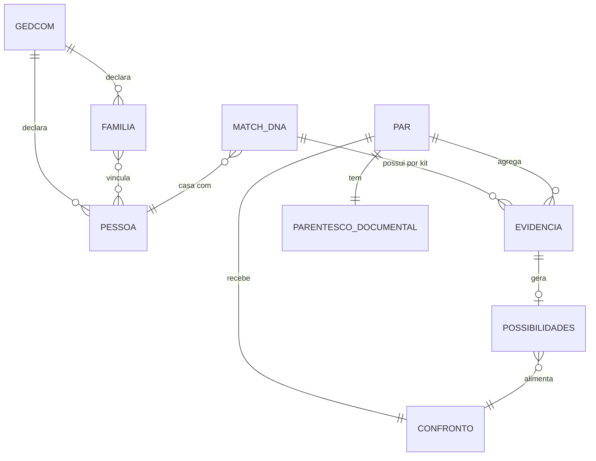

# Alma do Sistema

> Síntese executiva do projeto **analisador-genealogico** (Genetic Genealogy Path Analyzer).
> Gerada por **reversa-extract-soul** em 2026-10-05, sobre o SDD re-extraído de **2026-10-05** (nível `completo`).
> Fontes: `.reversa/context/surface.json`, `_reversa_sdd/inventory.md`, `architecture.md`, `domain.md`,
> `state-machines.md`, `permissions.md`, `adrs/` (23), `confidence-report.md`, `gaps.md` e `c4-context.md`.
> Escala de confiança: 🟢 CONFIRMADO | 🟡 INFERIDO | 🔴 LACUNA. Toda afirmação leva uma marca.
> Esta versão substitui a de 2026-09-28, que descrevia código que não existe mais
> (preservada em `.reversa/soul.20260928-1537.md`).

---

## 1. Propósito

**analisador-genealogico** é uma **aplicação web Flask monolítica**, de um único processo, para
**genealogistas genéticos**. Ela recebe duas entradas do próprio usuário, uma **árvore GEDCOM** (`.ged`)
e um **relatório de DNA em CSV** de correspondentes (formato GEDmatch), e responde à pergunta central:
**"como eu me conecto a essa pessoa?"** 🟢

O produto **não** afirma parentesco a partir de DNA. Ele separa **três eixos que não se contaminam**
(o que o GEDCOM afirma, o que o CSV informa e o confronto entre os dois) e publica o confronto como
**um de quatro estados**, sempre dizendo por quê. 🟢

A persona é **uma só**, o próprio operador, sem login, sem sessão e sem papéis; o uso é **single-tenant**
por aceite de risco declarado, e a exposição de rede exige ato explícito porque o padrão de escuta é
`127.0.0.1`. 🟢

A dor resolvida é a armadilha conhecida da genealogia genética: **cM compatível não prova um caminho**, e
**caminho documental plausível não é confirmado por DNA**. O sistema troca a afirmação única e silenciosa
por três leituras declaradas e um veredito auditável. 🟡

---

## 2. Entidades centrais

Oito entidades sustentam o esqueleto. As quatro primeiras são o domínio; as quatro seguintes são o
confronto, o armazenamento e a leitura tolerante.

| # | Entidade | O que representa | Relações diretas | Conf. |
| --- | --- | --- | --- | --- |
| E1 | **GEDCOM** | A árvore enviada, com registros `INDI` e `FAM`. Validada por **conteúdo** (`0 HEAD`), re-parseada a cada `POST` | 1:N com PESSOA e FAMILIA | 🟢 |
| E2 | **PESSOA** (`INDI`) | Indivíduo identificado por `xref_id` (ex.: `@I0001@`); `FAMC` e `FAMS` são seus vínculos | N:M com FAMILIA (como filho, cônjuge ou genitor) | 🟢 |
| E3 | **FAMILIA** (`FAM`) | Unidade com `HUSB`, `WIFE` e `CHIL`, chave da navegação por pais e do grafo pessoa↔família | N:M com PESSOA | 🟢 |
| E4 | **MATCH_DNA** | Linha do CSV: nome e cM compartilhado. A chave é o par **(nome, kit)**, nunca só o nome | 0:N com EVIDENCIA (uma por kit); casa com PESSOA por matching difuso | 🟢 |
| E5 | **PARENTESCO_DOCUMENTAL** | O que a árvore sustenta: caminho, MRCA, distância geracional e **status** (`not_found`, `found`, `ambiguous`, `affinity`). **Nunca lê cM** | 1:1 com PAR (pessoa raiz mais match) | 🟢 |
| E6 | **EVIDENCIA_GENETICA** | O que o CSV informa: kit, cM total, segmentos, maior segmento, SNPs. **Não conhece o GEDCOM**, e nunca soma kits diferentes | 1:N com PAR (um por kit) | 🟢 |
| E7 | **POSSIBILIDADES** (SCP 4.0) | O cM traduzido em **lista** de relações compatíveis pela tabela do Shared cM Project 4.0 (27 relações publicadas) | N:1 com CONFRONTO (alimenta a janela) | 🟢 |
| E8 | **CONFRONTO** | O veredito: `COMPATIVEL`, `POSSIVEL`, `CONFLITANTE` ou `INCONCLUSIVO`, por kit e com junção conservadora | 1:1 com PAR (um veredito por conexão) | 🟢 |

Entidades de apoio que completam o quadro: a **chave de armazenamento**
(`<sha256 do conteúdo truncado>__<nome visível>`), que faz o papel de identificador de continuidade, e o
**aviso** (`warning`), par `{code, message}` que carrega a granularidade fina que o `status` perde de
propósito. 🟢

> **Leitura do diagrama:** `PAR` é o par em análise (a pessoa raiz e o correspondente). Os três eixos
> aparecem como **três caminhos independentes** até o `CONFRONTO`, que é o único ponto onde eles se
> encontram. 🟢

---

## 3. Decisões fundadoras

Cinco escolhas sustentam o esqueleto. Mexer em qualquer uma delas reescreveria boa parte do sistema.

### D1. Separar parentesco documental, evidência genética e confronto, com quatro estados

- **Evidência:** `src/core/dna_analysis.py:1-31` (as duas proibições declaradas no código),
  `src/core/evidence_comparison.py:8-29`, `src/core/documentary_relationship.py:10-16`,
  `tests/test_confrontacao_gedcom_dna.py` (922 linhas, 27 funções, dez cenários) e
  `_reversa_sdd/adrs/14-separar-documental-genetica-e-confronto.md`. 🟢
- **Implicação:** o DNA **não** altera o parentesco documental; conflito vira aviso e rol de causas,
  nunca reescrita de vínculo. O cM **nunca** é usado sozinho para afirmar parentesco, e o rótulo antigo
  "Relacionamento Provável (DNA)" foi removido em favor de "Possibilidades de parentesco pelo DNA".
  O veredito é decidido por **sobreposição de faixas** (ADR-15), e não por distância em meioses, com o
  contraexemplo medido no próprio código; com vários kits vence sempre **o mais conservador**.
  `INCONCLUSIVO` é o estado inicial e o caminho de falha padrão, de modo que nenhum estado é afirmado
  por omissão. 🟢
- **Confiança:** 🟢 CONFIRMADO. É a maior mudança do sistema e **não existe em nenhum artefato da
  extração anterior**; nasceu em commits diretos (`7bf2676`, `cd8d7f3`, `a4d24df`, `2c0ba40`),
  **sem ciclo forward**, e é o motivo declarado desta re-extração. 🔴 Nada disso tem requisito,
  roadmap ou adendo registrado.

### D2. Núcleo de domínio em pacotes por responsabilidade, sob uma camada de rota fina

- **Evidência:** `src/app.py` (267 linhas, zero regra de negócio), `src/core/` (12 módulos),
  `src/parsers/`, `src/reporting/`, `src/utils/`, `_reversa_sdd/adrs/02-camada-de-rota-fina.md`,
  `adrs/10-mover-raiz-para-src.md` e `adrs/11-reorganizar-em-pacotes-por-responsabilidade.md`. 🟢
- **Implicação:** uma só autoridade por regra, e a fronteira que permite testar decisão sem HTTP.
  O `app.py` **cresceu** de cerca de 70 para 267 linhas sem violar a decisão: as linhas acrescentadas são
  infraestrutura de entrada (teto de corpo com `413`, filtros de template, ancoragem do caminho de upload,
  guarda de instância única e bloco `waitress`), e nenhuma das **118 regras** catalogadas vive ali.
  O custo declarado é a **superfície de compatibilidade** (`__all__` reexportando nomes históricos) e o
  `cm_estimator`, legado mantido fora do fluxo apenas porque a suíte e o harness o exercitam.
  🔴 Os quatro pacotes **não** formam camadas acíclicas: existem **dois ciclos** no nível de pacote,
  `core/` ↔ `reporting/` e `core/` ↔ `parsers/`. `utils/` é o único pacote folha real, e `reporting/`
  contém decisão de negócio de apresentação. 🟢
- **Confiança:** 🟢 CONFIRMADO para a decisão; 🔴 para a fronteira, que não é acionável por importação e
  **não tem decisão humana registrada** sobre manter ou desfazer.

### D3. Persistir o upload por chave derivada do conteúdo, não por sessão

- **Evidência:** `src/utils/validate.py` (módulo puro, sem Flask e sem disco), `src/app.py:32`,
  `:65-72`, `:90-108`, `tests/test_upload_seguranca.py` (425 linhas, 33 funções) e
  `_reversa_sdd/adrs/17-upload-por-chave-de-conteudo.md`. 🟢
- **Implicação:** a chave é `sha256` do conteúdo truncado em 16 hexadecimais, com a **extensão original
  preservada**, e é ela que circula entre requisições no campo `gedcom_filename`. Como o formulário
  devolve o valor no `POST` seguinte, um UUID aleatório quebraria a continuidade e duplicaria o arquivo.
  A validação é por **forma fechada** (`^[0-9a-f]{16}__[A-Za-z0-9._-]+$`), não por lista negra, e é essa
  forma que impede escape de caminho. O teto de corpo é de **16 MB**, com `HTTP 413` **antes** de ler o
  corpo, e arquivo de mesma chave não é reescrito. A decisão substitui a persistência por sessão:
  **não existe sessão em lugar algum**. 🔴 A chave é **identificador, não segredo**, e não há verificação
  de propriedade: quem conhece a chave carrega a árvore. 🟢
- **Confiança:** 🟢 CONFIRMADO. A lacuna anterior ("upload sem validação de extensão, tipo ou tamanho")
  está **superada** por esta decisão, registrada no `BUG-20260929-QMLY`.

### D4. Single-tenant por aceite de risco, com `waitress`, instância única e escuta local por padrão

- **Evidência:** `_reversa_sdd/adrs/12-servidor-waitress-instancia-unica.md`,
  `adrs/18-single-tenant-por-aceite-de-risco.md`, `src/app.py:179-267`,
  `tests/test_servidor_producao.py` e `_reversa_sdd/permissions.md`. 🟢
- **Implicação:** `waitress==3.0.2` substituiu o servidor de desenvolvimento e o `gunicorn`; o socket é
  criado, marcado e ligado **antes** de servir, de modo que uma segunda instância na mesma porta é
  **recusada** com diagnóstico que separa porta ocupada de endereço indisponível. O padrão passou de
  `0.0.0.0` para `127.0.0.1`, e abrir para a rede virou ato explícito por `ANALISADOR_HOST`.
  Como não há identidade, a correção de isolamento no legado seria código descartado pela Onda 3 e ainda
  assim **inverificável**: a decisão foi não corrigir e aceitar o risco, com condição de reabertura
  nomeada. 🔴 A guarda de instância única é de **processo, não de thread**: o servidor atende com
  4 threads (`ANALISADOR_THREADS`) e o estado do GEDCOM é global de processo, o que deixa aberta a
  corrida da lacuna L2. 🔴 Zero autenticação, zero papéis e zero `owner_id`, confirmado por varredura. 🟢
- **Confiança:** 🟢 CONFIRMADO para a decisão e para os mecanismos; 🟡 para o alcance da corrida,
  que nunca foi medido.

### D5. Matching difuso defensivo, com desempate determinístico

- **Evidência:** `src/core/matching.py` (índices e cinco ramos de aceitação),
  `src/core/name_normalization.py`, `tests/test_characterization_matching.py` (24 testes, incluindo 2 de
  determinismo) e `_reversa_sdd/adrs/23-desempate-deterministico.md`. 🟢
- **Implicação:** o score combina `token_sort`, `partial` e similaridade de prenome com bônus por
  interseção de sobrenomes; o filtro anti-falso-positivo **rejeita** o candidato sem sobrenome em comum e
  sem acerto de sufixo, registrando o motivo, e o descartado é **exibido, nunca escondido**. O cM
  influencia apenas o limiar de Jaccard (0,50, caindo para 0,33 só com cM ≥ 150 e prenome não genérico),
  o que um teste de caracterização confirma. O desempate ganhou um **quarto critério**, o menor `xref_id`,
  porque a ordem de iteração de um `set` muda a cada `PYTHONHASHSEED` e a escolha do candidato se propaga
  até o veredito do confronto. 🔴 Essa correção é a **única divergência deliberada do legado que muda
  comportamento** em toda a extração; fora do empate triplo, nada muda. 🟢
- **Confiança:** 🟢 CONFIRMADO. As regras de aceitação herdadas foram preservadas com fidelidade e as
  13 decisões humanas verificadas estão **todas honradas** pelo código depois desta correção.

---

## 4. Lacunas

Quatro lacunas seguem abertas. As três últimas **não dependem de decisão humana**: são limitação da
fonte, custo e trabalho de rastreabilidade e teste.

| # | Lacuna | Pergunta sugerida ao humano | Conf. |
| --- | --- | --- | --- |
| L1 | 🔴 **Sem autenticação, sem RBAC e sem `owner_id`.** Confirmado por varredura: nenhum `session`, `login`, `auth`, `role` ou `permission` em `src/`. A chave de conteúdo é identificador, não segredo, e a lista completa de nomes (`all_names`) é embutida em toda resposta. Dado genealógico de pessoas vivas fica acessível a quem alcança a porta e conhece a chave. A correção está especificada para a **Onda 3** da migração (teste negativo de 404 como portão de go-live) e não foi aplicada ao legado por ser inverificável sem identidade. | "O aceite de risco single-tenant continua válido, ou alguém além de você passou a ter acesso antes da Onda 3?" | 🟢 |
| L2 | 🔴 **Corrida entre requisições concorrentes** (`L-16` / `M-03` / `P-02`, o mesmo mecanismo com três identificadores). O estado do GEDCOM é global de processo e reescrito a cada requisição, com 4 threads por padrão: A parseia a árvore A, B parseia a árvore B, e A segue lendo o estado de B. Mecanismo **confirmado por leitura de código**; **alcance não medido**. Nunca foi observado resultado cruzado em uso real. | "Qual é a janela real de exposição com 4 threads, e vale serializar o par parse e uso antes da Onda 3?" | 🟡 |
| L3 | 🔴 **O CSV é apenas do GEDmatch.** A cobertura de exportadores deixou de ser incerteza e passou a ser **declarada**: só o GEDmatch é usado. O CSV também não passa por validação de conteúdo, só a forma do nome é validada. | "Outros exportadores (MyHeritage, FamilyTreeDNA) entram no escopo, e a validação de conteúdo do CSV pertence ao alvo?" | 🟢 |
| L4 | 🔴 **Nada é persistido entre execuções.** A árvore é re-parseada a cada `POST` e nenhum resultado é gravado: não há histórico de análises, nem registro do veredito do operador sobre uma conexão. Não existe estado de ciclo de vida em entidade alguma do sistema. Persistir virou requisito encaminhado ao sistema alvo, não correção do legado. | "O histórico de análises e o veredito do operador devem virar requisito do próximo ciclo forward?" | 🟢 |

Não são lacunas, e sim decisões vigentes: o teto de 20 iterações do BFS que corta em silêncio, a
varredura condicional de `get_spouses`, a endogamia apenas avisada, a declaração das faixas de cM como
heurística e a ordem de apresentação com documental primeiro. 🟢

---

## 5. Como ler esse documento

Este `soul.md` é uma **síntese**, não substitui:

- `_reversa_sdd/inventory.md` para o mapeamento de superfície, rotas, contagens e dependências
- `_reversa_sdd/code-analysis.md` e `flowcharts/` para o detalhe módulo a módulo (118 regras, 77 funções)
- `_reversa_sdd/domain.md` para as regras de negócio, o glossário e as 21 mensagens de contrato
- `_reversa_sdd/state-machines.md` e `permissions.md` para as duas máquinas de decisão e a ausência de RBAC
- `_reversa_sdd/architecture.md`, `c4-context.md`, `c4-containers.md`, `c4-components.md` e
  `erd-complete.md` para os diagramas C4 e as 27 estruturas de dados
- `_reversa_sdd/adrs/` para as 23 decisões reconstruídas, com contexto, alternativas e consequências
- `_reversa_sdd/confidence-report.md` e `gaps.md` para os números medidos e o passivo da extração

**Números medidos desta extração:** 37 arquivos de código, 5.966 linhas não vazias em `src/` e `tests/`,
179 itens de teste coletados com **164 passando** (os 15 erros são de ambiente, `PermissionError` do
sandbox ao criar diretório temporário, e não regressão), **83 %** de cobertura de `src/` e confiança
global de **92,8 %** sobre 1.922 afirmações. 🟢
