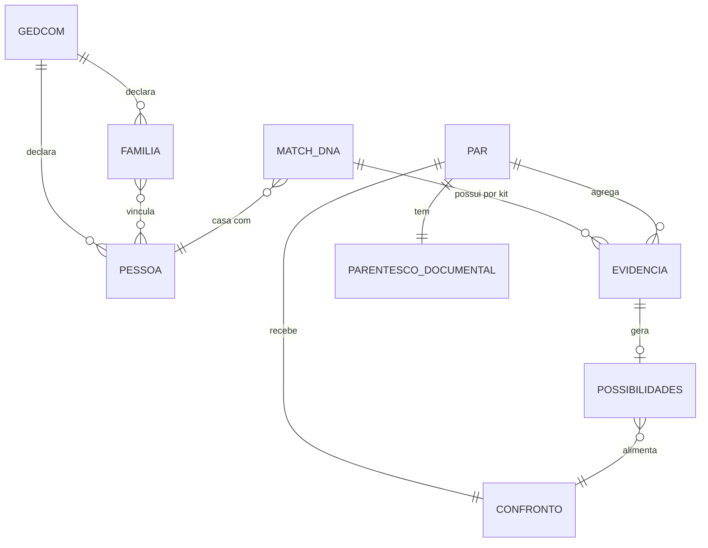
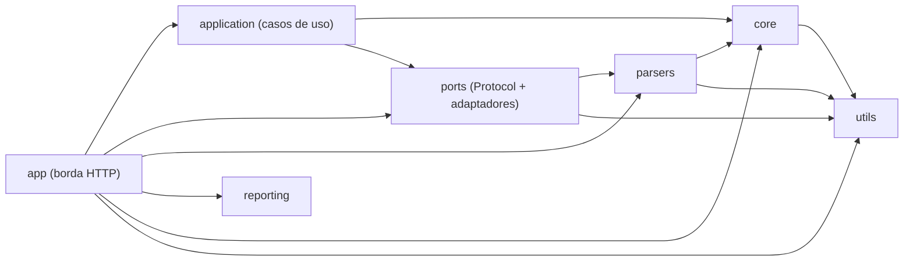

# Alma do Sistema

> Síntese executiva do projeto **analisador-genealogico** (Genetic Genealogy Path Analyzer).
> Reescrita por **reversa-extract-soul** em 2026-10-08, sobre o estado do código **depois** das
> features 005 a 008 do ciclo forward (nível `completo`, idioma Português).
> Fontes, na ordem de autoridade: os quatro adendos vigentes em `_reversa_sdd/addenda/`
> (`005-nucleo-puro-src`, `006-fronteira-aplicacao-ports`, `007-dono-no-port-e-baseline`,
> `008-persistencia-postgres-docker`); os `requirements.md`, `roadmap.md` e `actions.md` dessas
> quatro features em `_reversa_forward/`; o código real em `src/`; e, apenas para o que não mudou
> desde 2026-10-05, `_reversa_sdd/architecture.md`, `domain.md` e `state-machines.md`.
> Escala de confiança: 🟢 CONFIRMADO | 🟡 INFERIDO | 🔴 LACUNA. Toda afirmação leva uma marca.
> Esta versão substitui a de 2026-10-06 (preservada em `.reversa/soul.20261006-0142.md`), que
> descrevia o esqueleto **antes** das quatro features e afirmava, incorretamente para o código
> atual, que os pacotes não formavam camadas acíclicas.

---

## 1. Propósito

**analisador-genealogico** é uma **aplicação web Flask monolítica**, de um único processo, para
**genealogistas genéticos**. Ela recebe duas entradas do próprio usuário, uma **árvore GEDCOM**
(`.ged`) e um **relatório de DNA em CSV** de correspondentes (formato GEDmatch), e responde à
pergunta central: **"como eu me conecto a essa pessoa?"** 🟢

O produto **não** afirma parentesco a partir de DNA. Ele separa **três eixos que não se
contaminam** (o que o GEDCOM afirma, o que o CSV informa e o confronto entre os dois) e publica o
confronto como **um de quatro estados**, sempre dizendo por quê. 🟢

A persona é **uma só**, o próprio operador, sem login, sem sessão e sem papéis; o uso é
**single-tenant** por aceite de risco declarado, e a exposição de rede exige ato explícito porque
o padrão de escuta é `127.0.0.1` (`src/app.py`). 🟢

A dor resolvida é a armadilha conhecida da genealogia genética: **cM compatível não prova um
caminho**, e **caminho documental plausível não é confirmado por DNA**. O sistema troca a
afirmação única e silenciosa por três leituras declaradas e um veredito auditável. 🟡

---

## 2. Entidades centrais

Oito entidades sustentam o esqueleto, e a ordem abaixo é a da travessia do dado: da entrada até o
veredito. As quatro primeiras são o domínio; as quatro seguintes são **os três eixos
independentes e o único ponto onde eles se encontram**. As entidades de apoio vêm depois da
tabela.

| # | Entidade | O que representa | Relações diretas | Conf. |
| --- | --- | --- | --- | --- |
| E1 | **GEDCOM** | A árvore enviada, com registros `INDI` e `FAM`. Validada por **conteúdo** (`0 HEAD`), re-parseada a cada `POST`, e armazenada como arquivo imutável sob **chave derivada do conteúdo** | 1:N com PESSOA e FAMILIA | 🟢 |
| E2 | **PESSOA** (`INDI`) | Indivíduo identificado por `xref_id` (ex.: `@I0001@`); `FAMC` e `FAMS` são seus vínculos | N:M com FAMILIA (como filho, cônjuge ou genitor) | 🟢 |
| E3 | **FAMILIA** (`FAM`) | Unidade com `HUSB`, `WIFE` e `CHIL`, chave da navegação por pais e do grafo pessoa↔família | N:M com PESSOA | 🟢 |
| E4 | **MATCH_DNA** | Linha do CSV: nome e cM compartilhado. A chave é o par **(nome, kit)**, nunca só o nome | 0:N com EVIDENCIA (uma por kit); casa com PESSOA por matching difuso | 🟢 |
| E5 | **PARENTESCO_DOCUMENTAL** | O que a árvore sustenta: caminho, MRCA, distância geracional e **status** (`not_found`, `found`, `ambiguous`, `affinity`). **Nunca lê cM** | 1:1 com PAR (pessoa raiz mais match) | 🟢 |
| E6 | **EVIDENCIA_GENETICA** | O que o CSV informa: kit, cM total, segmentos, maior segmento, SNPs. **Não conhece o GEDCOM**, e nunca soma kits diferentes | 1:N com PAR (um por kit) | 🟢 |
| E7 | **POSSIBILIDADES** (SCP 4.0) | O cM traduzido em **lista** de relações compatíveis pela tabela do Shared cM Project 4.0 (27 relações publicadas) | N:1 com CONFRONTO (alimenta a janela) | 🟢 |
| E8 | **CONFRONTO** | O veredito: `COMPATIVEL`, `POSSIVEL`, `CONFLITANTE` ou `INCONCLUSIVO`, por kit e com junção conservadora | 1:1 com PAR (um veredito por conexão) | 🟢 |

> **Leitura do diagrama:** `PAR` é o par em análise (a pessoa raiz e o correspondente). Os três
> eixos aparecem como **três caminhos independentes** até o `CONFRONTO`, que é o único ponto onde
> eles se encontram. 🟢

**Entidades de apoio, fora do diagrama para não poluí-lo.** A **chave de armazenamento**
(`<sha256 do conteúdo truncado>_<nome visível>`) continua sendo o identificador de continuidade
entre requisições, e continua sendo **identificador, não segredo**. O **aviso** (`warning`), par
`{code, message}`, carrega a granularidade fina que o `status` perde de propósito. E a
**ANALISE_REGISTRADA**, entidade nova da feature 008, é o histórico do que morria ao fim da
requisição: o contexto da análise, as fichas das pessoas que ela usou, os metadados de cada kit, o
veredito por conexão e por kit com o porquê, os descartes e a ordem de apresentação. 🟢

**Arquitetura de dependência, que é o esqueleto novo.** Depois das features 005 e 006 as arestas
de pacote são exatamente estas, e **não há ciclo algum**: `core → utils` (e nada mais);
`parsers → core, utils`; `ports → parsers, utils`; `application → core, ports`;
`app → application, core, parsers, ports, reporting, utils`. 🟢

---

## 3. Decisões fundadoras

Seis escolhas sustentam o esqueleto, uma a mais do que o teto de cinco do nível `completo`: o
sistema ganhou, na feature 008, o **eixo da persistência**, e dobrá-lo dentro de outra decisão
esconderia que ele é reversível sem tocar no núcleo. Mexer em qualquer uma destas seis reescreveria
boa parte do sistema.

### D1. Separar parentesco documental, evidência genética e confronto, com quatro estados

- **Evidência:** `src/core/dna_analysis.py:1-31` (as duas proibições declaradas no código),
  `src/core/evidence_comparison.py`, `src/core/documentary_relationship.py`,
  `tests/test_confrontacao_gedcom_dna.py` (827 linhas não vazias) e
  `_reversa_sdd/adrs/14-separar-documental-genetica-e-confronto.md`. 🟢
- **Implicação:** o DNA **não** altera o parentesco documental; conflito vira aviso e rol de causas,
  nunca reescrita de vínculo. O cM **nunca** é usado sozinho para afirmar parentesco, e o rótulo
  antigo "Relacionamento Provável (DNA)" foi removido em favor de "Possibilidades de parentesco pelo
  DNA". O veredito é decidido por **sobreposição de faixas** (ADR-15), e não por distância em
  meioses, com o contraexemplo medido no próprio código; com vários kits vence sempre **o mais
  conservador**. `INCONCLUSIVO` é o estado inicial e o caminho de falha padrão, de modo que nenhum
  estado é afirmado por omissão. 🟢
- **Confiança:** 🟢 CONFIRMADO. É a maior mudança do sistema, nasceu em commits diretos
  (`7bf2676`, `cd8d7f3`, `a4d24df`, `2c0ba40`) **sem ciclo forward**, e segue sem requisito,
  roadmap ou adendo próprios: é a única capacidade estrutural do sistema que **nenhuma feature
  registrou**. 🔴

### D2. Núcleo puro em `src/core/`, sem estado de módulo, dependendo só de `utils/`

- **Evidência:** `_reversa_sdd/addenda/005-nucleo-puro-src.md` (adendo vigente desde 2026-10-07),
  `tests/test_dependencias_nucleo.py` (guardas por AST, provadas nos dois sentidos),
  `src/core/registro.py` (módulo puro que herdou `get_name` e `ref_id`),
  `src/core/diagram_domain.py` e `src/utils/name_keys.py`. 🟢
- **Implicação:** a árvore deixou de ser **estado global** e passou a ser **valor passado por
  parâmetro**: `src/core/gedcom_state.py` foi apagado, `carregar_arvore` devolve a árvore, e toda
  função pública do núcleo que precisa dela a recebe como primeiro parâmetro. O núcleo não importa
  `parsers/` nem `reporting/`, não declara `people`, `families`, `graph`, `child_to_family` nem
  `versao` no nível de módulo, não faz I/O e não importa framework: quatro guardas automáticas
  prendem isso, cada uma com prova negativa de que consegue falhar. As dependências de borda do
  núcleo (leitura de CSV e emissão de diagrama) são montadas **uma vez**, na borda, e injetadas. 🟢
- **Confiança:** 🟢 CONFIRMADO, e **nenhum resultado de domínio mudou**: a paridade diferencial
  contra o oráculo congelado ficou em 100 % nas 6 fixtures, exit 0. 🔴 Dois limites declarados: a
  guarda procura cinco nomes de estado, então um cache de módulo com outro nome passa por ela
  (`documentary_relationship.py` mantém um, de conteúdo derivado, preservado de propósito); e o
  núcleo permaneceu **de propósito** com a assinatura de retorno congelada, sem modernização.

### D3. Casos de uso em `src/application/` e o mundo externo entrando por `src/ports/`

- **Evidência:** `_reversa_sdd/addenda/006-fronteira-aplicacao-ports.md` e
  `_reversa_sdd/addenda/007-dono-no-port-e-baseline.md` (vigentes), `src/application/`
  (`__init__.py`, `dna_analysis.py`, `path_search.py`, `traducao.py`, `upload_gedcom.py`),
  `src/ports/__init__.py` e `src/ports/adaptadores.py`. 🟢
- **Implicação:** a orquestração **saiu da rota**. A rota **adapta**, o caso de uso **orquestra** e
  o núcleo **decide**; `src/app.py` não chama mais o núcleo diretamente em nenhum dos três fluxos.
  As condições de erro que antes viajavam como string ou `except Exception` genérico passaram a ser
  **exceções de domínio tipadas** com raiz `ErroDeDominio(ValueError)` em `src/core/erros.py`, e o
  adaptador de entrada as traduz de volta ao literal exato da tela em
  `src/application/traducao.py`. A fronteira expõe **três portas com consumidor** e uma quarta
  declarada sem implementação: `ArmazenamentoDeArquivos`, `CarregadorDeArvores` e
  `RegistroDeAnalises`, mais o `RepositorioDeArvores`, que existe só para dar lugar tipado à Onda 3
  e **não tem implementação nem consumidor**. O tipo do retorno do núcleo permaneceu congelado, e o
  desfecho (resultado, sem resultado, erro de entrada) é campo declarado do resultado do caso de
  uso, nunca inferido do texto da mensagem. 🟢
- **Confiança:** 🟢 CONFIRMADO, com paridade em 100 % e 19 casos de mensagem de tela sem
  divergência. 🔴 Declarado fora do escopo: `Dependencias` continua sendo classe concreta do
  núcleo, não interface da fronteira, e os artefatos de `_reversa_sdd/migration/` continuam
  planejando FastAPI, PostgreSQL e React para ondas futuras sem que o alvo real tenha mudado.

### D4. Armazenar o upload por chave derivada do conteúdo, e dar a posse desse estado às portas

- **Evidência:** `src/utils/validate.py`, `src/ports/adaptadores.py` (`ArmazenamentoEmDisco`),
  `src/ports/__init__.py` (as três portas exigindo `dono`), `src/app.py`
  (`DONO_DO_PROCESSO = "unico"`), `tests/test_porta_de_armazenamento.py` (493 linhas não vazias) e
  `_reversa_sdd/adrs/17-upload-por-chave-de-conteudo.md`. 🟢
- **Implicação:** a chave é `sha256` do conteúdo truncado em 16 hexadecimais, com a **extensão
  original preservada**, e é ela que circula entre requisições no campo `gedcom_filename`; como o
  formulário devolve o valor no `POST` seguinte, um UUID aleatório quebraria a continuidade e
  duplicaria o arquivo. A validação é por **forma fechada** (`^[0-9a-f]{16}__[A-Za-z0-9._-]+$`),
  não por lista negra, e é essa forma que impede escape de caminho; o teto de corpo é de 16 MB, com
  `HTTP 413` antes de ler o corpo, e arquivo de mesma chave não é reescrito. O estado do
  armazenamento deixou de estar espalhado pela rota: quem grava e quem resolve é a porta
  `ArmazenamentoDeArquivos`, e o adaptador **delega** para `utils/validate.py`, que continua sendo
  a autoridade única da regra. 🟢
- **Confiança:** 🟢 CONFIRMADO. 🔴 O `dono` é **costura de assinatura, não funcionalidade**: ele é
  parâmetro obrigatório, sem valor padrão, das três portas, vira coluna `owner_id` no banco e
  **não filtra nada** (nenhum `WHERE`, `CHECK` ou índice começa por ele). Duas dívidas seguem
  abertas por decisão, e nenhuma entrega das features 005 a 008 pode ser citada como tendo
  implementado isolamento: **#4**, ausência de identidade e de isolamento entre donos, e **#3**,
  contaminação entre requisições concorrentes, porque a guarda de exclusividade é de **processo, não
  de thread**.

### D5. Persistir o histórico das análises como camada de saída opcional

- **Evidência:** `_reversa_sdd/addenda/008-persistencia-postgres-docker.md` (vigente desde
  2026-10-08), `src/ports/adaptadores.py` (`RegistroDeAnalisesPostgres`), `src/app.py` (a regra dos
  três estados e `DATABASE_URL`), `init.sql` (seis tabelas idempotentes), `docker-compose.yml`,
  `tests/test_persistencia_desabilitada.py` e `tests/test_persistencia_indisponivel.py`. 🟢
- **Implicação:** a persistência entra **depois** do processamento e **fora** da decisão. A borda
  monta o registrador segundo três estados: **sem** `DATABASE_URL` o registrador é nulo e nada muda
  na tela; **com** a variável e o banco respondendo, grava; **com** a variável e a gravação
  falhando, a análise **conclui e é exibida** e o operador recebe apenas um aviso não bloqueante.
  Nenhum módulo de `src/core/` conhece banco, e **nada é lido do banco para decidir** o que a tela
  mostra: o banco é histórico. A gravação é uma **transação única** por análise, para que não exista
  análise pela metade, e o driver é importado de forma **preguiçosa** dentro do método de gravação
  justamente para que `import app` não dependa de ambiente. 🟢
- **Confiança:** 🟢 CONFIRMADO para o mecanismo e para o estado suportado (suíte sem a variável:
  **282 aprovados e 8 pulados**). 🔴 Três consequências declaradas: os **oito testes pulados** são
  do adaptador e **não executaram no host**, porque o driver não está no `.venv/` e a suíte roda
  sem `DATABASE_URL` (a prova desses caminhos é feita dentro do contêiner); sem banco fica
  indisponível **todo** o histórico, a comparação entre execuções e a reabertura de uma análise
  antiga, já que não há interface de histórico e nada é lido de volta para a tela; e o volume do
  banco guarda dado genético real **sem criptografia em repouso**, por aceite de risco declarado em
  2026-10-08, com a condição de reabertura nomeada (qualquer pessoa além do operador passar a ter
  acesso antes da Onda 5).

### D6. Matching difuso defensivo, com desempate determinístico

- **Evidência:** `src/core/matching.py` (índices, cinco ramos de aceitação e o quarto critério de
  desempate declarado no código), `src/core/name_normalization.py`, `src/utils/name_keys.py` e
  `_reversa_sdd/adrs/23-desempate-deterministico.md`. 🟢
- **Implicação:** o score combina `token_sort`, `partial` e similaridade de prenome com bônus por
  interseção de sobrenomes; o filtro anti-falso-positivo **rejeita** o candidato sem sobrenome em
  comum e sem acerto de sufixo, registrando o motivo, e o descartado é **exibido, nunca escondido**.
  O cM influencia apenas o limiar de Jaccard (0,50, caindo para 0,33 só com cM ≥ 150 e prenome não
  genérico). O desempate ganhou um **quarto critério**, o menor `xref_id`, porque a ordem de
  iteração de um `set` muda a cada `PYTHONHASHSEED` e a escolha do candidato se propaga até o
  veredito do confronto. O núcleo puro não mudou nenhum limiar, peso, ordem de avaliação ou
  critério: as cinco ramificações de aceitação continuam intactas. 🟢
- **Confiança:** 🟢 CONFIRMADO. 🔴 Essa correção é a **única divergência deliberada do legado que
  muda comportamento**, e vale apenas no empate triplo. 🟡 A paridade em 100 % prova o resultado
  observável da análise inteira; ela **não** prova as cinco ramificações de aceitação isoladamente,
  porque o probe do harness funde "recusado pelas regras" com "aceito mas sem caminho".

---

## 4. Lacunas

Sete lacunas seguem abertas. A numeração continua a do documento anterior, L1 a L4, e as novas
entram como L5 a L7.

| # | Lacuna | Pergunta sugerida ao humano | Conf. |
| --- | --- | --- | --- |
| L1 | 🔴 **Sem autenticação, sem RBAC e sem `owner_id` com efeito.** Continua valendo: nenhum `session`, `login`, `auth`, `role` ou `permission` em `src/`. A chave de conteúdo é identificador, não segredo, e a lista completa de nomes é embutida em toda resposta. A feature 008 fez `owner_id` virar **coluna**, e nada filtra por ele. A correção está especificada para a **Onda 3** da migração, com o teste negativo de `404` como portão de go-live, e **não foi aplicada**. | "O aceite de risco single-tenant continua válido, ou alguém além de você passou a ter acesso antes da Onda 3?" | 🟢 |
| L2 | 🔴 **Corrida entre requisições concorrentes.** A feature 005 removeu **um** dos vetores: a árvore não é mais estado global, cada requisição monta a sua. O que sobra é a guarda de exclusividade de **processo, não de thread**, com 4 threads por padrão, e o diretório `src/uploads/` compartilhado como motivo remanescente. 🟡 O alcance nunca foi medido, e o `W003` da feature 005 existe para impedir que aquela entrega seja citada como tendo fechado esta dívida. | "Qual é a janela real de exposição com 4 threads, e vale serializar antes da Onda 3?" | 🟡 |
| L3 | 🔴 **O CSV é apenas do GEDmatch.** A cobertura de exportadores é **declarada**, não incerta: só o GEDmatch é usado. O CSV também continua **sem validação de conteúdo**, e continua sendo gravado antes de qualquer verificação, diferente do GEDCOM: é assimetria preservada **de propósito** (dívida #10), porque corrigi-la mudaria comportamento observável e quebraria a paridade. | "Outros exportadores (MyHeritage, FamilyTreeDNA) entram no escopo, e a validação de conteúdo do CSV pertence ao alvo?" | 🟢 |
| L4 | 🔴 **O histórico não é lido de volta.** A dívida antiga ("nada é persistido entre requisições") deixou de ser verdadeira: o resultado da análise é gravado. Mas nada é **lido** do banco para decidir, completar ou corrigir o que a tela mostra, e **não existe interface de histórico**: sem banco, o operador não tem como reabrir nem comparar duas execuções. O requisito nº 2 de `_reversa_sdd/gaps.md#6`, registrar o veredito do operador, continua em aberto e no alvo. | "A tela de histórico e o registro do veredito do operador entram na próxima feature, ou ficam para a Onda 3?" | 🟢 |
| L5 | 🔴 **Os oito testes do adaptador de persistência não executam no host.** `tests/test_registro_de_analises.py` está escrito e marcado com `skipif`: são 8 pulos na suíte, porque o driver não está instalado no `.venv/` do host e a suíte roda sem `DATABASE_URL`. **Um teste pulado não é um teste que passou**, e a prova desses caminhos foi feita dentro do contêiner. A divergência entre o `.venv/` e `requirements.txt` **piora de propósito**, porque é ela que mantém a suíte e a paridade independentes do banco. | "O `.venv/` do host deve passar a ter o driver, para que a suíte não dependa de execução em contêiner para cobrir a persistência?" | 🟢 |
| L6 | 🔴 **Nenhum item de vigilância cobre o texto novo que a persistência acrescentou.** A feature 008 introduziu **texto visível novo** ao operador (o aviso não bloqueante de que o histórico não foi registrado), e o `W005` da feature 006 existe para vigiar literais de tela ao caractere. O aviso é texto **novo**, e não alteração de literal existente, então não viola o `W005`; mas não há item vigiando o literal que ele introduz. O `regression-watch.md` da feature 008 traz o watch principal **vazio**, e a justificativa registrada nele está obsoleta. | "Vale criar um item de vigilância para o literal do aviso de persistência, e corrigir a justificativa do watch vazio?" | 🟢 |
| L7 | 🔴 **A extração principal ainda descreve o sistema de antes das features 005 a 008.** O `_reversa_sdd/architecture.md` continua afirmando que o mecanismo de integração é **estado global mutável** (`§1`), que existem **dois ciclos de pacote** (`§3` e `§7`, dívida #5), que o sistema é **sem banco de dados e sem persistência** (`§1`, `§4`) e que há **zero integrações de rede** (`§6`). O `state-machines.md` §2 ainda justifica a ausência de ciclo de vida com "não há banco de dados". Os adendos vigentes corrigem **parte** disso, e nenhum deles reescreve o corpo do artefato: os ciclos são a contradição mais grave, porque o código atual é acíclico e **não há adendo que o declare**. | "Os quatro adendos devem ser absorvidos no corpo do `architecture.md` e do `state-machines.md`, ou o registro por adendo é o formato definitivo deste projeto?" | 🟢 |

Não são lacunas, e sim decisões vigentes: o teto de 20 iterações do BFS que corta em silêncio, a
varredura condicional de `get_spouses`, a endogamia apenas avisada, a declaração das faixas de cM
como heurística, a ordem de apresentação com documental primeiro, o `cm_estimator.py` que segue em
disco sem reexportação, o `RepositorioDeArvores` declarado e sem implementação, e a **aresta do
grafo sem tipo**, que faz filiação e casamento contarem o mesmo salto (conflito herdado contra o
Princípio IV, declarado desde a feature 005 e nunca fechado). 🟢

---

## 5. Como ler esse documento

Este `soul.md` é uma **síntese**, não substitui:

- `_reversa_sdd/inventory.md` para o mapeamento de superfície, rotas, contagens e dependências
- `_reversa_sdd/code-analysis.md` e `flowcharts/` para o detalhe módulo a módulo (118 regras, 77 funções)
- `_reversa_sdd/domain.md` para as regras de negócio, o glossário e as mensagens de contrato
- `_reversa_sdd/state-machines.md` e `permissions.md` para as máquinas de decisão e a ausência de RBAC
- `_reversa_sdd/architecture.md`, `c4-context.md`, `c4-containers.md`, `c4-components.md` e
  `erd-complete.md` para os diagramas C4 e as estruturas de dados, **lendo junto os quatro adendos
  vigentes de 2026-10-07 e 2026-10-08**, que são a fonte autoritativa do delta
- `_reversa_sdd/adrs/` para as 23 decisões reconstruídas em 2026-10-05
- `_reversa_sdd/confidence-report.md` e `gaps.md` para os números medidos e o passivo da extração
- `_reversa_forward/005-*` a `008-*` para o delta de cada feature, com `requirements.md`,
  `roadmap.md`, `actions.md` e `regression-watch.md`

**Números medidos desta versão.** Contando apenas linhas **não vazias**, há **61 arquivos e 9.972
linhas** no conjunto de código: **60 arquivos `.py` com 9.476 linhas** (36 arquivos e 4.000 linhas
em `src/`, e 24 arquivos e 5.476 linhas em `tests/`, dos quais 23 são `test_*.py` ou `conftest.py`
e 4 são fixtures) mais **1 arquivo `.html` com 496 linhas** (`src/templates/index.html`). 🟢 O
`src/app.py` tem **336 linhas não vazias**. 🟢 Os pacotes de importação de primeiro nível são
**oito**: `app`, `application`, `core`, `parsers`, `ports`, `reporting`, `utils` e `tests`. 🟢 O
grafo de pacotes tem **zero ciclos**, verificado por varredura das declarações de import contra a
lista de pacotes. 🟢

🟢 **As duas contagens se reconciliam, e a diferença é o template.** A contagem que motivou esta
reescrita soma **61 arquivos e 9.972 linhas não vazias** porque inclui `src/templates/index.html`,
que não é `.py`: são **60 arquivos `.py` com 9.476 linhas não vazias** mais **1 arquivo `.html` com
496 linhas não vazias**, e 9.476 + 496 = 9.972, exato. O `app.py` tem **336 linhas não vazias** e
378 no total. Quem citar qualquer um destes números deve citar **o método junto com o valor**,
porque o próprio `surface.json` registra que contagens deste projeto já foram truncadas por
diferença de método.

**Base de prova vigente:** a última linha de base registrada de suíte, sem `DATABASE_URL`, é de
**282 aprovados e 8 pulados** (feature 008). Os pares anteriores, `261 aprovados` (feature 007) e
`231 aprovados, 15 erros de ambiente` (feature 006), são leitura **histórica**, e a comparação
entre entregas passou a ser por **conjunto** de aprovados, e não por total. 🟢
