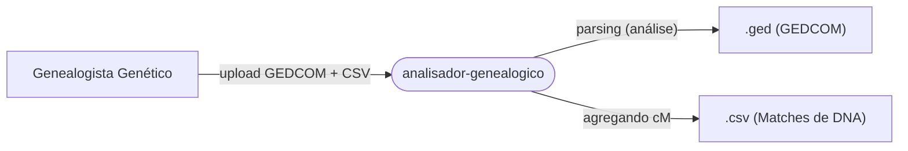

# analisador-genealogico (Analisador de Caminhos em Genealogia Genética)


## Nome e Descrição do Projeto

**analisador-genealogico** é uma aplicação web desenvolvida para genealogistas genéticos. Seu objetivo principal é identificar, calcular e visualizar conexões genealógicas entre uma pessoa raiz e suas correspondências de DNA, cruzando árvores GEDCOM (`.ged`) com listas de segmentos de DNA (`.csv`).

## Stack Tecnológica

O projeto conta com uma stack web moderna em Python, sem a necessidade de um banco de dados persistente:

- **Linguagem Principal:** Python 3
- **Framework Web:** Flask
- **Processamento de Dados:** Pandas (manipulação de CSV)
- **Grafos & Algoritmos:** NetworkX (busca de caminhos, BFS)
- **Leitura de GEDCOM:** Ged4py
- **Busca Aproximada (Fuzzy Matching):** TheFuzz
- **Frontend & UI:** HTML5, Jinja2, Bootstrap 5, Mermaid.js, Pyvis

## Arquitetura do Projeto

O sistema opera como um **Servidor Web Monolítico** com renderização do lado do servidor (SSR). Ele funciona puramente como uma ferramenta de análise sob demanda:

- **Gerenciamento de Estado:** Totalmente em memória (dicionários e grafos `networkx`). Não há banco de dados persistente. O estado é calculado por sessão/requisição.
- **Armazenamento de Arquivos:** Os arquivos enviados (`.ged` e `.csv`) são armazenados temporariamente em um diretório `uploads/` durante o processamento.
- **Fluxo de Processamento:** Ao receber uma requisição `POST`, o arquivo GEDCOM é processado e convertido em um grafo, as correspondências de DNA são agregadas a partir do CSV, e um algoritmo de busca de nomes por aproximação (*fuzzy matching*) é usado para encontrar caminhos até a pessoa raiz.



## Começando (Getting Started)

### Pré-requisitos
- Python 3.x
- pip (gerenciador de pacotes do Python)

### Instalação e Configuração

1. Clone ou navegue até o diretório do repositório.
2. Instale as dependências necessárias:
   ```bash
   pip install -r requirements.txt
   ```
3. Execute a aplicação Flask:
   ```bash
   python app.py
   ```
4. Acesse a interface web em `http://127.0.0.1:5000/`.

## Estrutura do Projeto

```text
analisador-genealogico/
├── app.py                      # Aplicação Flask: rotas e orquestração das requisições
├── requirements.txt            # Dependências do Python
├── reconstructed/              # Pacote com a lógica reconstruída e modularizada
│   ├── domain.py               # Entidades de domínio (PERSON, FAMILIA, DNA_MATCH) e limpeza de mojibake
│   ├── upload.py               # Upload e parsing de GEDCOM, construção do grafo networkx
│   ├── path_search.py          # Busca de caminhos diretos (MRCA) e indiretos (afinidade), Mermaid
│   └── dna_analysis.py         # Cruzamento GEDCOM × CSV de matches, fuzzy matching e previsão de parentesco
├── static/
│   └── graph_path_search.html  # HTML estático gerado para grafos interativos (Pyvis)
├── templates/
│   └── index.html              # Template principal da UI (Bootstrap 5, Mermaid.js)
└── uploads/                    # Armazenamento dos arquivos GEDCOM e CSV enviados (inclui exemplos)
```

### Testes

```text
tests/
├── fixtures/
│   ├── sample_dna.py           # GEDCOM e CSVs sintéticos para análise de DNA
│   └── sample_gedcom.py        # GEDCOM sintético para parsing e busca de caminhos
├── test_domain.py              # Entidades de domínio e correção de mojibake
├── test_upload.py              # Parsing de GEDCOM e construção do grafo
├── test_path_search.py         # Busca de ancestrais diretos e caminhos por afinidade
└── test_dna_analysis.py        # Agregação de segmentos, fuzzy matching e previsões por cM
```

## Principais Funcionalidades

- **Integração de GEDCOM & CSV:** Mescla a topologia da árvore (GEDCOM) com os dados genéticos (CSV).
- **Busca Aproximada de Nomes:** Algoritmo avançado para contornar "mojibake" (corrupção de codificação) e combinar nomes apesar de variações de grafia ou abreviações.
- **Previsões baseadas em cM:** Mapeia DNA compartilhado (centiMorgans) para prováveis graus de parentesco biológico.
- **Busca de Ancestrais Diretos:** Encontra o Ancestral Comum Mais Recente (MRCA - *Most Recent Common Ancestor*) e o caminho direto até 20 gerações de profundidade.
- **Busca de Caminhos Indiretos (Afinidade):** Utiliza uma Busca em Largura (BFS - *Breadth-First Search*) como alternativa para encontrar conexões por casamento e outras pontes de afinidade (até 40 saltos).
- **Redes Visuais:** Renderiza os caminhos da árvore genealógica de forma dinâmica usando Mermaid.js e Pyvis.

## Fluxo de Desenvolvimento

O projeto originalmente monolítico (o `app.py` legado possuía cerca de 888 linhas) foi **reconstruído e modularizado** com o framework [Reversa](https://github.com/sandeco/reversa): a lógica foi extraída para o pacote `reconstructed/`, e o `app.py` passou a apenas orquestrar as rotas Flask (~86 linhas).
- **CI/CD:** Não há pipelines de implantação automatizada ou arquivos Docker (Dockerfiles) configurados.
- **Deploy:** O `requirements.txt` inclui o Gunicorn, indicando um setup comum de implantação em produção padrão WSGI (ex: Heroku, AWS).

## Padrões de Código

- A lógica de negócio está modularizada no pacote `reconstructed/`, separada da camada web (`app.py`).
- O estado é mantido **em memória** (dicionários `people`, `families` e grafos `networkx`), não persistente, recalculado por sessão/requisição.
- Entidades de domínio (`Family`, `GenealogyGraph`, `DNAGroup`) e rotinas de limpeza de caracteres corrompidos (`demojibake`) ficam em `domain.py`.
- Busca de caminhos (direto por MRCA até 20 gerações e indireto por afinidade até 40 saltos) em `path_search.py`.
- Cruzamento GEDCOM × CSV, fuzzy matching e previsão de parentesco por faixas de cM em `dna_analysis.py`.

## Testes

- **Abordagem de Testes:** A suíte automatizada usa **pytest** (`pytest.ini` aponta para `tests/`) e conta com **47 testes** cobrindo parsing de GEDCOM, construção de grafo, entidades de domínio, busca de caminhos e análise de DNA (agregação de segmentos, fuzzy matching e previsões por cM).
- **Como rodar:**
  ```bash
  pip install -r requirements.txt pytest
  pytest
  ```

## Contribuindo

Ao contribuir para este projeto, por favor, considere as seguintes diretrizes:
1. Garanta que ajustes na lógica de *fuzzy matching* não aumentem os falsos positivos.
2. Se modificar os caminhos dos grafos (`networkx`), esteja ciente da sobrecarga de memória, uma vez que o estado é recalculado a cada requisição `POST`.
3. Evite adicionar requisitos de banco de dados persistente sem uma refatoração estrutural.
4. Adicione testes básicos para novas funcionalidades algorítmicas (como `find_ancestral_path` ou `find_indirect_path`) para melhorar a robustez do sistema.

## Autoria e Créditos
- Autor do Código Legado: [Sandro Azevedo](https://github.com/sssazevedo/analisador-genealogico)
- Autor do projeto Reversa: [Adriano Santos](https://github.com/Adriano1976)
- Autor do Framework Reversa: [Sandeco](https://github.com/sandeco/reversa)
- Fonte do Código Legado: [analisador-genealogico](https://github.com/sssazevedo/analisador-genealogico/tree/main)
- Documentação Antes: [mini-site do projeto](https://adriano1976.github.io/_reversa_docs/)
- Documentação Depois: [mini-site do projeto](https://adriano1976.github.io/_reversa_docs_v2/)

## Licença

Este repositório inclui um arquivo LICENSE com os termos de licenciamento. Consulte `LICENSE` para detalhes.

##
 
<br><br>

<div align="center">
  <p><b><h3> Contagem de visitantes </h3></b></p>  
  
   <br>
  
</div>
