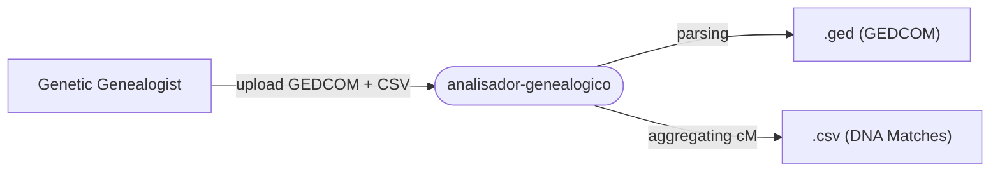

# analisador-genealogico (Genetic Genealogy Path Analyzer)


## Project Name and Description

**analisador-genealogico** is a web application designed for genetic genealogists. Its primary purpose is to identify, calculate, and visualize genealogical connections between a root person and their DNA matches by crossing GEDCOM (`.ged`) trees with lists of DNA segments (`.csv`).

## Technology Stack

The project relies on a modern Python web stack without the need for a persistent database:

- **Core Language:** Python 3
- **Web Framework:** Flask
- **Data Processing:** Pandas (CSV handling)
- **Graph & Algorithms:** NetworkX (path finding, BFS)
- **GEDCOM Parsing:** Ged4py
- **Fuzzy Matching:** TheFuzz
- **Frontend & UI:** HTML5, Jinja2, Bootstrap 5, Mermaid.js, Pyvis

## Project Architecture

The system operates as a **Monolithic Web Server** with server-side rendering (SSR). It functions purely as an on-demand analysis tool:

- **State Management:** Entirely in-memory (dictionaries and `networkx` graphs). There is no persistent database. State is calculated per session/request.
- **File Storage:** Uploaded files (`.ged` and `.csv`) are temporarily stored in an `uploads/` directory during processing.
- **Processing Flow:** Upon receiving a `POST` request, the GEDCOM file is parsed into a graph, the DNA matches are aggregated from the CSV, and a fuzzy name matching algorithm is used to find paths to the root person.



## Getting Started

### Prerequisites
- Python 3.x
- pip (Python package installer)

### Installation & Setup

1. Clone or navigate to the repository directory.
2. Install the required dependencies:
   ```bash
   pip install -r requirements.txt
   ```
3. Run the Flask application:
   ```bash
   python app.py
   ```
4. Access the web interface at `http://127.0.0.1:5000/`.

## Project Structure

```text
analisador-genealogico/
├── app.py                      # Main Flask application, parsing, routing, graph logic
├── requirements.txt            # Python dependencies
├── static/
│   └── graph_path_search.html  # Generated static HTML for interactive graphs (Pyvis)
├── templates/
│   └── index.html              # Main UI template (Bootstrap 5, Mermaid.js)
└── uploads/                    # Temporary storage for uploaded GEDCOM and CSV files
```

## Key Features

- **GEDCOM & CSV Integration:** Merges tree topology (GEDCOM) with genetic data (CSV).
- **Fuzzy Name Matching:** Advanced algorithm to counter "mojibake" (encoding corruption) and match names despite spelling variations or abbreviations.
- **cM-based Predictions:** Maps shared DNA (centiMorgans) to likely biological relationships.
- **Direct Ancestor Search:** Finds the Most Recent Common Ancestor (MRCA) and the direct path up to 20 generations deep.
- **Indirect Path Finding (Affinity):** Uses a fallback Breadth-First Search (BFS) to find connections by marriage and other affinity bridges (up to 40 hops).
- **Visual Networking:** Renders family tree paths dynamically using Mermaid.js and Pyvis.

## Development Workflow

The project currently operates as a standalone monolithic codebase (`app.py` is ~888 lines). 
- **CI/CD:** No automated deployment pipelines or Dockerfiles are configured.
- **Deployments:** The `requirements.txt` includes Gunicorn, indicating typical WSGI production deployment (e.g., Heroku, AWS).

## Coding Standards

- The logic is tightly integrated within `app.py`.
- Dictionaries (`people`, `families`) and NetworkX graphs are the primary data structures for memory management.
- Complex parsing logic (such as cleaning mojibake via `demojibake`) is encapsulated in specific helper functions before processing graph paths.

## Testing

- **Testing Approach:** Currently, there is an absence of automated unit or integration tests (no test files or frameworks detected). Any changes must be manually verified through the web UI by uploading test `.ged` and `.csv` files.

## Contributing

When contributing to this project, please consider the following guidelines:
1. Ensure that fuzzy matching logic adjustments do not increase false positives.
2. If modifying graph paths (`networkx`), be aware of the memory overhead since state is recalculated on every `POST`.
3. Avoid adding persistent database requirements without structural refactoring.
4. Add basic tests for new algorithmic features (like `find_ancestral_path` or `find_indirect_path`) to improve the robustness of the system.

## License

*(No license information explicitly provided in the documentation.)*
