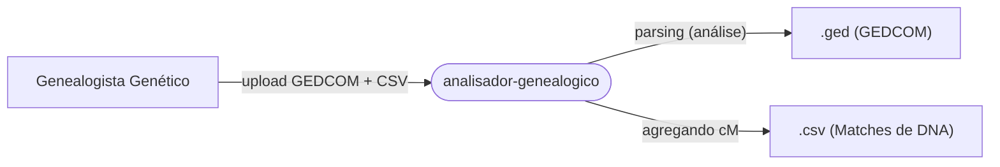

# analisador-genealogico (Analisador de Caminhos em Genealogia Genética)


## Nome e Descrição do Projeto

**analisador-genealogico** é uma aplicação web desenvolvida para genealogistas genéticos. Seu objetivo principal é identificar, calcular e visualizar conexões genealógicas entre uma pessoa raiz e suas correspondências de DNA, cruzando árvores GEDCOM (`.ged`) com listas de segmentos de DNA (`.csv`).

## Stack Tecnológica

O projeto conta com uma stack web moderna em Python, sem a necessidade de um banco de dados persistente:

- **Linguagem Principal:** Python 3
- **Framework Web:** Flask
- **Processamento de Dados:** Pandas (manipulação de CSV)
- **Grafos & Algoritmos:** NetworkX (busca de caminhos, BFS)
- **Leitura de GEDCOM:** Ged4py
- **Busca Aproximada (Fuzzy Matching):** TheFuzz
- **Frontend & UI:** HTML5, Jinja2, Bootstrap 5, Mermaid.js

## Arquitetura do Projeto

O sistema opera como um **Servidor Web Monolítico** com renderização do lado do servidor (SSR). Ele funciona puramente como uma ferramenta de análise sob demanda:

- **Gerenciamento de Estado:** Totalmente em memória (dicionários e grafos `networkx`). Não há banco de dados persistente. O estado é calculado por sessão/requisição.
- **Armazenamento de Arquivos:** Os arquivos enviados (`.ged` e `.csv`) são armazenados temporariamente em um diretório `uploads/` durante o processamento.
- **Fluxo de Processamento:** Ao receber uma requisição `POST`, o arquivo GEDCOM é processado e convertido em um grafo, as correspondências de DNA são agregadas a partir do CSV, e um algoritmo de busca de nomes por aproximação (*fuzzy matching*) é usado para encontrar caminhos até a pessoa raiz.


```mermaid
flowchart LR
    U["Genealogista Genético"]
    S(["analisador-genealogico"])
    C1[".ged (GEDCOM)"]:::ext
    C2[".csv (Matches de DNA)"]:::ext

    U -->|"upload GEDCOM + CSV"| S
    S -->|"parsing (análise)"| C1
    S -->|"agregando cM"| C2
```

## Começando (Getting Started)

### Pré-requisitos
- Python 3.x
- pip (gerenciador de pacotes do Python)

### Instalação e Configuração

1. Clone ou navegue até o diretório do repositório.
2. Instale as dependências necessárias (o `requirements.txt` fica na raiz do repositório):
   ```bash
   pip install -r requirements.txt
   ```
3. Execute a aplicação Flask (a partir da raiz do repositório):
   ```bash
   python src/app.py
   ```
4. Acesse a interface web em `http://127.0.0.1:5000/`.

## Estrutura do Projeto

```text
src/                            # raiz de código da aplicação
├── app.py                      # Aplicação Flask: rotas e orquestração das requisições
├── reconstructed/              # Pacote com a lógica reconstruída e modularizada
│   ├── domain.py               # Autoridade única de limpeza de mojibake (strip_bad_utf, demojibake)
│   ├── name_normalization.py   # Normalização e decomposição de nomes (norm_name, split_name_pt)
│   ├── upload.py               # Upload e parsing de GEDCOM, construção do grafo networkx
│   ├── family_navigation.py    # Resolução de pessoa por nome e navegação de parentesco
│   ├── path_finding.py         # Busca direta por ancestral comum (MRCA) e indireta por afinidade
│   ├── mermaid_render.py       # Emissão do diagrama Mermaid e contrato de escape do rótulo
│   ├── path_search.py          # Fachada da busca de caminhos, consumida pelo app.py
│   ├── csv_ingest.py           # Leitura do CSV de matches e agregação de cM por segmento
│   ├── matching.py             # Índices do GEDCOM e decisão de aceitação de candidatos
│   ├── dna_analysis.py         # Fachada do cruzamento GEDCOM × CSV, consumida pelo app.py
│   └── validate.py             # Validação do upload: nome visível, chave de conteúdo e GEDCOM
├── templates/
│   └── index.html              # Template principal da UI (Bootstrap 5, Mermaid.js)
└── uploads/                    # Criado em tempo de execução pelo app.py; recebe os arquivos enviados e não é versionado
```

Na raiz do repositório ficam `requirements.txt`, `pytest.ini`, `pyrefly.toml` e este `README.md`. A documentação original do projeto, em inglês, e o arquivo de ignore do módulo foram removidos: o primeiro anunciava uma biblioteca que o projeto abandonou na migração para Mermaid, e o segundo só continha regra para um artefato que o projeto deixou de gerar.

### Pastas do Framework Reversa

Os artefatos do Reversa ficam na raiz do repositório e não fazem parte do runtime da aplicação:

```text
.reversa/            # Configuração, estado, princípios, hooks e snapshots do framework
.agents/skills/      # Skills dos agentes do Reversa instalados
_reversa_sdd/        # Especificações extraídas do legado (o output_folder do framework)
_reversa_forward/    # Pipelines de evolução do código a partir das specs
_reversa_bugs/       # Intake, triagem e rastreabilidade de bugs
_reversa_refactor/   # Inventário de oportunidades de refatoração e suas transformações
_reversa_docs/       # Mini-site HTML de documentação (publicado no GitHub Pages)
```

A política de escrita do Reversa é definida em `.reversa/reversa-config.json`. Neste projeto `allowLegacyEdits` é `true`, com `allowedPaths` cobrindo `src/**`, `tests/**`, `README.md`, `pyrefly.toml` e `.vscode/**`; escritas fora desses caminhos são recusadas pelo framework.

### Testes

```text
tests/
├── fixtures/
│   ├── sample_dna.py                   # GEDCOM e CSVs sintéticos para análise de DNA
│   └── sample_gedcom.py                # GEDCOM sintético para parsing e busca de caminhos
├── test_domain.py                      # Limpeza de mojibake de nomes GEDCOM
├── test_upload.py                      # Parsing de GEDCOM e construção do grafo
├── test_path_search.py                 # Busca de ancestrais diretos e caminhos por afinidade
├── test_dna_analysis.py                # Agregação de segmentos, fuzzy matching e previsões por cM
├── test_characterization_matching.py   # Caracterização: congela a decisão de matching
├── test_characterization_mermaid.py    # Caracterização: congela a saída do diagrama Mermaid
├── test_mermaid_escape.py              # Contrato de escape do rótulo Mermaid
└── test_upload_seguranca.py            # Teto de requisição, chave derivada do conteúdo e recusa de GEDCOM inválido
```

## Principais Funcionalidades

- **Integração de GEDCOM & CSV:** Mescla a topologia da árvore (GEDCOM) com os dados genéticos (CSV).
- **Busca Aproximada de Nomes:** Algoritmo avançado para contornar "mojibake" (corrupção de codificação) e combinar nomes apesar de variações de grafia ou abreviações.
- **Previsões baseadas em cM:** Mapeia DNA compartilhado (centiMorgans) para prováveis graus de parentesco biológico.
- **Busca de Ancestrais Diretos:** Encontra o Ancestral Comum Mais Recente (MRCA - *Most Recent Common Ancestor*) e o caminho direto, com teto de 20 iterações de profundidade no BFS bidirecional.
- **Busca de Caminhos Indiretos (Afinidade):** Utiliza uma Busca em Largura (BFS - *Breadth-First Search*) como alternativa para encontrar conexões por casamento e outras pontes de afinidade (até 40 saltos).
- **Redes Visuais:** Renderiza os caminhos da árvore genealógica de forma dinâmica usando Mermaid.js.

## Fluxo de Desenvolvimento

O projeto originalmente monolítico (o `app.py` legado possuía cerca de 888 linhas) foi **reconstruído e modularizado** com o framework [Reversa](https://github.com/sandeco/reversa): a lógica foi extraída para o pacote `reconstructed/`, e o `app.py` passou a apenas orquestrar as rotas Flask (166 linhas — o crescimento sobre as 84 originais vem da validação de upload introduzida pela correção do BUG-20260929-QMLY).
- **CI/CD:** Não há pipeline de build ou de testes automatizado. O único workflow é o `.github/workflows/deploy-pages.yml`, que publica o mini-site de `_reversa_docs/` no GitHub Pages e dispara em pushes para a branch `main` (a branch principal do repositório é `master`). Não há Dockerfile nem `docker-compose.yml`.
- **Deploy:** O `requirements.txt` inclui o Gunicorn, indicando um setup comum de implantação em produção padrão WSGI (ex: Heroku, AWS).

## Padrões de Código

- A lógica de negócio está modularizada no pacote `reconstructed/`, separada da camada web (`app.py`).
- O estado é mantido **em memória** (dicionários `people`, `families` e grafos `networkx`), não persistente, recalculado por sessão/requisição.
- As rotinas de limpeza de caracteres corrompidos (`demojibake`, `strip_bad_utf`) ficam em `domain.py`, como autoridade única. As entidades `Family`, `GenealogyGraph` e `DNAGroup` viviam ali como arquitetura abandonada — nenhuma era instanciada em produção — e foram removidas em 2026-09-30.
- Busca de caminhos em `path_finding.py`: direto por MRCA (teto de 20 iterações de profundidade) e indireto por afinidade (até 40 saltos). A emissão do diagrama e o contrato de escape do rótulo ficam em `mermaid_render.py`, e `path_search.py` é a fachada consumida pelo `app.py`.
- Cruzamento GEDCOM × CSV, fuzzy matching e previsão de parentesco por faixas de cM em `dna_analysis.py` (fachada), com a leitura do CSV em `csv_ingest.py`, a decisão de aceitação de candidatos em `matching.py` e a normalização de nomes em `name_normalization.py`.
- Validação do upload (teto de requisição, chave de armazenamento derivada do conteúdo e recusa de GEDCOM inválido) em `validate.py`.

## Testes

- **Abordagem de Testes:** A suíte automatizada usa **pytest** (`pytest.ini` aponta para `tests/`) e conta com **87 funções de teste** — o total coletado é maior, por conta da parametrização — cobrindo limpeza de mojibake, parsing de GEDCOM, construção de grafo, busca de caminhos, análise de DNA (agregação de segmentos, fuzzy matching e previsões por cM), caracterização de matching e de Mermaid, e segurança do upload.
- **Como rodar (da raiz do repositório, onde está o `pytest.ini`):**
  ```bash
  pip install -r requirements.txt pytest
  pytest
  ```

## Contribuindo

Ao contribuir para este projeto, por favor, considere as seguintes diretrizes:
1. Garanta que ajustes na lógica de *fuzzy matching* não aumentem os falsos positivos.
2. Se modificar os caminhos dos grafos (`networkx`), esteja ciente da sobrecarga de memória, uma vez que o estado é recalculado a cada requisição `POST`.
3. Evite adicionar requisitos de banco de dados persistente sem uma refatoração estrutural.
4. Adicione testes básicos para novas funcionalidades algorítmicas (como `find_ancestral_path` ou `find_indirect_path`) para melhorar a robustez do sistema.

## Autoria e Créditos
- Autor do Código Legado: [Sandro Azevedo](https://github.com/sssazevedo/analisador-genealogico)
- Autor do projeto Reversa: [Adriano Santos](https://github.com/Adriano1976)
- Autor do Framework Reversa: [Sandeco](https://github.com/sandeco/reversa)
- Fonte do Código Legado: [analisador-genealogico](https://github.com/sssazevedo/analisador-genealogico/tree/main)
- Documentação Antes: [mini-site do projeto](https://adriano1976.github.io/_reversa_docs/)
- Documentação Depois: [mini-site do projeto](https://adriano1976.github.io/_reversa_docs_v2/)

## Licença

Este repositório inclui um arquivo LICENSE com os termos de licenciamento. Consulte `LICENSE` para detalhes.

##
 
<br><br>

<div align="center">
  <p><b><h3> Contagem de visitantes </h3></b></p>  
  
   <br>
  
</div>
