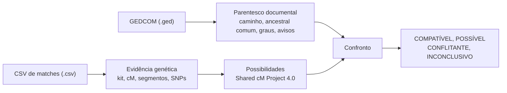
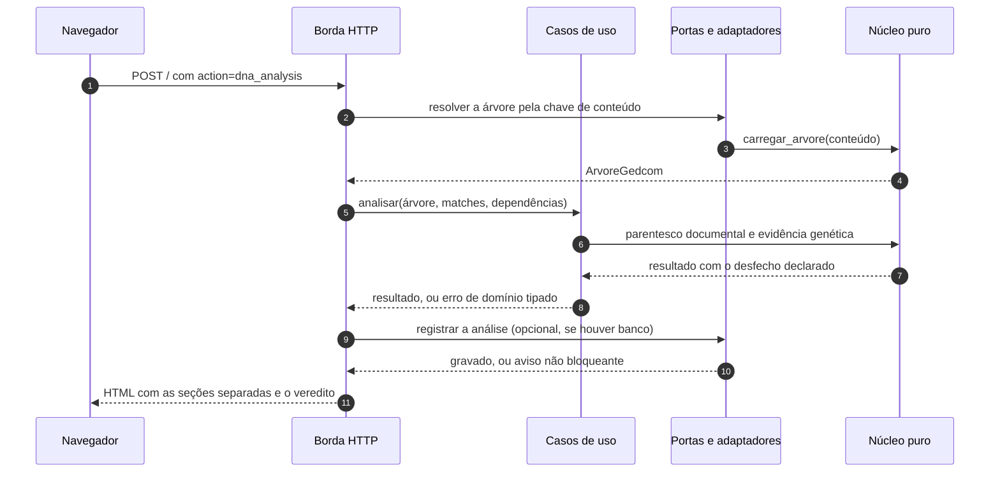
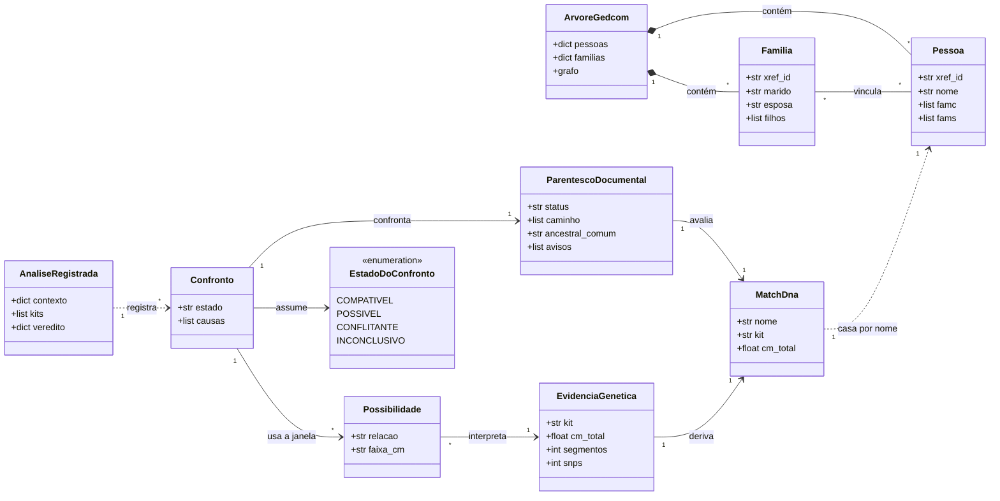
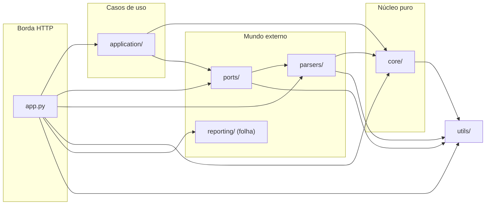

# Analisador Genealógico

<p align="center">
  
</p>


Aplicação web para genealogia genética. Cruza uma árvore GEDCOM (`.ged`) com uma lista de matches de DNA
(`.csv`) e apresenta caminhos documentais, evidências genéticas e possibilidades de parentesco sem tratar o
cM como confirmação genealógica.

## Regra de análise (GEDCOM, DNA e confronto)

A aplicação separa rigorosamente três coisas, e nunca deixa uma contaminar a outra:

1. **Parentesco documental** — o que o GEDCOM afirma: caminho, ancestral comum, distância geracional,
   homônimos, caminhos múltiplos, colapso de pedigree e a evidência de cada salto (registro de família e datas).
2. **Evidência genética** — o que o arquivo de DNA informa: kit, fonte, cM total, segmentos, maior segmento,
   SNPs, cromossomo e posições.
3. **Possibilidades e confronto** — o cM vira uma **lista** de relacionamentos compatíveis pela tabela
   publicada do Shared cM Project 4.0, e o confronto devolve um dos quatro estados:

| Estado | Significado |
| --- | --- |
| **COMPATÍVEL** | o parentesco documental não entra em conflito evidente com o cM observado |
| **POSSÍVEL** | a evidência permite o relacionamento, mas não confirma o caminho documental |
| **CONFLITANTE** | a incompatibilidade é significativa; verifique as causas listadas |
| **INCONCLUSIVO** | os dados não permitem avaliar (sem DNA, sem caminho, homônimo ou sem faixa publicada) |

Três invariantes que o código e a interface respeitam:

- **O GEDCOM determina o parentesco documental.** O DNA não altera, não corrige e não cria caminho
  genealógico.
- **O cM não é usado sozinho para afirmar parentesco.** `cM → conjunto de possibilidades`, nunca `cM → parentesco único`.
- **DNA compartilhado não confirma o caminho.** O máximo que a tela afirma é que existe compartilhamento; o
  parentesco documental é apresentado em seção própria, com fonte declarada.

## Stack Tecnológica

O projeto usa Python 3.14. O interpretador oficial é o ambiente virtual `.venv`; as dependências de runtime
estão fixadas em [`requirements.txt`](./requirements.txt).

| Tecnologia | Versão | Uso |
| --- | --- | --- |
| Flask | 3.1.3 | Aplicação web e renderização Jinja2 |
| waitress | 3.0.2 | Servidor WSGI |
| ged4py | 0.5.5 | Leitura de arquivos GEDCOM |
| NetworkX | 3.7 | Grafo e busca de caminhos |
| pandas | 3.0.6 | Ingestão e processamento de CSV |
| thefuzz | 0.22.1 | Comparação aproximada de nomes |
| RapidFuzz | 3.14.6 | Backend de matching, fixado para manter resultados reprodutíveis |
| python-Levenshtein | 0.27.5 | Backend de distância de edição |
| Bootstrap | 5.3.3 | Componentes da interface |
| Mermaid | 10 | Diagramas de caminhos |

## Arquitetura do Projeto

O Flask recebe os arquivos e renderiza HTML no servidor. O código tem quatro camadas com papéis
distintos: `src/app.py` é a borda HTTP, `src/application/` orquestra os casos de uso, `src/core/` decide
sem conhecer HTTP nem disco, e o mundo externo entra por `src/ports/`, onde ficam os `Protocol` das portas
e os adaptadores concretos, que por sua vez usam `src/parsers/`, `src/reporting/` e `src/utils/`.

- Os arquivos enviados são gravados na **pasta canônica de dados**, `src/uploads/`, sob nomes derivados do
  conteúdo. O destino é resolvido por `_pasta_uploads()` e pode ser sobreposto por `ANALISADOR_UPLOAD_FOLDER`
  — sobreposição que a suíte e o invólucro de paridade usam para não escreverem na pasta real; ver "Onde ficam
  os arquivos enviados". O diretório é armazenamento local persistente, não um diretório temporário.
- O histórico das análises é **opcional**: sem `DATABASE_URL` nada é gravado e a tela não muda; com a
  variável e o banco respondendo, a análise é registrada em uma transação única; se a gravação falhar, a
  análise **conclui e é exibida** e o operador recebe apenas um aviso não bloqueante. Nada é lido do banco
  para decidir o que a tela mostra: o banco é histórico, não fonte de decisão.
- O GEDCOM é reprocessado em cada `POST` que usa a árvore. A árvore existe **por requisição**: cada `POST`
  faz o parse do arquivo e passa o resultado como parâmetro para o núcleo, que é composto de funções puras.
  Não há estado de domínio compartilhado entre requisições nem entre threads — a aplicação impede outra
  instância na mesma porta, mas nenhuma requisição depende disso para estar correta.
- A lista completa de nomes da árvore, inclusive nomes de pessoas vivas, é incluída no HTML para preencher
  campos de sugestão. A aplicação não tem autenticação; não a exponha a uma rede compartilhada sem controles
  adicionais.

### Os três eixos da análise

O núcleo do produto é a separação. O GEDCOM alimenta um eixo, o CSV alimenta outro, e só no fim os dois se
encontram, em um veredito que nunca reescreve o parentesco documental.


```mermaid
flowchart LR
    G["GEDCOM (.ged)"] --> PD["Parentesco documental<br>caminho, ancestral comum, graus, avisos"]
    C["CSV de matches (.csv)"] --> EG["Evidência genética<br>kit, cM, segmentos, SNPs"]
    EG --> PO["Possibilidades<br>Shared cM Project 4.0"]
    PD --> CF["Confronto"]
    PO --> CF
    CF --> R["COMPATÍVEL, POSSÍVEL<br>CONFLITANTE, INCONCLUSIVO"]
```

### O ciclo de uma requisição

O caminho do dado, da borda até a tela, com o registro opcional no fim. A rota adapta, o caso de uso
orquestra e o núcleo decide.


```mermaid
sequenceDiagram
    autonumber
    participant N as Navegador
    participant A as Borda HTTP
    participant U as Casos de uso
    participant P as Portas e adaptadores
    participant C as Núcleo puro
    N->>A: POST / com action=dna_analysis
    A->>P: resolver a árvore pela chave de conteúdo
    P->>C: carregar_arvore(conteúdo)
    C-->>A: ArvoreGedcom
    A->>U: analisar(árvore, matches, dependências)
    U->>C: parentesco documental e evidência genética
    C-->>U: resultado com o desfecho declarado
    U-->>A: resultado, ou erro de domínio tipado
    A->>P: registrar a análise (opcional, se houver banco)
    P-->>A: gravado, ou aviso não bloqueante
    A-->>N: HTML com as seções separadas e o veredito
```

### UML do domínio

As entidades que sustentam a decisão e as relações entre elas. `ParentescoDocumental` nunca lê cM, e
`EvidenciaGenetica` nunca conhece o GEDCOM: eles só se encontram no `Confronto`.


```mermaid
classDiagram
    direction LR
    class ArvoreGedcom {
        +dict pessoas
        +dict familias
        +grafo
    }
    class Pessoa {
        +str xref_id
        +str nome
        +list famc
        +list fams
    }
    class Familia {
        +str xref_id
        +str marido
        +str esposa
        +list filhos
    }
    class MatchDna {
        +str nome
        +str kit
        +float cm_total
    }
    class ParentescoDocumental {
        +str status
        +list caminho
        +str ancestral_comum
        +list avisos
    }
    class EvidenciaGenetica {
        +str kit
        +float cm_total
        +int segmentos
        +int snps
    }
    class Possibilidade {
        +str relacao
        +str faixa_cm
    }
    class Confronto {
        +str estado
        +list causas
    }
    class AnaliseRegistrada {
        +dict contexto
        +list kits
        +dict veredito
    }
    class EstadoDoConfronto {
        <<enumeration>>
        COMPATIVEL
        POSSIVEL
        CONFLITANTE
        INCONCLUSIVO
    }
    ArvoreGedcom "1" *-- "*" Pessoa : contém
    ArvoreGedcom "1" *-- "*" Familia : contém
    Familia "*" -- "*" Pessoa : vincula
    MatchDna "1" ..> "1" Pessoa : casa por nome
    ParentescoDocumental "1" --> "1" MatchDna : avalia
    EvidenciaGenetica "1" --> "1" MatchDna : deriva
    Possibilidade "*" --> "1" EvidenciaGenetica : interpreta
    Confronto "1" --> "1" ParentescoDocumental : confronta
    Confronto "1" --> "*" Possibilidade : usa a janela
    Confronto --> EstadoDoConfronto : assume
    AnaliseRegistrada "1" ..> "*" Confronto : registra
```

### A fronteira entre o núcleo e o mundo

O núcleo é puro e depende apenas de `utils/`. Tudo o que é de fora entra por `ports/`, e as setas apontam
sempre para dentro: não há ciclo entre os oito pacotes.


```mermaid
flowchart LR
    subgraph borda["Borda HTTP"]
        APP["app.py"]
    end
    subgraph casos["Casos de uso"]
        UC["application/"]
    end
    subgraph externo["Mundo externo"]
        PORTS["ports/"]
        PARSERS["parsers/"]
        REPORT["reporting/ (folha)"]
    end
    subgraph puro["Núcleo puro"]
        CORE["core/"]
    end
    UTILS["utils/"]

    APP --> UC
    APP --> PORTS
    APP --> PARSERS
    APP --> CORE
    APP --> REPORT
    APP --> UTILS
    UC --> CORE
    UC --> PORTS
    PORTS --> PARSERS
    PORTS --> UTILS
    PARSERS --> CORE
    PARSERS --> UTILS
    CORE --> UTILS
```

## Começando (Getting Started)

### Pré-requisitos

- Python 3.14
- Git

### Instalação e Configuração

1. Clone o repositório e entre na pasta do projeto.
2. Crie e configure o ambiente oficial (PowerShell, na raiz do repositório):

   ```powershell
   py -3.14 -m venv .venv
   .\.venv\Scripts\python.exe -m pip install -r requirements.txt
   ```

3. Execute a aplicação:

   ```powershell
   .\.venv\Scripts\python.exe src\app.py
   ```

4. Acesse `http://127.0.0.1:5000/`. Por padrão, o servidor atende apenas a máquina local.

Para configurar outro ambiente, instale Python 3.14 e recrie `.venv`. Não use o Python global para executar
ou testar: o backend RapidFuzz participa da decisão de matching, e as versões instaladas estão pinadas para
reprodutibilidade.

### Configuração de execução

O bloco de entrada lê três variáveis de ambiente — todas com padrão declarado no código, então nada precisa
ser definido para subir a aplicação. A tabela inclui ainda a variável da pasta de upload, que é lida na
**importação** do módulo, e não no bloco de entrada:

| Variável | Padrão | Para que serve |
| --- | --- | --- |
| `ANALISADOR_HOST` | `127.0.0.1` | endereço de escuta. O padrão atende apenas a máquina local; use `0.0.0.0` para atender a rede |
| `ANALISADOR_PORT` | `5000` | porta de escuta |
| `ANALISADOR_THREADS` | `4` | número de threads do servidor |
| `ANALISADOR_UPLOAD_FOLDER` | *(sem padrão: usa `<diretório do app>/uploads`)* | pasta que recebe os arquivos enviados. É uma **sobreposição de processo**, usada pela suíte e pelo invólucro de paridade para não escreverem na pasta de dados; ver "Onde ficam os arquivos enviados" |

#### Abrir a aplicação para a rede

> **A aplicação não tem autenticação.** Qualquer equipamento que alcance a porta pode acessar a interface e
> enviar arquivos. O padrão é fechado; abrir a rede é uma decisão de quem opera.

No PowerShell, a partir da raiz do repositório:

```powershell
$env:ANALISADOR_HOST = "0.0.0.0"
.\.venv\Scripts\python.exe src\app.py
```

A inicialização informa o endereço em uso (`Servindo com waitress em http://0.0.0.0:5000 ...`). De outro
equipamento da mesma rede, acesse `http://<ip-da-máquina>:5000/`. Em rede compartilhada, mantenha o padrão e
não defina a variável.

#### Onde ficam os arquivos enviados

Os arquivos enviados são gravados em **`src/uploads`**, dentro do repositório, e essa é a **única** pasta que
os recebe. A aplicação resolve a pasta a partir do próprio arquivo (`_pasta_uploads()`), ancorada em
`__file__` e nunca no diretório corrente, e a cria na importação do módulo. Nada precisa ser configurado para
subir a aplicação.

A variável `ANALISADOR_UPLOAD_FOLDER` existe como **sobreposição de processo**, não como modo de operação. Ela
é lida na **importação**, não a cada requisição — defini-la depois de subir não muda nada. Quem depende dela é
o teste: `tests/conftest.py` e `tests/rodar_paridade.py` a apontam para uma pasta descartável, para que nem a
suíte nem o instrumento de paridade escrevam na pasta de dados do operador.

No modo com contêiner, a mesma pasta do repositório é montada no alvo que a aplicação já deriva
(`/app/src/uploads`), sem variável de ambiente envolvida: é a linha de `volumes:` do serviço `app`, em
`docker-compose.yml`, e ela é `./src/uploads:/app/src/uploads`.

> **O que protege este dado.** Duas guardas, e só duas:
>
> - o `.gitignore` cobre `uploads/` em qualquer profundidade, então o dado **nunca** é versionado;
> - o `.dockerignore` reexclui `src/uploads/` do contexto de build, então o dado **nunca** é enviado ao
>   daemon do Docker. A reexclusão vem **depois** de `!src/**`, porque no `.dockerignore` a **última regra que
>   casa vence** — invertidas as duas linhas, o dado voltaria ao contexto de build sem que nenhuma linha
>   tivesse sido removida.
>
> As duas são presas por teste em `tests/test_guardas_do_armazenamento.py`: tirá-las faz a suíte falhar, e o
> teste confere também a ordem acima, com verificação por mutação.
>
> **A pasta é não rastreada, e isso tem preço.** `git clean -xdf` — e também `-Xdf`, que remove só o que é
> ignorado — **apaga `src/uploads` inteira**. Faça backup periódico para fora do repositório: ela é a única
> cópia do dado.

A manutenção da pasta fica em `tests/manutencao_de_uploads.py`, com quatro verbos: `manifesto` (a lista
revisável do resíduo de instrumento), `expurgo` (remove **apenas** o que estiver no manifesto, e sempre tem
simulação), `duplicatas` (relata cópias byte a byte idênticas, sem removê-las) e `migrar` (cópia verificada
por `sha256`, sem papel no modo de operação — ferramenta de cópia avulsa):

```powershell
.\.venv\Scripts\python.exe tests\manutencao_de_uploads.py manifesto --pasta src\uploads --saida manifesto.txt
.\.venv\Scripts\python.exe tests\manutencao_de_uploads.py expurgo --manifesto manifesto.txt --dry-run
.\.venv\Scripts\python.exe tests\manutencao_de_uploads.py expurgo --manifesto manifesto.txt --aplicar
.\.venv\Scripts\python.exe tests\manutencao_de_uploads.py duplicatas --pasta src\uploads
```

#### Uma instância por vez

A aplicação **recusa subir** se já houver uma instância atendendo no endereço e na porta configurados. A
segunda execução termina com código de saída diferente de zero e uma mensagem que nomeia o endereço e a
porta:

```text
Recusando subir: 127.0.0.1:5000 ja esta em uso (...). Encerre o processo que ja esta no ar, ou suba esta instancia em outra porta com ANALISADOR_PORT.
```

O trecho entre parênteses é o diagnóstico do sistema operacional. Cada processo usa a mesma pasta canônica de
dados, então duas instâncias sobre a mesma pasta competiriam pelo mesmo armazenamento, e requisições do
mesmo operador cairiam em instâncias diferentes. Encerre a instância anterior (Ctrl+C) antes de subir outra, ou
use outra porta com `ANALISADOR_PORT`.

## Estrutura do Projeto

```text
src/                            # raiz de código: 34 arquivos, 4.816 linhas não vazias
├── app.py                      # Borda HTTP: rota única com despacho por action, variáveis de ambiente, guarda de instância única e montagem das dependências
├── application/                # Casos de uso: orquestram o núcleo e traduzem o desfecho
│   ├── upload_gedcom.py        # Upload: decide se pode gravar, grava sob chave de conteúdo e carrega a árvore
│   ├── dna_analysis.py         # Análise: cruza GEDCOM e CSV pelas três etapas
│   ├── path_search.py          # Busca de caminho
│   └── traducao.py             # Traduz exceção de domínio de volta para o literal da tela
├── core/                       # Núcleo puro: decide sem HTTP, sem I/O e sem estado de módulo
│   ├── documentary_relationship.py  # Parentesco documental: caminho, ancestral comum, homônimos, caminhos múltiplos, colapso de pedigree
│   ├── genetic_evidence.py     # Evidência genética: kits, cM, segmentos, SNPs (nunca soma kits diferentes)
│   ├── relationship_hypotheses.py   # cM → possibilidades, pela tabela publicada do Shared cM Project 4.0
│   ├── evidence_comparison.py  # Confronto GEDCOM × DNA: COMPATÍVEL, POSSÍVEL, CONFLITANTE, INCONCLUSIVO
│   ├── matching.py             # Índices do GEDCOM e decisão de aceitação de candidatos
│   ├── name_normalization.py   # Normalização e decomposição de nomes
│   ├── path_finding.py         # Caminho entre duas pessoas, na árvore recebida por parâmetro
│   ├── family_navigation.py    # Quem é parente de quem, na árvore recebida por parâmetro
│   ├── dna_analysis.py         # Fachada do cruzamento para o caso de uso
│   ├── path_search.py          # Fachada da busca de caminhos para o caso de uso
│   ├── diagram_domain.py       # Consultas de domínio que o desenho do Mermaid precisa
│   ├── erros.py                # Exceções de domínio tipadas, com raiz ErroDeDominio
│   ├── registro.py             # Nome de exibição e identificador do registro
│   └── cm_estimator.py         # LEGADO: faixas de cM escritas à mão, fora do fluxo
├── ports/                      # A fronteira: os Protocol das portas e os adaptadores concretos
│   ├── __init__.py             # As portas e o conjunto de dependências que o caso de uso recebe
│   └── adaptadores.py          # Armazenamento em disco, carregador de GEDCOM e registro em Postgres
├── parsers/                    # Leitura do mundo de fora
│   ├── gedcom_parser.py        # Parsing do GEDCOM e construção do grafo networkx
│   └── csv_ingest.py           # CSV de matches: encoding, separador, preâmbulo e linha torta, com agregação por match
├── reporting/                  # Transformação de resultado em apresentação
│   └── mermaid_render.py       # Emissão do diagrama Mermaid e contrato de escape do rótulo
├── utils/                      # Utilitários transversais
│   ├── text_cleaning.py        # Autoridade única de limpeza de mojibake (strip_bad_utf, demojibake)
│   ├── number_format.py        # Formatação de cM, SNPs e posições
│   ├── name_keys.py            # Normalização de um nome para forma comparável
│   └── validate.py             # Validação do upload: nome visível, chave de conteúdo e conteúdo do GEDCOM
├── templates/
│   └── index.html              # Template principal da UI (Bootstrap 5, Mermaid.js e ícone da aba)
├── assets/
│   └── apple-touch-icon.png    # Arte canônica do ícone de atalho, servida em /apple-touch-icon.png
└── uploads/                    # Criado em tempo de execução pela aplicação; recebe os arquivos enviados e é a pasta canônica de dados, a única. Não é versionada
```

Na raiz ficam `requirements.txt`, `pytest.ini`, `pyrefly.toml`, `docker-compose.yml`, `init.sql`,
`.dockerignore`, `LICENSE` e este README.

### Pastas do Framework Reversa

Os artefatos do Reversa ficam na raiz do repositório e não fazem parte do runtime da aplicação:

```text
.reversa/            # Configuração, estado, princípios, hooks e snapshots do framework
.agents/skills/      # Skills dos agentes do Reversa instalados
.github/skills/      # Skills auxiliares do repositório (README, convenções de git, auditoria)
_reversa_sdd/        # Especificações extraídas do legado (o output_folder do framework)
_reversa_forward/    # Pipelines de evolução do código a partir das specs
_reversa_bugs/       # Intake, triagem e rastreabilidade de bugs
_reversa_refactor/   # Inventário de oportunidades de refatoração e suas transformações
_reversa_docs/       # Mini-site HTML de documentação, com os dados em assets/data/
docs/                # Espelho publicado do mini-site
```

O `docs/` é um espelho de `_reversa_docs/`. Com a remoção do workflow de deploy em 2026-10-08, a
publicação da documentação passou a sair desta pasta; por isso, depois de regenerar o mini-site, os dois
precisam ser sincronizados, senão o site publicado continua mostrando a versão anterior sem avisar ninguém.

### Testes

```text
tests/
├── conftest.py                          # Coleta e ambiente temporário da suíte
├── fixtures/
│   ├── arvore_atual.py                  # A árvore carregada pelo último parse
│   ├── helpers.py                       # Helpers compartilhados das fixtures
│   ├── sample_dna.py                    # GEDCOM e CSVs sintéticos para a análise de DNA
│   └── sample_gedcom.py                 # GEDCOM sintético para parsing e busca de caminhos
├── icone_de_atalho.py                   # Receita de derivação da arte do ícone de atalho (não é teste)
├── test_ambiente_temporario_da_suite.py # O diretório temporário da suíte
├── test_arvore_devolvida.py             # A árvore devolvida pelo parse como valor
├── test_characterization_matching.py    # Caracterização: congela a decisão de matching
├── test_characterization_mermaid.py     # Caracterização: congela a saída Mermaid
├── test_confrontacao_gedcom_dna.py      # Regra final: os 10 cenários exigidos de confronto
├── test_dependencias_nucleo.py          # Guardas estruturais do núcleo puro, verificadas por AST
├── test_deriva_da_arte.py               # A arte de runtime contra a arte canônica
├── test_desfecho_do_resultado.py        # O modo de renderização vem do desfecho, não do texto
├── test_dna_analysis.py                 # Agregação de segmentos, fuzzy matching e previsão por cM
├── test_domain.py                       # Limpeza de mojibake de nomes GEDCOM
├── test_erros_de_dominio.py             # As exceções de domínio tipadas
├── test_formatacao_cm.py                # Formatação do total de cM no cartão de resultado
├── test_icone_de_atalho.py              # A rota do ícone de atalho
├── test_mermaid_escape.py               # Contrato de escape do rótulo Mermaid
├── test_path_search.py                  # Busca de ancestrais diretos e caminhos por afinidade
├── test_persistencia_desabilitada.py    # Persistência desabilitada: nada é gravado
├── test_persistencia_indisponivel.py    # Persistência indisponível: a análise conclui com aviso
├── test_porta_de_armazenamento.py       # A porta de armazenamento e a chave derivada do conteúdo
├── test_projecao_da_analise.py          # A projeção do resultado no payload da porta
├── test_registro_de_analises.py         # O adaptador Postgres contra o banco (pulado sem banco)
├── test_servidor_producao.py            # Bloco de entrada: waitress, instância única e endereço padrão
├── test_traducao_de_erros.py            # A tabela que devolve o literal da tela
├── test_upload.py                       # Parsing de GEDCOM e construção do grafo
└── test_upload_seguranca.py             # Teto de requisição, chave de conteúdo e recusa de GEDCOM inválido
```

## Principais Funcionalidades

- **Integração de GEDCOM e CSV:** cruza a topologia da árvore com os dados genéticos sem misturar as
  evidências; elas aparecem em seções separadas.
- **Leitura tolerante de CSV:** reconhece `,`, `;`, TAB e `|`, localiza cabeçalhos após preâmbulos e informa
  linhas irregulares em vez de abortar a leitura.
- **Busca aproximada de nomes:** combina variações de grafia e abreviações.
- **Possibilidades pelo DNA:** apresenta relações compatíveis segundo o Shared cM Project 4.0, sem afirmar
  um parentesco único.
- **Confronto GEDCOM × DNA:** retorna COMPATÍVEL, POSSÍVEL, CONFLITANTE ou INCONCLUSIVO e explica as causas
  relevantes.
- **Alertas documentais:** sinaliza datas impossíveis, homônimos, caminhos múltiplos e colapso de pedigree.
- **Busca de caminhos:** localiza ancestrais comuns e conexões indiretas por afinidade.
- **Redes Visuais:** Renderiza os caminhos da árvore genealógica de forma dinâmica usando Mermaid.js.
- **Histórico opcional em PostgreSQL:** registra cada análise em uma transação única quando há
  `DATABASE_URL` configurada, e funciona igual sem banco. A gravação nunca bloqueia nem altera o que a
  tela mostra: se falhar, o operador recebe um aviso e o resultado continua na tela.

## Fluxo de Desenvolvimento

O código está organizado em `src/`, separando rotas Flask, parsing, domínio, apresentação e utilitários. O
framework [Reversa](https://github.com/sandeco/reversa) mantém especificações e documentação em pastas próprias.

- **CI/CD:** não há workflow de integração contínua no repositório; a suíte é executada localmente. A
  publicação da documentação passou a sair da pasta `docs/`, que espelha `_reversa_docs/`.
- **Execução:** `waitress` atende a aplicação; não há etapa de build. Use o Python do `.venv` e as
  dependências fixadas em `requirements.txt`.

## Padrões de Código

- A lógica de negócio está modularizada em `src/` nos pacotes `parsers/`, `core/`, `reporting/` e `utils/`,
  separada da camada web (`app.py`).
- A regra final da análise fica em módulos separados: `documentary_relationship` (GEDCOM),
  `genetic_evidence` (CSV), `relationship_hypotheses` (Shared cM Project 4.0) e `evidence_comparison`
  (confronto). O DNA não altera o parentesco documental.
- `utils/number_format.py` é a autoridade única de formatação numérica. O arredondamento ocorre apenas na
  apresentação.
- A árvore é montada a cada requisição e passada ao núcleo como parâmetro; não há estado de domínio compartilhado
  entre threads. Os arquivos enviados ficam em `src/uploads`, a única pasta canônica de dados; o que a análise
  produziu vai para o banco apenas
  se houver `DATABASE_URL`, e nada é lido de volta para decidir o que a tela mostra.
- A limpeza de caracteres corrompidos (`demojibake`, `strip_bad_utf`) é centralizada em `text_cleaning.py`.
- `path_finding.py` busca caminhos; `mermaid_render.py` emite diagramas com rótulos escapados.
- `dna_analysis.py` coordena o cruzamento; `csv_ingest.py`, `matching.py` e `name_normalization.py`
  cuidam da leitura e da correspondência de nomes.
- `validate.py` valida uploads, aplica o limite da requisição e deriva chaves de armazenamento do conteúdo.

## Testes

- A suíte usa **pytest**; `pytest.ini` configura `tests/` como diretório de testes. A medição com
  `pytest-cov` em 2026-10-08 registrou **88% de cobertura em `src/`** (1.871 instruções, 223 descobertas),
  com **302 testes aprovados e 8 pulados**. O resultado varia conforme as alterações; as specs em
  [`_reversa_sdd/`](./_reversa_sdd/) indicam componentes que ainda podem receber mais testes.
- Os **8 pulos** são os testes do adaptador de persistência: eles só executam com o driver e um banco
  disponíveis, e sem `DATABASE_URL` a suíte roda inteira sem banco, de propósito.
- Instale as dependências de teste no ambiente oficial e execute os testes:

  ```powershell
  .\.venv\Scripts\python.exe -m pip install pytest pytest-cov
  .\.venv\Scripts\python.exe -m pytest
  .\.venv\Scripts\python.exe -m pytest --cov=src --cov-report=term-missing
  ```

- A **paridade diferencial** contra o oráculo congelado do legado é medida por um invólucro, que isola a pasta
  de upload antes de lançar o instrumento:

  ```powershell
  .\.venv\Scripts\python.exe tests\rodar_paridade.py
  ```

  O `harness.py` é o instrumento e **não** deve ser executado direto: sem o invólucro ele escreve as sondas de
  GEDCOM e as fixtures de DNA na pasta real de uploads, que é justamente o resíduo que a feature 010 corrigiu.

## Contribuindo

Ao contribuir para este projeto, por favor, considere as seguintes diretrizes:

1. Garanta que ajustes na lógica de *fuzzy matching* não aumentem os falsos positivos.
2. Ao modificar os grafos (`networkx`), preserve os testes de caracterização e lembre que o núcleo recebe a
   árvore por parâmetro: funções de `src/core/` não leem nem escrevem estado de módulo.
3. Novas regras algorítmicas devem vir acompanhadas de testes; verifique também a cobertura dos módulos afetados.

## Autoria e Créditos

- Autor do Código Legado: [Sandro Azevedo](https://github.com/sssazevedo/analisador-genealogico)
- Autor do projeto Reversa: [Adriano Santos](https://github.com/Adriano1976)
- Autor do Framework Reversa: [Sandeco](https://github.com/sandeco/reversa)
- Fonte do Código Legado: [analisador-genealogico](https://github.com/sssazevedo/analisador-genealogico/tree/main)
- Documentação Antes: [mini-site da extração original](https://adriano1976.github.io/_reversa_docs/) — o
  sistema legado, com 10 módulos funcionais, como foi lido antes da reconstrução
- Documentação Depois: [mini-site da reconstrução](https://adriano1976.github.io/_reversa_docs_v2/) — a
  versão publicada em 2026-10-06; o mini-site atual, regenerado em 2026-10-08, está em
  [`_reversa_docs/`](./_reversa_docs/) e no espelho [`docs/`](./docs/)

## Licença

Este repositório inclui um arquivo [LICENSE](./LICENSE) com os termos de licenciamento.
