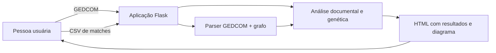

# Analisador Genealógico


Aplicação web para genealogia genética. Cruza uma árvore GEDCOM (`.ged`) com uma lista de matches de DNA
(`.csv`) e apresenta caminhos documentais, evidências genéticas e possibilidades de parentesco sem tratar o
cM como confirmação genealógica.

## Regra de análise (GEDCOM, DNA e confronto)

A aplicação separa rigorosamente três coisas, e nunca deixa uma contaminar a outra:

1. **Parentesco documental** — o que o GEDCOM afirma: caminho, ancestral comum, distância geracional,
   homônimos, caminhos múltiplos, colapso de pedigree e a evidência de cada salto (registro de família e datas).
2. **Evidência genética** — o que o arquivo de DNA informa: kit, fonte, cM total, segmentos, maior segmento,
   SNPs, cromossomo e posições.
3. **Possibilidades e confronto** — o cM vira uma **lista** de relacionamentos compatíveis pela tabela
   publicada do Shared cM Project 4.0, e o confronto devolve um dos quatro estados:

| Estado | Significado |
| --- | --- |
| **COMPATÍVEL** | o parentesco documental não entra em conflito evidente com o cM observado |
| **POSSÍVEL** | a evidência permite o relacionamento, mas não confirma o caminho documental |
| **CONFLITANTE** | a incompatibilidade é significativa; verifique as causas listadas |
| **INCONCLUSIVO** | os dados não permitem avaliar (sem DNA, sem caminho, homônimo ou sem faixa publicada) |

Três invariantes que o código e a interface respeitam:

- **O GEDCOM determina o parentesco documental.** O DNA não altera, não corrige e não cria caminho
  genealógico.
- **O cM não é usado sozinho para afirmar parentesco.** `cM → conjunto de possibilidades`, nunca `cM → parentesco único`.
- **DNA compartilhado não confirma o caminho.** O máximo que a tela afirma é que existe compartilhamento; o
  parentesco documental é apresentado em seção própria, com fonte declarada.

## Stack Tecnológica

O projeto usa Python 3.14. O interpretador oficial é o ambiente virtual `.venv`; as dependências de runtime
estão fixadas em [`requirements.txt`](./requirements.txt).

| Tecnologia | Versão | Uso |
| --- | --- | --- |
| Flask | 3.1.3 | Aplicação web e renderização Jinja2 |
| waitress | 3.0.2 | Servidor WSGI |
| ged4py | 0.5.5 | Leitura de arquivos GEDCOM |
| NetworkX | 3.7 | Grafo e busca de caminhos |
| pandas | 3.0.6 | Ingestão e processamento de CSV |
| thefuzz | 0.22.1 | Comparação aproximada de nomes |
| RapidFuzz | 3.14.6 | Backend de matching, fixado para manter resultados reprodutíveis |
| python-Levenshtein | 0.27.5 | Backend de distância de edição |
| Bootstrap | 5.3.3 | Componentes da interface |
| Mermaid | 10 | Diagramas de caminhos |

## Arquitetura do Projeto

O Flask recebe os arquivos e renderiza HTML no servidor. Os módulos em `src/core/`, `src/parsers/`,
`src/reporting/` e `src/utils/` implementam o domínio e a apresentação dos resultados.

- Os arquivos enviados são gravados em `src/uploads/` sob nomes derivados do conteúdo. Esse diretório é
  armazenamento local persistente; não é um diretório temporário de processamento.
- Não há banco de dados nem histórico persistido de análises. O GEDCOM é reprocessado em cada `POST` que usa a árvore.
- A árvore existe **por requisição**: cada `POST` faz o parse do arquivo e passa o resultado como parâmetro para o
  núcleo, que é composto de funções puras. Não há estado de domínio compartilhado entre requisições nem entre
  threads — a aplicação impede outra instância na mesma porta, mas nenhuma requisição depende disso para estar
  correta.
- A lista completa de nomes da árvore, inclusive nomes de pessoas vivas, é incluída no HTML para preencher
  campos de sugestão. A aplicação não tem autenticação; não a exponha a uma rede compartilhada sem controles
  adicionais.


```mermaid
flowchart LR
    U["Pessoa usuária"] -->|"GEDCOM"| W["Aplicação Flask"]
    U -->|"CSV de matches"| W
    W --> P["Parser GEDCOM + grafo"]
    W --> D["Análise documental e genética"]
    P --> D
    D --> H["HTML com resultados e diagrama"]
    H --> U
```

## Começando (Getting Started)

### Pré-requisitos

- Python 3.14
- Git

### Instalação e Configuração

1. Clone o repositório e entre na pasta do projeto.
2. Crie e configure o ambiente oficial (PowerShell, na raiz do repositório):

   ```powershell
   py -3.14 -m venv .venv
   .\.venv\Scripts\python.exe -m pip install -r requirements.txt
   ```

3. Execute a aplicação:

   ```powershell
   .\.venv\Scripts\python.exe src\app.py
   ```

4. Acesse `http://127.0.0.1:5000/`. Por padrão, o servidor atende apenas a máquina local.

Para configurar outro ambiente, instale Python 3.14 e recrie `.venv`. Não use o Python global para executar
ou testar: o backend RapidFuzz participa da decisão de matching, e as versões instaladas estão pinadas para
reprodutibilidade.

### Configuração de execução

O bloco de entrada lê três variáveis de ambiente. Todas têm padrão declarado no código, então nada precisa
ser definido para subir a aplicação:

| Variável | Padrão | Para que serve |
| --- | --- | --- |
| `ANALISADOR_HOST` | `127.0.0.1` | endereço de escuta. O padrão atende apenas a máquina local; use `0.0.0.0` para atender a rede |
| `ANALISADOR_PORT` | `5000` | porta de escuta |
| `ANALISADOR_THREADS` | `4` | número de threads do servidor |

#### Abrir a aplicação para a rede

> **A aplicação não tem autenticação.** Qualquer equipamento que alcance a porta pode acessar a interface e
> enviar arquivos. O padrão é fechado; abrir a rede é uma decisão de quem opera.

No PowerShell, a partir da raiz do repositório:

```powershell
$env:ANALISADOR_HOST = "0.0.0.0"
.\.venv\Scripts\python.exe src\app.py
```

A inicialização informa o endereço em uso (`Servindo com waitress em http://0.0.0.0:5000 ...`). De outro
equipamento da mesma rede, acesse `http://<ip-da-máquina>:5000/`. Em rede compartilhada, mantenha o padrão e
não defina a variável.

#### Uma instância por vez

A aplicação **recusa subir** se já houver uma instância atendendo no endereço e na porta configurados. A
segunda execução termina com código de saída diferente de zero e uma mensagem que nomeia o endereço e a
porta:

```text
Recusando subir: 127.0.0.1:5000 ja esta em uso (...). Encerre o processo que ja esta no ar, ou suba esta instancia em outra porta com ANALISADOR_PORT.
```

O trecho entre parênteses é o diagnóstico do sistema operacional. Cada processo lê o mesmo diretório de uploads
`src/uploads/`, então duas instâncias sobre a mesma pasta competiriam pelo mesmo armazenamento, e requisições do
mesmo operador cairiam em instâncias diferentes. Encerre a instância anterior (Ctrl+C) antes de subir outra, ou
use outra porta com `ANALISADOR_PORT`.

## Estrutura do Projeto

```text
src/                            # raiz de código da aplicação
├── app.py                      # Aplicação Flask: rotas e orquestração das requisições
├── parsers/                    # Leitura do mundo de fora: o arquivo GEDCOM e o CSV de matches
│   ├── gedcom_parser.py        # Leitura do GEDCOM e construção do grafo networkx
│   └── csv_ingest.py           # Leitura do CSV de matches: encoding, separador, preâmbulo e linha torta — com agregação de cM por segmento
├── core/                       # Decisão sobre o que foi lido, sem saber de HTTP
│   ├── documentary_relationship.py  # Parentesco DOCUMENTAL: caminho, MRCA, homônimos, caminhos múltiplos, colapso de pedigree, datas
│   ├── genetic_evidence.py     # Evidência GENÉTICA: kits, cM, segmentos, SNPs, cromossomo, posições (nunca soma kits diferentes)
│   ├── relationship_hypotheses.py   # cM → possibilidades, pela tabela publicada do Shared cM Project 4.0
│   ├── evidence_comparison.py  # Confronto GEDCOM × DNA: COMPATÍVEL / POSSÍVEL / CONFLITANTE / INCONCLUSIVO
│   ├── cm_estimator.py         # LEGADO: faixas de cM escritas à mão, mantidas só como superfície de compatibilidade
│   ├── matching.py             # Índices do GEDCOM e decisão de aceitação de candidatos
│   ├── name_normalization.py   # Normalização e decomposição de nomes (norm_name, split_name_pt)
│   ├── path_finding.py         # Busca direta por ancestral comum (MRCA) e indireta por afinidade
│   ├── family_navigation.py    # Resolução de pessoa por nome e navegação de parentesco
│   ├── gedcom_state.py         # Estado do GEDCOM carregado: pessoas, famílias e grafo
│   ├── path_search.py          # Fachada da busca de caminhos, consumida pelo app.py
│   └── dna_analysis.py         # Orquestra as três etapas do cruzamento, consumida pelo app.py
├── reporting/                  # Transformação de resultado em apresentação
│   └── mermaid_render.py       # Emissão do diagrama Mermaid e contrato de escape do rótulo
├── utils/                      # Utilitários transversais
│   ├── text_cleaning.py        # Autoridade única de limpeza de mojibake (strip_bad_utf, demojibake)
│   ├── number_format.py        # Formatação de cM, SNPs e posições
│   └── validate.py             # Validação do upload: nome visível, chave de conteúdo e GEDCOM
├── templates/
│   └── index.html              # Template principal da UI (Bootstrap 5, Mermaid.js)
└── uploads/                    # Criado em tempo de execução pelo app.py; recebe os arquivos enviados e não é versionado
```

Na raiz ficam `requirements.txt`, `pytest.ini`, `pyrefly.toml` e este README.

### Pastas do Framework Reversa

Os artefatos do Reversa ficam na raiz do repositório e não fazem parte do runtime da aplicação:

```text
.reversa/            # Configuração, estado, princípios, hooks e snapshots do framework
.agents/skills/      # Skills dos agentes do Reversa instalados
_reversa_sdd/        # Especificações extraídas do legado (o output_folder do framework)
_reversa_forward/    # Pipelines de evolução do código a partir das specs
_reversa_bugs/       # Intake, triagem e rastreabilidade de bugs
_reversa_refactor/   # Inventário de oportunidades de refatoração e suas transformações
_reversa_docs/       # Mini-site HTML de documentação (publicado no GitHub Pages)
```

### Testes

```text
tests/
├── fixtures/
│   ├── sample_dna.py                   # GEDCOM e CSVs sintéticos para análise de DNA
│   └── sample_gedcom.py                # GEDCOM sintético para parsing e busca de caminhos
├── test_domain.py                      # Limpeza de mojibake de nomes GEDCOM
├── test_upload.py                      # Parsing de GEDCOM e construção do grafo
├── test_path_search.py                 # Busca de ancestrais diretos e caminhos por afinidade
├── test_dna_analysis.py                # Agregação de segmentos, fuzzy matching e previsões por cM
├── test_characterization_matching.py   # Caracterização: congela a decisão de matching e a forma do payload
├── test_characterization_mermaid.py    # Caracterização: congela a saída do diagrama Mermaid
├── test_confrontacao_gedcom_dna.py     # Regra final: os 10 cenários exigidos (GEDCOM, DNA, confronto, homônimos, múltiplos kits)
├── test_mermaid_escape.py              # Contrato de escape do rótulo Mermaid
├── test_servidor_producao.py           # Bloco de entrada: servidor de produção, guarda de instância única e padrão do endereço
└── test_upload_seguranca.py            # Teto de requisição, chave derivada do conteúdo e recusa de GEDCOM inválido
```

## Principais Funcionalidades

- **Integração de GEDCOM e CSV:** cruza a topologia da árvore com os dados genéticos sem misturar as
  evidências; elas aparecem em seções separadas.
- **Leitura tolerante de CSV:** reconhece `,`, `;`, TAB e `|`, localiza cabeçalhos após preâmbulos e informa
  linhas irregulares em vez de abortar a leitura.
- **Busca aproximada de nomes:** combina variações de grafia e abreviações.
- **Possibilidades pelo DNA:** apresenta relações compatíveis segundo o Shared cM Project 4.0, sem afirmar
  um parentesco único.
- **Confronto GEDCOM × DNA:** retorna COMPATÍVEL, POSSÍVEL, CONFLITANTE ou INCONCLUSIVO e explica as causas
  relevantes.
- **Alertas documentais:** sinaliza datas impossíveis, homônimos, caminhos múltiplos e colapso de pedigree.
- **Busca de caminhos:** localiza ancestrais comuns e conexões indiretas por afinidade.
- **Redes Visuais:** Renderiza os caminhos da árvore genealógica de forma dinâmica usando Mermaid.js.

## Fluxo de Desenvolvimento

O código está organizado em `src/`, separando rotas Flask, parsing, domínio, apresentação e utilitários. O
framework [Reversa](https://github.com/sandeco/reversa) mantém especificações e documentação em pastas próprias.

- **CI/CD:** O workflow disponível publica `_reversa_docs/` no GitHub Pages; não executa a suíte de testes.
- **Execução:** `waitress` atende a aplicação; não há etapa de build. Use o Python do `.venv` e as
  dependências fixadas em `requirements.txt`.

## Padrões de Código

- A lógica de negócio está modularizada em `src/` nos pacotes `parsers/`, `core/`, `reporting/` e `utils/`,
  separada da camada web (`app.py`).
- A regra final da análise fica em módulos separados: `documentary_relationship` (GEDCOM),
  `genetic_evidence` (CSV), `relationship_hypotheses` (Shared cM Project 4.0) e `evidence_comparison`
  (confronto). O DNA não altera o parentesco documental.
- `utils/number_format.py` é a autoridade única de formatação numérica. O arredondamento ocorre apenas na
  apresentação.
- A árvore é montada a cada requisição e passada ao núcleo como parâmetro; não há estado de domínio compartilhado
  entre threads. Os arquivos enviados ficam em `src/uploads/`; análises e vereditos não são persistidos.
- A limpeza de caracteres corrompidos (`demojibake`, `strip_bad_utf`) é centralizada em `text_cleaning.py`.
- `path_finding.py` busca caminhos; `mermaid_render.py` emite diagramas com rótulos escapados.
- `dna_analysis.py` coordena o cruzamento; `csv_ingest.py`, `matching.py` e `name_normalization.py`
  cuidam da leitura e da correspondência de nomes.
- `validate.py` valida uploads, aplica o limite da requisição e deriva chaves de armazenamento do conteúdo.

## Testes

- A suíte usa **pytest**; `pytest.ini` configura `tests/` como diretório de testes. A medição com
  `pytest-cov` registrou **83% de cobertura em `src/`**. O resultado varia conforme as alterações; as
  specs em [`_reversa_sdd/`](./_reversa_sdd/) indicam componentes que ainda podem receber mais testes.
- Instale as dependências de teste no ambiente oficial e execute os testes:

  ```powershell
  .\.venv\Scripts\python.exe -m pip install pytest pytest-cov
  .\.venv\Scripts\python.exe -m pytest
  .\.venv\Scripts\python.exe -m pytest --cov=src --cov-report=term-missing
  ```

## Contribuindo

Ao contribuir para este projeto, por favor, considere as seguintes diretrizes:

1. Garanta que ajustes na lógica de *fuzzy matching* não aumentem os falsos positivos.
2. Ao modificar os grafos (`networkx`), preserve os testes de caracterização e lembre que o núcleo recebe a
   árvore por parâmetro: funções de `src/core/` não leem nem escrevem estado de módulo.
3. Novas regras algorítmicas devem vir acompanhadas de testes; verifique também a cobertura dos módulos afetados.

## Autoria e Créditos

- Autor do Código Legado: [Sandro Azevedo](https://github.com/sssazevedo/analisador-genealogico)
- Autor do projeto Reversa: [Adriano Santos](https://github.com/Adriano1976)
- Autor do Framework Reversa: [Sandeco](https://github.com/sandeco/reversa)
- Fonte do Código Legado: [analisador-genealogico](https://github.com/sssazevedo/analisador-genealogico/tree/main)
- Documentação Antes: [mini-site do projeto](https://adriano1976.github.io/_reversa_docs/)
- Documentação Depois: [mini-site do projeto](https://adriano1976.github.io/_reversa_docs_v2/)

## Licença

Este repositório inclui um arquivo [LICENSE](./LICENSE) com os termos de licenciamento.
