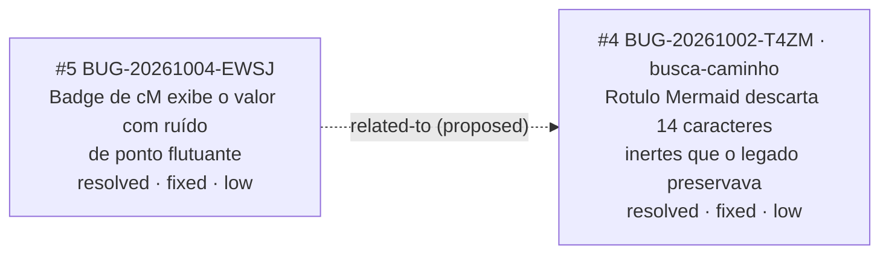

<!-- GENERATED, DO NOT EDIT: regenerado por /reversa-debugger-graph em 2026-10-04T13:48:48-03:00 a partir de 1 bugs -->

# Grafo de relações · analise-dna

> Derivado de `relationships` dos `bug.md` deste contexto. Aresta tracejada é `proposed`, isto é,
> hipótese. Aresta cheia é `supported` ou `confirmed`.

## Grafo

## Arestas com state `supported` ou `confirmed`

Nenhuma. Existe **uma** aresta neste contexto, e ela está em `proposed`.

## Clusters

**Nenhum cluster.** O contexto tem um único bug, e não há convergência de múltiplos defeitos no mesmo
componente que indique causa estrutural. A aresta que sai daqui atravessa contexto: o alvo é do
contexto `busca-caminho`.

## Impact score

| Bug aberto | causados ×3 | bloqueados ×2 | regressões ×4 | relacionados ×1 | Score |
|------------|-------------|---------------|---------------|-----------------|-------|
| nenhum | | | | | |

Não há bug aberto neste contexto, então não há impact score a calcular. A aresta `related-to` do
`EWSJ` está em `proposed` e nunca entraria no cálculo, conforme a invariante do schema.

O impact score é **heurística de triagem**, e não substitui `priority` nem `severity`.
