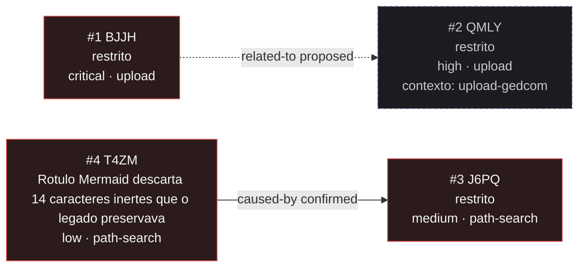

<!-- GENERATED, DO NOT EDIT: regenerado por /reversa-debugger-graph em 2026-10-02T16:28:42-03:00 a partir de 3 bugs -->

# Grafo de bugs · busca-caminho

## Clusters

2 aresta(s) tocam este contexto, todas pelo mesmo endereço de arquivo compartilhado; nenhuma outra convergência foi observada.

## Impact score

Heurística de triagem (`causados*3 + bloqueados*2 + regressões*4 + relacionados*1`), contando apenas arestas `supported`/`confirmed`. Não substitui `priority` nem `severity`.

| Bug | Impact score |
|-----|--------------|
| `BUG-20261002-T4ZM` | 3 |
| `BUG-20260929-BJJH` | 0 |
| `BUG-20260929-J6PQ` | 0 |
