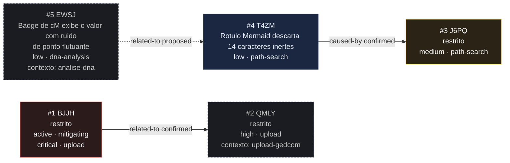

<!-- GENERATED, DO NOT EDIT: regenerado por /reversa-debugger-graph em 2026-10-04T13:55:34-03:00 a partir de 3 bugs -->

# Grafo de bugs · busca-caminho

Estilo: aresta cheia é `supported` ou `confirmed`; aresta tracejada é `proposed`, isto é, hipótese.
Nó com borda vermelha tem severidade `high` ou `critical`; amarela, `medium`. Nós de outros contextos
aparecem com borda tracejada e o contexto declarado.

## Clusters

**Nenhum cluster.** As duas arestas confirmadas que tocam este contexto tratam de mecanismos
diferentes: a exposição de estado e pasta compartilhada (`BJJH` e `QMLY`) e o escape do rótulo
(`T4ZM` e `J6PQ`). Não há convergência de múltiplos defeitos no mesmo componente que indique causa
estrutural.

A terceira aresta, `EWSJ -.-> T4ZM`, está em `proposed`: é hipótese conceitual, não causa.

## Impact score

Heurística de triagem (`causados*3 + bloqueados*2 + regressões*4 + relacionados*1`), contando apenas
arestas `supported`/`confirmed`, e apenas para bug aberto. `related-to` tem peso limitado a 3 no total.
Não substitui `priority` nem `severity`.

| Bug aberto | causados ×3 | bloqueados ×2 | regressões ×4 | relacionados ×1 | Score |
|------------|-------------|---------------|---------------|-----------------|-------|
| `BUG-20260929-BJJH` | 0 | 0 | 0 | 1 | **1** |

O bug aberto está bloqueado por uma **condição** (`blocking` de tipo `external`), e não por uma aresta
de relação. A heurística conta arestas `supported`/`confirmed` do bloco `relationships`, então a
condição de bloqueio **não entra no cálculo**. O score continua sendo o da aresta `related-to` com o
`QMLY`.

O `BUG-20260929-J6PQ` tem score zero por não ter aresta confirmada gravada nele, e a relação com o
`T4ZM` já está contada no lado que a gravou.
