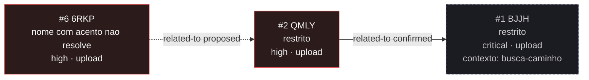

<!-- GENERATED, DO NOT EDIT: regenerado por /reversa-debugger-graph em 2026-10-09T15:30:33-03:00 a partir de 2 bugs -->

# Grafo de bugs · upload-gedcom

Estilo: aresta cheia é `supported` ou `confirmed`; aresta tracejada é `proposed`, isto é, hipótese.
Nó com borda vermelha tem severidade `high` ou `critical`; amarela, `medium`. Nós de outros contextos
aparecem com borda tracejada e o contexto declarado.

## Clusters

**Um cluster, e ele é o que esta regeneração passou a enxergar.** Enquanto o contexto tinha um único bug,
não havia convergência a medir. Agora há dois, e os dois tocam a **mesma região de código**: a composição
do nome armazenado.

O `BUG-20260929-QMLY` é quem **criou** essa forma. Antes dele o legado gravava com o nome enviado pelo
cliente (`os.path.join(UPLOAD_FOLDER, gedcom_file.filename)`), o que permitia escrita fora da pasta; a
correção tirou do cliente o controle do caminho e passou a compor
`<16 hex do sha256 do conteúdo>__<nome visível>`, com a forma fechada
`^[0-9a-f]{16}__[A-Za-z0-9._-]+$` como defesa, sem lista negra.

O `BUG-20261009-6RKP` é uma **contradição dentro** dessa forma: a metade que grava preserva acento e
espaço no nome visível, e a metade que lê recusa os dois. As duas metades vivem no mesmo arquivo
(`src/utils/validate.py`), e a spec que as manda conviver (`_reversa_sdd/upload-gedcom/contracts.md`,
linhas 51 e 53) se contradiz nas duas linhas vizinhas.

Leitura de triagem: **não são dois defeitos independentes, são duas camadas do mesmo movimento.** Quem
for corrigir o `6RKP` mexe exatamente no contrato que o `QMLY` estabeleceu, e a decisão de qual lado cede
(parar de gravar o acento, ou passar a aceitá-lo na leitura) é uma revisão daquele contrato, não um
conserto local. Por isso a aresta entre os dois está gravada como `proposed`: é hipótese de quem escreveu
este grafo, e o fix tem de confirmá-la ou rejeitá-la com evidência.

A aresta para `busca-caminho` continua sendo outra história: ela liga os dois bugs pelo mecanismo da
pasta de upload única com o nome controlado pelo cliente.

## Impact score

Heurística de triagem (`causados*3 + bloqueados*2 + regressões*4 + relacionados*1`), contando apenas
arestas `supported`/`confirmed`, e apenas para bug aberto. `related-to` tem peso limitado a 3 no total.
Não substitui `priority` nem `severity`.

| Bug aberto | causados ×3 | bloqueados ×2 | regressões ×4 | relacionados ×1 | Score |
|------------|-------------|---------------|---------------|-----------------|-------|
| `BUG-20261009-6RKP` | 0 | 0 | 0 | 0 | **0** |

O `6RKP` é o único bug aberto do contexto, e a única aresta dele está em estado `proposed`, que **não
conta**. Score 0 aqui **não** significa "impacto baixo": significa que as relações dele ainda não foram
apuradas. É o `priority: P2` e o `severity: high` que valem, e a relação com o `QMLY` é o primeiro item a
confirmar ou descartar no fix.

O `BUG-20260929-QMLY` está `resolved`, e a aresta dele já está contada no lado que a gravou.
