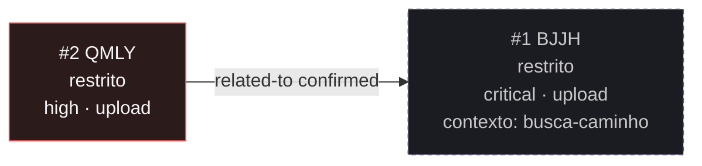

<!-- GENERATED, DO NOT EDIT: regenerado por /reversa-debugger-graph em 2026-10-04T13:51:03-03:00 a partir de 1 bugs -->

# Grafo de bugs · upload-gedcom

Estilo: aresta cheia é `supported` ou `confirmed`; aresta tracejada é `proposed`, isto é, hipótese.
Nó com borda vermelha tem severidade `high` ou `critical`; amarela, `medium`. Nós de outros contextos
aparecem com borda tracejada e o contexto declarado.

## Clusters

**Nenhum cluster.** O contexto tem um único bug, e não há convergência de múltiplos defeitos no mesmo
componente que indique causa estrutural.

A única aresta toca este contexto e cruza para `busca-caminho`. O mecanismo que os dois compartilham é
a pasta de upload única com o nome de arquivo controlado pelo cliente, e ele está descrito na aresta do
`BUG-20260929-BJJH`, do outro lado.

## Impact score

Heurística de triagem (`causados*3 + bloqueados*2 + regressões*4 + relacionados*1`), contando apenas
arestas `supported`/`confirmed`, e apenas para bug aberto. `related-to` tem peso limitado a 3 no total.
Não substitui `priority` nem `severity`.

| Bug aberto | causados ×3 | bloqueados ×2 | regressões ×4 | relacionados ×1 | Score |
|------------|-------------|---------------|---------------|-----------------|-------|
| nenhum | - | - | - | - | - |

Não há bug aberto neste contexto, então não há impact score a calcular. O `BUG-20260929-QMLY` está
`resolved` e a aresta dele já está contada no lado que a gravou.
