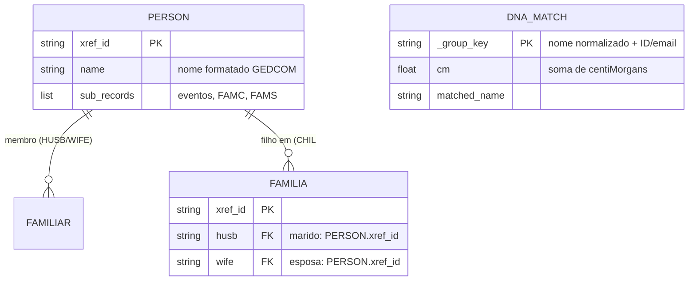

# Arquitetura — analisador-genealogico

> Gerado pelo **Architect** em 2026-08-03
> Nível de documentação: **Essencial** (`state.json`)
> Obs.: `inventory.md` menciona "Completo"; o nível ativo definido em `doc_level` é **essencial**.
> Escala de confiança: 🟢 CONFIRMADO | 🟡 INFERIDO | 🔴 LACUNA

---

## 1. Visão Geral da Arquitetura

Sistema **monolítico** de servidor web em Python/Flask com renderização server-side (Jinja2 + Bootstrap 5). Não há banco de dados persistente — todo o estado é mantido em memória (dicionários e grafo `networkx`) durante a sessão, com armazenamento temporário apenas dos arquivos enviados (`.ged`, `.csv`) na pasta `uploads/`.

O funcionamento é de **análise sob demanda**: a cada requisição `POST`, o GEDCOM é re-parseado e o grafo reconstruído, os dados de DNA são agregados e o matching difuso de nomes localiza correspondências até a pessoa-raiz.

---

## 2. Diagrama C4 — Contexto (Nível 1)

```mermaid
flowchart LR
    U[Genealogista Genético<br/>(usuário humano)]
    S([analisador-genealogico<br/>Aplicação Web Flask])
    C1[Arquivos GEDCOM .ged<br/>Árvore genealógica]:::ext
    C2[CSV de DNA matches<br/>GEDmatch .csv]:::ext
    C3[Recursos de Google Fonts/CDN<br/>Bootstrap/Mermaid (navegador do cliente)]

    U -->|"upload GEDCOM + CSV, busca de caminho"| S
    S -->|"leitura/parsing"| C1
    S -->|"leitura/agregação de segmentos cM"| C2
    S -.->|"download CDN (Bootstrap/Mermaid)"| U

    classDef ext fill:#e8f0fe,stroke:#4285f4,stroke-width:1px;

    %% Persona (usuário
    U2[Genealogista Genético] --> S
```

> Confiança do modelo: 🟢 para a estrutura monolítica; as integrações externas de rede (Bootstrap/Mermaid via CDN) são 🟡 INFERIDAS a partir do template.

### Atores e Sistemas Externos

| Participante | Papel | Direção |
| --- | --- | --- |
| **Genealogista Genético** (persona única) | Envia GEDCOM + CSV e executa buscas de caminho | → sistema |
| **Arquivos GEDCOM (.ged)** | Fonte da árvore genealógica | entrada |
| **Arquivos CSV de DNA** | Lista de matches de DNA (GEDmatch Ancestor Project) | entrada |
| **CDN (Bootstrap 5, Mermaid.js)** | Estilo e renderização de diagramas no navegador | navegador externo 🟡 |

---

## 3. ERD Resumido

Apenas **3 entidades lógicas** (abaixo de 5) — ERD embutido aqui em vez de `erd-complete.md`.



- **PERSON → FAMILIA**: um indivíduo é cônjuge em 0..N famílias (`FAMS`) e filho em 0..1 (`FAMC`) ou deduzido por `CHIL`. 🟢
- **FAMILIA**: contém `HUSB`, `WIFE` (opcionais) e `CHIL` (0..N). 🟢
- **DNA_MATCH**: entidade derivada do CSV agregado em memória — s/ persistência. 🟢

---

## 4. Mapa de Integrações Externas

| Sistema Externo | Tipo | Protocolo/Dados | Uso |
| --- | --- | --- | --- |
| **Nenhuma API REST/GraphQL externa consumida ou produzida** | — | — | A aplicação é standalone; leitura local de `.ged` e `.csv`. 🟢 |
| **GEDCOM** | Arquivo | ISO do formato GEDCOM (ged4py) | Parsing da árvore. 🟢 |
| **CSV de DNA** | Arquivo | CSV com colunas de Nome, cM, ID/Email | Agregação de segmentos. 🟢 |
| **CDN de recursos web** 🟡 | Assets | HTTPS | Bootstrap 5 + Mermaid.js renderizados no navegador. |

---

## 5. Dívidas Técnicas Identificadas

| # | Dívida | Severidade | Evidência |
| --- | --- | --- | --- |
| 1 | **Dependências sem versão fixada** em `requirements.txt` | 🔴 Alta | Sem `pins` — risco de breaking changes em novos ambientes. |
| 2 | **Ausência total de testes** | 🔴 Alta | Nenhum arquivo de teste detectado. |
| 3 | **Ausência de CI/CD e Docker** | 🟡 Média | Sem pipelines/default workflows detectados. |
| 4 | **Estado em memória + re-parse a cada requisição** | 🟡 Média | Ineficiente; recálculo integral a cada `POST`. |
| 5 | **Código monolítico (app.py ~887 linhas)** com rotas + lógica acopladas | 🟡 Média | Responsabilidades de parsing, matching e renderização num único módulo. |
| 6 | **`secret_key` hardcoded e versão "v16" no público** | 🟡 Média | `app.secret_key = 'f@milyse@rch_dna_edition_v16'` — segredo embutido. |
| 7 | **Correções de mojibake heurísticas/fragmentadas (`strip_bad_utf`)** | 🟢 Baixa | Substituições manuais incompletas. |
| 8 | **Colunas calculadas em memória, sem persistência de resultados** | 🟢 Baixa | Resultados não persistidos entre requisições. |

---

## 6. Resumo para o Reversa

- **Containers**: 1 (aplicação web Flask monolítica). Sem banco, fila ou cache.
- **Integrações externas**: nenhuma API — apenas entrada de arquivos `.ged`/`.csv` e assets web via CDN.
- **Dívidas técnicas**: 8 identificadas, com risco alto de dependências soltas e ausência de testes.
- **Packing**: Gunicorn listado no `requirements.txt` — deploy WSGI em produção (Heroku/Render/AWS) 🟡.