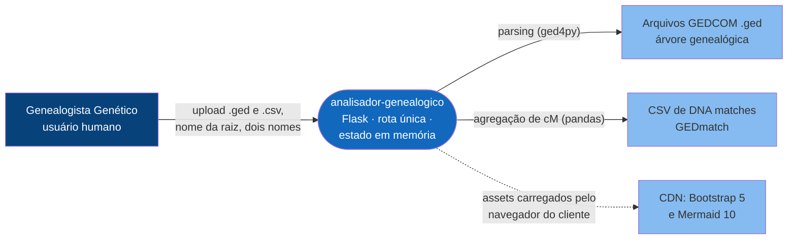
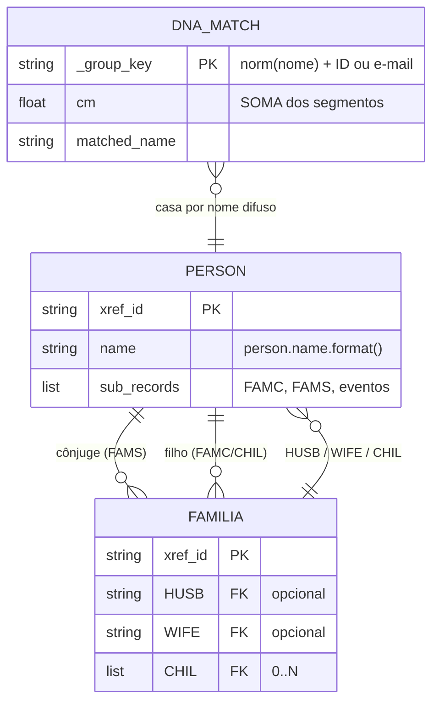

# Arquitetura — analisador-genealogico

> Nível de documentação: **Essencial** (`state.json` → `doc_level`)
> Re-extração de 2026-09-30. Substitui o `architecture.md` de 2026-08-03, que descrevia um monólito de ~887 linhas sem testes.
> Escala de confiança: 🟢 CONFIRMADO | 🟡 INFERIDO | 🔴 LACUNA

---

## 1. Visão Geral da Arquitetura

Aplicação **web monolítica de um único processo**, com renderização server-side (Flask + Jinja2), **sem banco de dados** e **sem persistência de resultados**.

O que define a arquitetura atual é a separação entre duas camadas com contratos opostos:

| Camada | Arquivo(s) | Linhas | Contrato |
| --- | --- | --- | --- |
| **Apresentação** | `app.py` | 84 | Valida entrada HTTP, despacha por `action`, renderiza. **Zero regra de negócio.** 🟢 |
| **Núcleo** | `reconstructed/{domain,upload,path_search,dna_analysis}.py` | 1117 | Toda a lógica de domínio. Não conhece HTTP. 🟢 |

O funcionamento é de **análise sob demanda**: a cada `POST`, o GEDCOM é **re-parseado integralmente** e o grafo reconstruído, os segmentos de DNA são agregados e o matching difuso localiza correspondências até a pessoa-raiz. 🟢

**O mecanismo de integração entre as camadas é estado global mutável**, não injeção de dependência: `upload.py` mantém `people`, `families`, `graph` e `child_to_family` no escopo do módulo, e os demais módulos os importam. A substituição é feita **in-place** (`clear()` + `update()`) para preservar as referências já importadas. 🟢

---

## 2. Diagrama C4 — Contexto (Nível 1)

```mermaid
flowchart LR
    U[Genealogista Genético<br/>usuário humano]:::person
    S([analisador-genealogico<br/>Flask · rota única ·<br/>estado em memória]):::system
    C1[Arquivos GEDCOM .ged<br/>árvore genealógica]:::ext
    C2[CSV de DNA matches<br/>GEDmatch]:::ext
    C3[CDN: Bootstrap 5<br/>e Mermaid 10]:::ext

    U -->|"upload .ged e .csv,<br/>nome da raiz, dois nomes"| S
    S -->|"parsing (ged4py)"| C1
    S -->|"agregação de cM (pandas)"| C2
    S -.->|"assets carregados pelo<br/>navegador do cliente"| C3

    classDef person fill:#08427B,color:#fff
    classDef system fill:#1168BD,color:#fff
    classDef ext fill:#85BBF0
```

> O C4 de Contexto completo, com a legenda e o contrato de interação, está em `c4-context.md`. Níveis 2 (Containers) e 3 (Componentes) **não são gerados** no nível `essencial`.

### Atores e Sistemas Externos

| Participante | Papel | Direção |
| --- | --- | --- |
| **Genealogista Genético** (persona única) | Envia GEDCOM + CSV, escolhe a raiz, busca caminhos | → sistema 🟢 |
| **Arquivos GEDCOM (`.ged`)** | Fonte da árvore genealógica | entrada 🟢 |
| **Arquivos CSV de DNA** | Lista de matches com cM, ID e/ou e-mail | entrada 🟢 |
| **CDN (Bootstrap 5, Mermaid 10)** | Estilo e renderização do diagrama no navegador | navegador externo 🟢 |

---

## 3. ERD Resumido

**9 entidades** foram identificadas — acima do limiar de 5, então `erd-complete.md` seria o destino natural no nível `completo`. Como o nível ativo é `essencial`, o ERD fica **embutido aqui**, com a ressalva de que **6 delas são conceituais ou decorativas** e apenas **3 existem de fato em memória durante a execução**.

### 3.1. Entidades efetivamente usadas no fluxo 🟢

```mermaid
erDiagram
    PERSON ||--o{ FAMILIA : "cônjuge (FAMS)"
    PERSON ||--o{ FAMILIA : "filho (FAMC/CHIL)"
    FAMILIA ||--o{ PERSON : "HUSB / WIFE / CHIL"
    DNA_MATCH }o--|| PERSON : "casa por nome difuso"

    PERSON {
        string xref_id PK
        string name "person.name.format()"
        list sub_records "FAMC, FAMS, eventos"
    }
    FAMILIA {
        string xref_id PK
        string HUSB FK "opcional"
        string WIFE FK "opcional"
        list CHIL FK "0..N"
    }
    DNA_MATCH {
        string _group_key PK "norm(nome) + ID ou e-mail"
        float cm "SOMA dos segmentos"
        string matched_name
    }
```

| Relacionamento | Cardinalidade | Regra |
| --- | --- | --- |
| PERSON → FAMILIA (como cônjuge) | 0..N | via referências `FAMS` no `INDI`. 🟢 |
| PERSON → FAMILIA (como filho) | 0..1 preferencial, 0..N no índice | `FAMC` é preferido; na ausência, o índice `child_to_family` acumula **todas** as famílias em que a pessoa aparece como `CHIL`. 🟢 |
| FAMILIA → PERSON | 0..2 cônjuges + 0..N filhos | `HUSB` e `WIFE` são opcionais. 🟢 |
| DNA_MATCH → PERSON | 0..1 | matching difuso; se casar, precisa ainda ter caminho ancestral até a raiz. 🟢 |

**Observação de cardinalidade:** o grafo é `nx.Graph` (não-direcionado), com nós de dois tipos (`type="person"` e `type="family"`). A direção parental **não** está no grafo — ela é derivada por `get_parents`. 🟢

### 3.2. Entidades declaradas mas decorativas 🟡

Verificado por varredura: aparecem **apenas na própria definição**, nunca instanciadas em caminho de produção.

| Entidade | Definição | Situação |
| --- | --- | --- |
| `Family` (dataclass) | `domain.py:61` | Só referenciada na anotação de `register_family`. O fluxo real guarda os registros do ged4py. 🟡 |
| `GenealogyGraph` | `domain.py:74` | Não instanciada. O grafo real é a global `graph`. 🟡 |
| `DNAGroup` (dataclass) | `domain.py:106` | Não instanciada. `dna_analysis` monta resultados como `dict`. 🟡 |

> 🔴 **L-01:** essas três são arquitetura abandonada ou preparação para uso futuro? Ninguém decidiu.

### 3.3. Estruturas de persistência e runtime 🟢

| Estrutura | Tipo | Chave → Valor | Onde |
| --- | --- | --- | --- |
| `people` | dict global | `xref_id` → registro `INDI` | `upload.py:16` |
| `families` | dict global | `xref_id` → registro `FAM` | `upload.py:17` |
| `graph` | `nx.Graph` global | nós pessoa e família | `upload.py:18` |
| `child_to_family` | dict global | `xref_id` do filho → lista de famílias | `upload.py:19` |
| `ged_index` | dict local | nome normalizado → lista de `pid` | `build_ged_indexes` |
| `surname_index` | dict local | sobrenome → lista de `pid` | `build_ged_indexes` |
| `features` | dict local (cache) | `pid` → atributos normalizados | `build_ged_indexes` |
| `uploads/` | filesystem | nome enviado → arquivo `.ged`/`.csv` | `UPLOAD_FOLDER` |

**Não há tabela, esquema, migration, ORM ou arquivo de configuração de banco.** 🟢

---

## 4. Mapa de Integrações Externas

| Sistema externo | Tipo | Protocolo / formato | Uso |
| --- | --- | --- | --- |
| **Nenhuma API REST/GraphQL consumida ou produzida** | — | — | A aplicação é standalone. 🟢 |
| **Nenhum webhook, fila, evento ou mensageria** | — | — | Não há integração assíncrona. 🟢 |
| **GEDCOM** | Arquivo | Formato GEDCOM, lido por `ged4py` 0.5.2 | Parsing da árvore. 🟢 |
| **CSV de DNA** | Arquivo | CSV com colunas de Nome, cM, ID/Email; UTF-8 com fallback Latin-1 | Agregação de segmentos. 🟢 |
| **CDN de assets web** | Assets | HTTPS | Bootstrap 5 + Mermaid 10 no navegador. 🟢 |
| **Exportadores de CSV** | Indirecto | GEDmatch Ancestor Project e similares | Detecção de coluna de ID depende do padrão `[A-Z]{2}\d{7}` — 🟡 específico de um exportador. |

---

## 5. Dívidas Técnicas Identificadas

| # | Dívida | Severidade | Evidência |
| --- | --- | --- | --- |
| 1 | **Estado global mutável** compartilhado entre requisições e usuários | 🔴 Alta | `upload.py:16-19`; mutação em `:95-98` |
| 2 | **Dependências sem versão fixada** em `requirements.txt` | 🔴 Alta | 6 dependências, zero `pins` |
| 3 | **`secret_key` hardcoded** no código | 🔴 Alta | `app.py:11` — `'f@milyse@rch_dna_edition_v16'` |
| 4 | **Upload sem validação** de extensão, tipo ou tamanho; nome do cliente vira caminho | 🔴 Alta | `app.py:29` — limitação **aceita** pelo usuário em 2026-08-03 |
| 5 | **Re-parse integral do GEDCOM a cada requisição** | 🟡 Média | `app.py:31` e `:42` |
| 6 | **Ausência de CI/CD e Docker** | 🟡 Média | Sem `.github/`, `Dockerfile` ou `docker-compose` |
| 7 | **Entidades declaradas que o fluxo não usa** | 🟢 Baixa | `domain.py:74`, `:106` |
| 8 | **Sem persistência de resultados** | 🟢 Baixa | `dna_analysis.py:393` monta tudo em memória |
| 9 | **`README.md` do módulo anuncia Pyvis**, removida do projeto | 🟢 Baixa | `analisador-genealogico/README.md` |

**Dívidas que deixaram de existir desde a extração anterior:**

| Dívida antiga | Situação atual |
| --- | --- |
| "Código monolítico (`app.py` ~887 linhas) com rotas + lógica acopladas" | ✅ endereçada — `app.py` tem 84 linhas e delega |
| "Ausência total de testes" | ✅ endereçada — 7 arquivos, 95 itens, incluindo caracterização |
| "Correções de mojibake heurísticas/fragmentadas" | ✅ endereçada — autoridade única em `domain.py` (ADR-07) |

---

## 6. Resumo para o Reversa

- **Containers:** 1 (aplicação web Flask single-process). Sem banco, fila ou cache. 🟢
- **Camadas:** 2 (rota fina de 84 linhas + núcleo de 1117 linhas), integradas por **estado global mutável**. 🟢
- **Integrações externas:** nenhuma API — apenas entrada de arquivos `.ged`/`.csv` e assets web via CDN. 🟢
- **Entidades:** 9 identificadas; **3 efetivamente em uso**, 3 decorativas, 3 estruturas de runtime. 🟢
- **Dívidas técnicas:** 9 identificadas, 4 de severidade alta. 🟢
- **Packing:** `gunicorn` está no `requirements.txt` mas **não é usado no código** — deploy WSGI em produção é inferência. 🟡
- **Instrumentação de desenvolvimento (fora do runtime):** `_reversa_sdd/` contém oráculo congelado (`oracle/`), harness diferencial de paridade com 100% em 6 fixtures e 5 árvores reais (`parity/`), goldens de tela (`screens/`) e a suíte de migração (`migration/`). **Nada disso faz parte do sistema em execução** e não deve ser confundido com a arquitetura da aplicação. 🟢

---

*Gerado pelo Reversa-Architect em 2026-09-30 (re-extração).*
