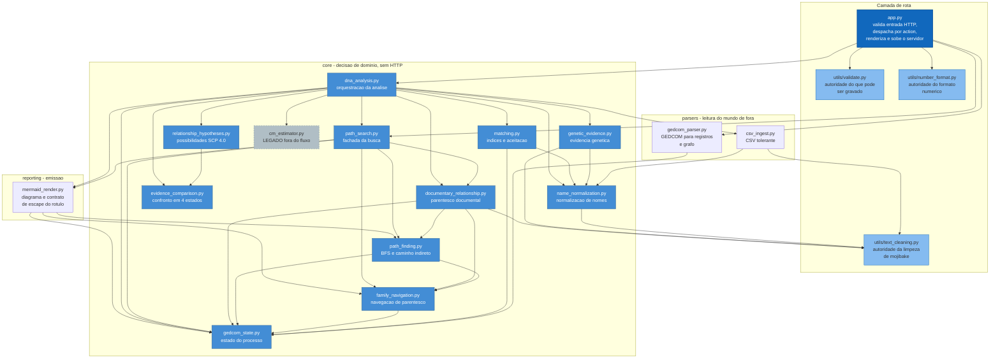

# Diagrama C4 — Componentes (Nível 3) — analisador-genealogico

> Nível de documentação: **Completo** (`state.json` → `doc_level`)
> Re-extração de **2026-10-05**. Artefato **novo** — o nível `essencial` não o gera.
> Confiança: 🟢 CONFIRMADO | 🟡 INFERIDO | 🔴 LACUNA
> Nível 1: `c4-context.md` · Nível 2: `c4-containers.md` · Visão geral: `architecture.md`

O nível 3 descreve os componentes internos do **container 1 (Aplicação web)**. São **19 módulos** em quatro pacotes, mais a camada de rota.

---

## Estrutura de dependências

---

## Inventário de componentes

### Camada de rota

| Componente | Responsabilidade | Depende de | É usado por | Conf. |
| --- | --- | --- | --- | --- |
| `app.py` | Ler a requisição, validar presença e forma, delegar aos fluxos, renderizar, aplicar os filtros de template e **subir o servidor** com a guarda de instância única. **Não contém regra de negócio de domínio.** | `validate`, `number_format`, `gedcom_parser`, `path_search`, `dna_analysis` | ponto de entrada | 🟢 |

### `utils/` — autoridades únicas transversais

| Componente | Responsabilidade | Depende de | É usado por | Conf. |
| --- | --- | --- | --- | --- |
| `validate.py` | **Toda** a decisão sobre o que pode ser gravado: nome visível seguro, chave derivada do conteúdo, validação de forma da chave recebida, reconhecimento de GEDCOM. **Módulo puro** — não importa Flask e não toca o disco. | `hashlib`, `re` | `app.py` | 🟢 |
| `text_cleaning.py` | **Autoridade única** da limpeza de mojibake (`strip_bad_utf`, `demojibake`). | `re` | `name_normalization`, `csv_ingest`, `genetic_evidence`, `documentary_relationship`, `dna_analysis` | 🟢 |
| `number_format.py` | **Autoridade única** do formato numérico de tela (`formatar_cm`, `formatar_inteiro`); exposta ao template como filtros `cm_br` e `inteiro_br`. | — | `app.py` (filtros) | 🟢 |

> **`utils/` é o único pacote folha real**: nenhum de seus três módulos importa qualquer outro módulo do projeto. 🟢

### `parsers/` — leitura do mundo de fora

| Componente | Responsabilidade | Depende de | É usado por | Conf. |
| --- | --- | --- | --- | --- |
| `gedcom_parser.py` | Traduzir o GEDCOM em registros `INDI`/`FAM` e no grafo bipartido; **substituir o estado**; devolver os nomes ordenados. | `ged4py`, `networkx`, `gedcom_state` | `app.py` | 🟢 |
| `csv_ingest.py` | Ler o CSV tolerando encoding, separador, preâmbulo e linha torta; localizar colunas por papel; agregar cM por chave composta. | `pandas`, `name_normalization`, `text_cleaning` | `dna_analysis` | 🟢 |

### `core/` — decisão de domínio

| Componente | Responsabilidade | Depende de | É usado por | Conf. |
| --- | --- | --- | --- | --- |
| `gedcom_state.py` | Registro do estado do processo (`people`, `families`, `graph`, `child_to_family`, `versao`) e acesso aos registros (`get_name`, `ref_id`). | — | **quase todos** | 🟢 |
| `name_normalization.py` | Normalização, decomposição de nomes e o vocabulário do matching (stop words, prenomes genéricos, sufixos, sobrenomes comuns, equivalências). | `text_cleaning` | `matching`, `genetic_evidence`, `csv_ingest`, `dna_analysis` | 🟢 |
| `matching.py` | Construir os índices do GEDCOM e **decidir a aceitação** de cada candidato (score, filtro anti-falso-positivo, Jaccard, ramos de aceite). | `thefuzz`, `name_normalization`, `gedcom_state` | `dna_analysis` | 🟢 |
| `family_navigation.py` | Resolver pessoa por nome e navegar parentesco (pais, cônjuges, casamento). | `gedcom_state` | `documentary_relationship`, `path_finding`, `path_search`, `mermaid_render` | 🟢 |
| `path_finding.py` | Os dois algoritmos de caminho: **BFS bidirecional por pais** e **caminho curto no grafo de famílias**. | `networkx`, `family_navigation`, `gedcom_state` | `documentary_relationship`, `path_search`, `mermaid_render` | 🟢 |
| `documentary_relationship.py` | **Parentesco documental completo**: caminho, ancestral comum, rótulo e meioses, homônimos, caminhos múltiplos, colapso de pedigree e evidência de cada salto. **Nunca lê cM.** | `family_navigation`, `path_finding`, `gedcom_state`, `text_cleaning` | `path_search`, `dna_analysis` | 🟢 |
| `genetic_evidence.py` | **Evidência genética** por (nome, kit): cM, segmentos, SNPs, cromossomos. **Não conhece o GEDCOM.** | `name_normalization`, `text_cleaning` | `dna_analysis` | 🟢 |
| `relationship_hypotheses.py` | Traduzir cM em **lista** de possibilidades e confiança, pela tabela publicada do Shared cM Project 4.0. **Sem dependência de projeto** (só stdlib). | — | `evidence_comparison`, `dna_analysis` | 🟢 |
| `evidence_comparison.py` | **Confronto** entre documento e genética: os quatro estados, o método declarado e o rol de causas. | `relationship_hypotheses` | `dna_analysis` | 🟢 |
| `path_search.py` | Fachada do fluxo de busca: resolver pessoas, escolher entre homônimos, decidir direto × indireto. | `documentary_relationship`, `family_navigation`, `path_finding`, `mermaid_render`, `gedcom_state` | `app.py`, `dna_analysis` | 🟢 |
| `dna_analysis.py` | **Orquestrar** as três etapas do cruzamento, montar o payload da tela e ordenar os resultados. | todos os anteriores | `app.py` | 🟢 |
| `cm_estimator.py` | **LEGADO fora do fluxo**: as nove faixas de cM escritas à mão, sem fonte verificável. Reexportado só por compatibilidade. | — | **ninguém no fluxo** (só testes e harness) | 🟢 |

### `reporting/` — emissão

| Componente | Responsabilidade | Depende de | É usado por | Conf. |
| --- | --- | --- | --- | --- |
| `mermaid_render.py` | Transformar um caminho em texto Mermaid e **aplicar o contrato de escape do rótulo** (lista branca) e do id de nó. | `family_navigation`, `path_finding`, `gedcom_state` | `path_search`, `dna_analysis` | 🟢 |

---

## 🔴 Achado de arquitetura: os pacotes **não** formam camadas acíclicas

A intenção declarada na reorganização (ADR-11) era uma pilha: `parsers` lê o mundo de fora, `core` decide, `reporting` apresenta, `utils` apoia. **O grafo real de importações não é essa pilha.** Há **dois ciclos no nível de pacote**:

| Ciclo | Aresta de ida | Aresta de volta | Evidência |
| --- | --- | --- | --- |
| **`core/` ↔ `reporting/`** | `core/path_search.py:51` e `core/dna_analysis.py:51` importam `reporting.mermaid_render` | `reporting/mermaid_render.py:16-23` importa `core.family_navigation`, `core.path_finding` e `core.gedcom_state` | confirmado por leitura das importações |
| **`core/` ↔ `parsers/`** | `core/dna_analysis.py:50` importa `parsers.csv_ingest` | `parsers/gedcom_parser.py:15-16` importa `core.gedcom_state`; `parsers/csv_ingest.py:41-42` importa `core.name_normalization` e `utils.text_cleaning` | idem |

**Não há ciclo em nível de módulo** — o sistema importa e os testes passam. Mas a consequência é real:

1. **`reporting/` não é folha, e não pode ser.** O renderizador precisa **navegar o domínio** para decidir *como desenhar*: usa `get_spouses`, `pick_spouse_for_couple`, `split_path_by_marriage` e `exclude_tail` (`mermaid_render.py:16-21`) e ainda `find_ancestral_path`. Ou seja, **há decisão de apresentação que é decisão de negócio** — o mesmo ponto que a análise de migração registrou ao tratar o Mermaid no cliente. 🟢
2. **`parsers/` escreve o estado do domínio.** `gedcom_parser` **substitui** `people`, `families`, `graph` e `child_to_family` — não devolve um valor para que `core` decida o que fazer com ele. É a razão de existir do contador `versao` e do import dentro de função em `path_finding.py:38`. 🟢
3. **A consequência prática é de disciplina, não de execução:** nenhuma alteração isolada em `reporting/` é segura sem olhar `core/`, e vice-versa. Quem reimplementar deve decidir explicitamente se mantém essa fronteira ou se assume um único pacote de domínio. 🔴 **Não há decisão humana registrada sobre isso.**

---

## Cadeia de dependência dos três fluxos

| Fluxo | Cadeia de componentes | Conf. |
| --- | --- | --- |
| **`upload_gedcom`** | `app.py` → `validate.validar_conteudo_gedcom` → `validate.chave_de_armazenamento` → `validate.nome_do_arquivo_armazenado` → *(disco)* → `gedcom_parser.load_gedcom_and_build_graph` → `gedcom_state` | 🟢 |
| **`path_search`** | `app.py` → `validate.chave_recebida_e_valida` → *(disco)* → `gedcom_parser` *(re-parse)* → `path_search.path_search` → `family_navigation.find_person_by_name` → `documentary_relationship.documentary_relationship` → `path_finding.find_ancestral_path` *(ou `find_indirect_path`)* → `mermaid_render` | 🟢 |
| **`dna_analysis`** | `app.py` → *(disco + re-parse)* → `dna_analysis.dna_analysis` → `csv_ingest.read_csv_with_fallback` → `genetic_evidence.build_genetic_evidence` → `matching.build_ged_indexes` + `match_candidates` → `documentary_relationship` → `genetic_evidence.evidence_for` → `relationship_hypotheses.hypotheses_for_evidence` → `evidence_comparison.compare` → `mermaid_render` → `number_format` (na tela) | 🟢 |

> **`gedcom_parser` aparece nos três fluxos**, porque o GEDCOM é re-parseado a cada requisição (o "recurso compartilhado" é o arquivo em disco, não um objeto em memória de vida longa).

---

## Superfícies de compatibilidade (dívida assumida)

Vários componentes reexportam **nomes históricos** que já não usam, num `__all__` explícito, porque testes e sondas os importam dali:

| Componente | O que reexporta sem usar | Declarado em |
| --- | --- | --- |
| `path_search.py` | `are_spouses`, `get_parents`, `get_spouses`, `pick_spouse_for_couple`, `split_path_by_marriage`, `exclude_tail`, `MAX_DEPTH`, `_mermaid_sid`, `_LABEL_SEGURO`, `_mermaid_label`, `ref_id` | comentário em `:61-64` |
| `dna_analysis.py` | `get_relationships_by_cm`, `SHARED_CM_DATA`, `aggregate_matches`, `detect_columns`, `read_csv_with_fallback`, `build_ged_indexes`, `match_candidates`, funções de nome | docstring do módulo `:25-30` |

**Leitura correta:** é dívida **de teste**, não de produção. Existe para que a reorganização (ADR-11) não tivesse de reescrever a suíte e o harness de paridade ao mesmo tempo em que movia os arquivos. 🔴 **Não há decisão registrada sobre quando retirá-la.**

---

*Gerado pelo Reversa-Architect em 2026-10-05 (re-extração, nível completo).*
