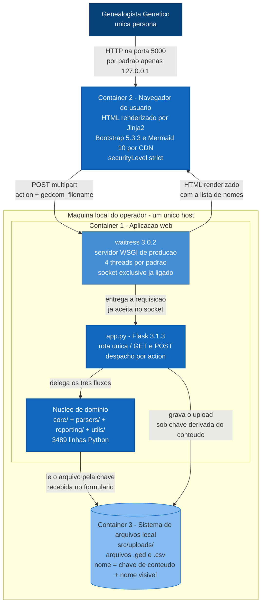

# Diagrama C4 — Containers (Nível 2) — analisador-genealogico

> Nível de documentação: **Completo** (`state.json` → `doc_level`)
> Re-extração de **2026-10-05**. Artefato **novo** — não existia nas extrações anteriores, porque o nível `essencial` não o gera.
> Confiança: 🟢 CONFIRMADO | 🟡 INFERIDO | 🔴 LACUNA
> Nível 1: `c4-context.md` · Nível 3: `c4-components.md` · Visão geral: `architecture.md`

---

## Nível 2 — Containers

---

## Inventário de containers

| # | Container | Tecnologia | Responsabilidade | Estado | Conf. |
| --- | --- | --- | --- | --- | --- |
| 1 | **Aplicação web** | Python 3.14.6 · Flask 3.1.3 · waitress 3.0.2 | Validar e gravar uploads, parsear o GEDCOM, executar os três fluxos de análise e renderizar a tela. **Único processo do sistema.** | Estado **em memória do processo** (`people`, `families`, `graph`, `child_to_family`, `versao`) | 🟢 |
| 2 | **Navegador do usuário** | HTML5 · Jinja2 · Bootstrap 5.3.3 · Mermaid 10 (CDN) | Exibir a tela, enviar os formulários e **renderizar o diagrama Mermaid no cliente** | Sem estado próprio além do DOM e do campo oculto `gedcom_filename` | 🟢 |
| 3 | **Sistema de arquivos local** | Sistema de arquivos do host | Guardar os arquivos enviados, sob chave derivada do conteúdo | **Persistente**, e o único estado que sobrevive ao processo | 🟢 |

**Não há** container de banco de dados, fila, cache, worker assíncrono ou serviço externo. 🟢
**São três containers, e não um**, por uma razão específica: a renderização do diagrama foi **movida para o cliente** (ADR-03), então o navegador passou a executar lógica que antes era do servidor. O container 2 não é um cliente burro.

---

## Comunicação entre containers

| Origem | Destino | Protocolo / formato | Gatilho | Conf. |
| --- | --- | --- | --- | --- |
| Navegador | Aplicação | **HTTP `POST` multipart** na rota `/`, com `action`, `gedcom_filename` e os campos do fluxo | Ação do usuário | 🟢 |
| Aplicação | Navegador | **HTML** renderizado no servidor (`text/html`); o diagrama viaja como **string Mermaid** dentro do HTML | Resposta da requisição | 🟢 |
| Aplicação | Navegador | **HTTP 413** com HTML em português | Corpo acima de **16 MB** | 🟢 |
| Aplicação | Sistema de arquivos | Escrita de bytes, `open(caminho, "wb")` | Upload aceito | 🟢 |
| Núcleo | Sistema de arquivos | Leitura por caminho **validado por forma** | Todo `POST` que não é upload | 🟢 |
| Navegador | CDN | **HTTPS** para Bootstrap e Mermaid | Carregamento da página | 🟢 |

**Fluxo de uma requisição de análise, do ponto de vista dos containers** 🟢

1. O navegador envia `POST` com `action` e `gedcom_filename` (a chave de conteúdo).
2. A rota **valida a forma** da chave e resolve o caminho na pasta de upload.
3. O núcleo **re-parseia o GEDCOM do zero** e reconstrói o grafo em memória — antes de ramificar para o fluxo.
4. O fluxo escolhido roda sobre o estado recém-construído e devolve o payload.
5. O template renderiza; o navegador interpreta a string Mermaid e desenha o diagrama.

> **Não há cache entre requisições.** O passo 3 acontece em **toda** requisição de análise, mesmo que a árvore seja a mesma da anterior. 🟢

---

## Propriedades arquiteturais dos containers

### Concorrência e exclusividade 🟢

- O container 1 é **single-instance por construção**: o socket é criado, marcado (`SO_EXCLUSIVEADDRUSE` no Windows) e **ligado antes de servir**, e entregue pronto ao waitress. Uma segunda instância na mesma porta **falha no `bind`** com diagnóstico que separa "porta ocupada" de "endereço indisponível". 🟢
- O mesmo container é **multi-thread**: `ANALISADOR_THREADS` tem padrão **4**. 🔴 **A exclusividade é de processo, não de thread** — e o estado do GEDCOM é global de processo, reatribuído a cada requisição. É a lacuna `L-16`/`M-03`. 🟡

### Fronteira entre servidor e cliente 🟢

- O servidor **não** gera HTML de grafo em disco (não existe `static/`): ele emite **texto Mermaid**, e quem desenha é o container 2. 🟢
- Isso transferiu ao cliente uma responsabilidade de **parsing de gramática de terceiro** e criou dois bugs de escape (`J6PQ`, `T4ZM`), tratados no ADR-05. O contrato de escape vive no **servidor** (`reporting/mermaid_render.py`), e não no cliente — decisão deliberada: o texto é sanitizado **antes** de sair. 🟢
- Consequência operacional: o único golden file pendente (`SCR-G03`, indicador de carregamento) **não pode** ser capturado por `curl`, porque depende de JavaScript no container 2.

### Persistência 🟢

- O container 3 guarda **arquivos imutáveis**: o mesmo conteúdo produz a mesma chave, e um arquivo já existente **não é reescrito**. Nada é apagado pelo sistema. 🟢
- **Nenhum resultado de análise é persistido.** Sair do navegador perde tudo, menos o arquivo enviado. 🔴 Não há decisão de negócio registrada sobre isso (`L-21`).

---

## Fora do escopo deste diagrama

| Caminho | Natureza | Por que não é container |
| --- | --- | --- |
| `_reversa_sdd/`, `.reversa/`, `_reversa_forward/`, `_reversa_bugs/`, `_reversa_docs/` | Artefatos do framework Reversa | Não são executados pela aplicação |
| `plugins/dsh-markdownlint/` | Sub-projeto **Node/JavaScript** independente | Plugin do harness DSH; não é importado pelo Python |
| `docs/` · `.github/skills/` | Vault Obsidian e skills de apoio | Índice de navegação e apoio ao desenvolvimento |
| `.github/workflows/deploy-pages.yml` | CI/CD | Publica `_reversa_docs/` no GitHub Pages; **não há pipeline de teste, build ou análise estática** da aplicação |

---

*Gerado pelo Reversa-Architect em 2026-10-05 (re-extração, nível completo).*
