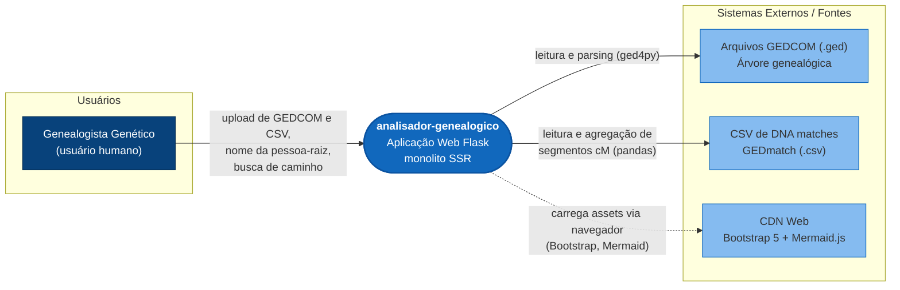

# Diagrama C4 — Contexto — analisador-genealogico

> Gerado pelo **Architect** em 2026-08-03
> Nível de documentação: **Essencial**
> Confiança: 🟢 CONFIRMADO | 🟡 INFERIDO

---

## Nível 1 — Contexto (sistema no centro)

## Legenda

| Símbolo | Descrição | Confiança |
| --- | --- | --- |
| **Genealogista Genético** | Única persona de usuário (sem autenticação/RBAC). | 🟢 |
| **Aplicação Web Flask** | Monolito SSR com rotas `GET /` e `POST /` (ações `dna_analysis`, `path_search`). | 🟢 |
| **GEDCOM (.ged)** | Entrada de árvore genealógica, parseada a cada requisição. | 🟢 |
| **CSV DNA** | Entrada de matches de DNA; colunas Nome/cM/ID/Email. | 🟢 |
| **CDN Web** | Bootstrap 5 e Mermaid.js via navegador — 🟡 INFERIDO do template. | 🟡 |

## Notas

- Não há banco de dados, fila, cache ou API externa consumida/produzida. 🟢
- Todas as interações externas de dados são **entrada de arquivos locais**. 🟢