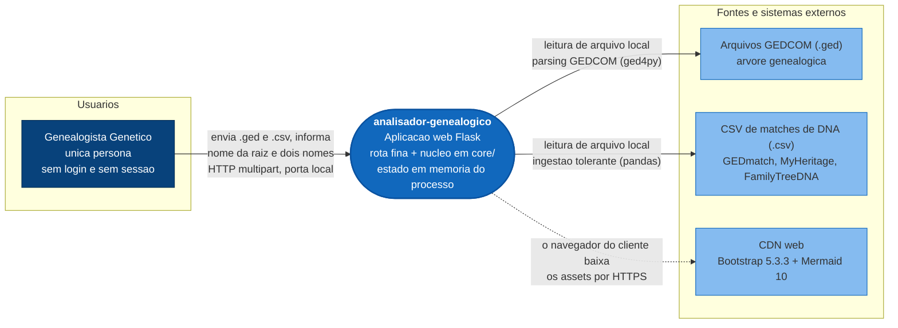

# Diagrama C4 — Contexto (Nível 1) — analisador-genealogico

> Nível de documentação: **Completo** (`state.json` → `doc_level`, decidido em 2026-10-05)
> Re-extração de **2026-10-05**. Substitui o `c4-context.md` de 2026-09-30, que descrevia a raiz `analisador-genealogico/`, o pacote `reconstructed/` e **não conhecia** a regra final da análise.
> Snapshot da versão substituída: `.reversa/snapshots/2026-10-05-pre-reextracao/c4-context.md`
> Confiança: 🟢 CONFIRMADO | 🟡 INFERIDO | 🔴 LACUNA
> Níveis 2 e 3: `c4-containers.md` e `c4-components.md` · Visão geral: `architecture.md`

---

## Nível 1 — Contexto

```mermaid
flowchart LR
    subgraph Usuarios["Usuarios"]
        U1["Genealogista Genetico<br/>unica persona<br/>sem login e sem sessao"]:::person
    end

    S(["<b>analisador-genealogico</b><br/>Aplicacao web Flask<br/>rota fina + nucleo em core/<br/>estado em memoria do processo"]):::system

    subgraph Externos["Fontes e sistemas externos"]
        C1["Arquivos GEDCOM (.ged)<br/>arvore genealogica"]:::ext
        C2["CSV de matches de DNA (.csv)<br/>GEDmatch, MyHeritage, FamilyTreeDNA"]:::ext
        C3["CDN web<br/>Bootstrap 5.3.3 + Mermaid 10"]:::ext
    end

    U1 -->|"envia .ged e .csv, informa<br/>nome da raiz e dois nomes<br/>HTTP multipart, porta local"| S
    S -->|"leitura de arquivo local<br/>parsing GEDCOM (ged4py)"| C1
    S -->|"leitura de arquivo local<br/>ingestao tolerante (pandas)"| C2
    S -.->|"o navegador do cliente baixa<br/>os assets por HTTPS"| C3

    classDef person fill:#08427B,color:#fff,stroke:#052e56,stroke-width:1px
    classDef system fill:#1168BD,color:#fff,stroke:#0b53a1,stroke-width:2px
    classDef ext fill:#85BBF0,stroke:#1168BD,stroke-width:1px
```

> **Não há integração de rede com nenhum sistema.** Os arquivos chegam **pelo upload do navegador** e são lidos **do disco local**; o único tráfego de saída é o download dos assets de CDN feito pelo navegador do próprio usuário. A aplicação **não** consome nem produz API REST/GraphQL, não publica eventos e não fala com banco de dados. 🟢

---

## Legenda dos elementos

| Elemento | Descrição | Conf. |
| --- | --- | --- |
| **Genealogista Genético** | Única persona. **Não há login, sessão, papéis nem permissões** — nenhum `session`, `login`, `auth`, `role` ou `permission` existe em `src/` (ver `permissions.md`). | 🟢 |
| **analisador-genealogico** | Aplicação Flask com **uma única rota** (`/`, `GET`+`POST`) e despacho pelo campo `action`. O núcleo vive em `src/core/` + `src/parsers/` + `src/reporting/` + `src/utils/`; o estado do GEDCOM é **global de processo**. | 🟢 |
| **GEDCOM (`.ged`)** | Entrada da árvore. Parseada por `ged4py` 0.5.2. **Re-parseada integralmente a cada `POST`** — não há cache nem persistência de resultado. | 🟢 |
| **CSV de DNA** | Entrada dos matches. Leitura **tolerante**: encoding `utf-8` com recuo para `latin-1`, separador detectado entre `,` `;` TAB `\|`, cabeçalho localizado sob preâmbulo e linhas irregulares descartadas **com aviso**. | 🟢 |
| **CDN web** | Bootstrap 5.3.3 e Mermaid 10, carregados pelo navegador. Mermaid inicializado com `securityLevel: 'strict'`. | 🟢 |

---

## Superfície de interação (o contrato real)

| Método | Rota | `action` | O que o usuário recebe |
| --- | --- | --- | --- |
| `GET` | `/` | — | Formulário inicial de upload, sem estado. |
| `POST` | `/` | `upload_gedcom` | Lista completa de nomes da árvore + confirmação de carga, e a **chave de conteúdo** que identifica o arquivo nas requisições seguintes. |
| `POST` | `/` | `dna_analysis` | Por conexão: parentesco documental, evidência genética, possibilidades, **confronto com um dos quatro estados**, observações e diagrama. Mais a lista de descartados. |
| `POST` | `/` | `path_search` | Caminho textual + diagrama Mermaid, direto (ancestral comum) ou indireto (afinidade). |

> **Não existe API REST/JSON, webhook, fila ou evento.** Toda saída é **HTML renderizado no servidor** (Jinja2) para uma **tela única** de 525 linhas. 🟢
> Todas as respostas de erro de conteúdo são **HTML com `success=false`** — com **uma exceção**: o teto de corpo excedido responde **HTTP 413**. 🟢

---

## Notas de fronteira

- **Nenhum banco de dados, fila, cache ou API externa** consumida ou produzida. O único armazenamento é o **sistema de arquivos local** (`src/uploads/`), e o único estado vivo é a **memória do processo**. 🟢
- **O que substitui a sessão é a chave de conteúdo.** Como não há sessão, a continuidade entre requisições viaja no próprio formulário: o campo oculto `gedcom_filename` carrega `<sha256 do conteúdo truncado>__<nome visível>`, e o servidor **re-parseia o arquivo a partir dela antes de ramificar**. A chave é **identificador, não segredo** — e **não há verificação de propriedade**. Detalhamento em `permissions.md` §4. 🟢
- **Não há isolamento entre usuários.** O estado do GEDCOM é global de processo e o servidor atende com **4 threads**; a guarda de instância única impede dois **processos**, não duas **threads**. Registrado como `L-16` em `domain.md` §7 e §4.3 de `permissions.md`. 🟡
- **A exposição é ato explícito:** o padrão de escuta é `127.0.0.1`, e uma segunda instância na mesma porta é recusada. 🟢
- **Fora do escopo deste diagrama:** a instrumentação de *desenvolvimento* dentro de `_reversa_sdd/` — oráculo congelado (`oracle/`), harness diferencial de paridade (`parity/`), goldens de tela (`screens/`), suíte de migração (`migration/`) e os 23 ADRs (`adrs/`). **Nada disso faz parte do sistema em execução.** O repositório também hospeda o sub-projeto Node `plugins/dsh-markdownlint/` e o vault Obsidian `docs/`, ambos fora do runtime. 🟢

---

*Gerado pelo Reversa-Architect em 2026-10-05 (re-extração, nível completo).*
