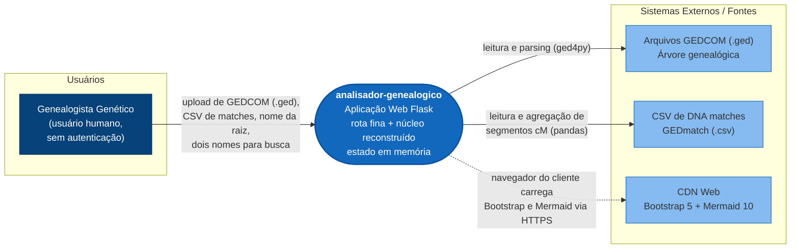

# Diagrama C4 — Contexto — analisador-genealogico

> Nível de documentação: **Essencial** (`state.json` → `doc_level`)
> Re-extração de 2026-09-30. Substitui o `c4-context.md` de 2026-08-03, que descrevia um "monolito SSR".
> Confiança: 🟢 CONFIRMADO | 🟡 INFERIDO

---

## Nível 1 — Contexto (sistema no centro)

```mermaid
flowchart LR
    subgraph Usuario["Usuários"]
        U1["Genealogista Genético<br/>(usuário humano,<br/>sem autenticação)"]:::person
    end

    S(["<b>analisador-genealogico</b><br/>Aplicação Web Flask<br/>rota fina + núcleo reconstruído<br/>estado em memória"]):::system

    subgraph Externos["Sistemas Externos / Fontes"]
        C1["Arquivos GEDCOM (.ged)<br/>Árvore genealógica"]:::ext
        C2["CSV de DNA matches<br/>GEDmatch (.csv)"]:::ext
        C3["CDN Web<br/>Bootstrap 5 + Mermaid 10"]:::ext
    end

    U1 -->|"upload de GEDCOM (.ged),<br/>CSV de matches, nome da raiz,<br/>dois nomes para busca"| S
    S -->|"leitura e parsing (ged4py)"| C1
    S -->|"leitura e agregação de<br/>segmentos cM (pandas)"| C2
    S -.->|"navegador do cliente carrega<br/>Bootstrap e Mermaid via HTTPS"| C3

    classDef person fill:#08427B,color:#fff,stroke:#052e56,stroke-width:1px
    classDef system fill:#1168BD,color:#fff,stroke:#0b53a1,stroke-width:2px
    classDef ext fill:#85BBF0,stroke:#1168BD,stroke-width:1px
```

---

## Legenda

| Elemento | Descrição | Confiança |
| --- | --- | --- |
| **Genealogista Genético** | Única persona. Não há login, sessão, papéis ou permissões. | 🟢 |
| **analisador-genealogico** | Aplicação Flask com **uma única rota** (`/`, `GET`+`POST`) e despacho por campo `action`. A lógica vive em `reconstructed/`. Estado em memória do processo, sem banco. | 🟢 |
| **GEDCOM (.ged)** | Entrada da árvore. Parseada por `ged4py`. **Re-parseada integralmente a cada POST** — não há cache. | 🟢 |
| **CSV DNA** | Entrada dos matches. Colunas reconhecidas: `Name`/`MatchedName`/`Nome`, `cM`/`TotalCM`/`Total cM`, mais ID (`[A-Z]{2}\d{7}`) e/ou e-mail. | 🟢 |
| **CDN Web** | Bootstrap 5 e Mermaid 10, carregados pelo navegador. Mermaid inicializado com `securityLevel: 'strict'` (`index.html:182`). | 🟢 |

---

## Superfície de interação (o contrato real)

| Método | Rota | `action` | O que o usuário recebe |
| --- | --- | --- | --- |
| GET | `/` | — | Formulário inicial de upload |
| POST | `/` | `upload_gedcom` | Lista de nomes da árvore + confirmação de carga |
| POST | `/` | `path_search` | Caminho textual + diagrama Mermaid (direto ou indireto) |
| POST | `/` | `dna_analysis` | Tabela de conexões ordenada por cM + diagrama + lista de descartados |

> Não existe API REST/JSON, webhook, fila ou evento. Toda saída é **HTML renderizado no servidor** (Jinja2) para uma tela única. 🟢

---

## Notas de fronteira

- **Nenhum banco de dados, fila, cache ou API externa** consumida ou produzida. 🟢
- Toda troca de dados externa é **entrada de arquivo local** ou **asset de CDN no navegador**. 🟢
- **Não há isolamento entre usuários.** Como o estado é global no processo, dois genealogistas usando a mesma instância compartilham a mesma árvore — o upload de um substitui o do outro. 🟢 (risco registrado em `migration/risk_register.md`)
- **Fora do escopo deste diagrama:** a instrumentação de *desenvolvimento* que vive dentro de `_reversa_sdd/` (oráculo congelado, harness diferencial de paridade, goldens de tela, suíte de testes). Não faz parte do sistema em runtime e não deve ser confundida com a arquitetura da aplicação.

---

*Gerado pelo Reversa-Architect em 2026-09-30 (re-extração).*
