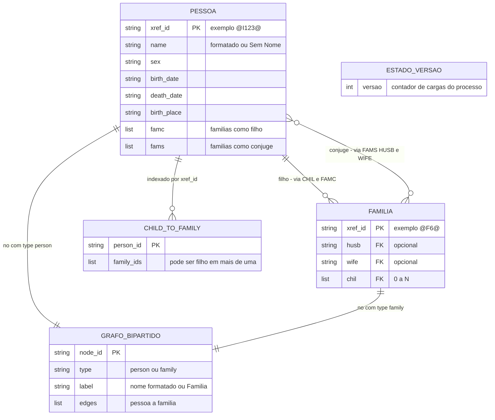
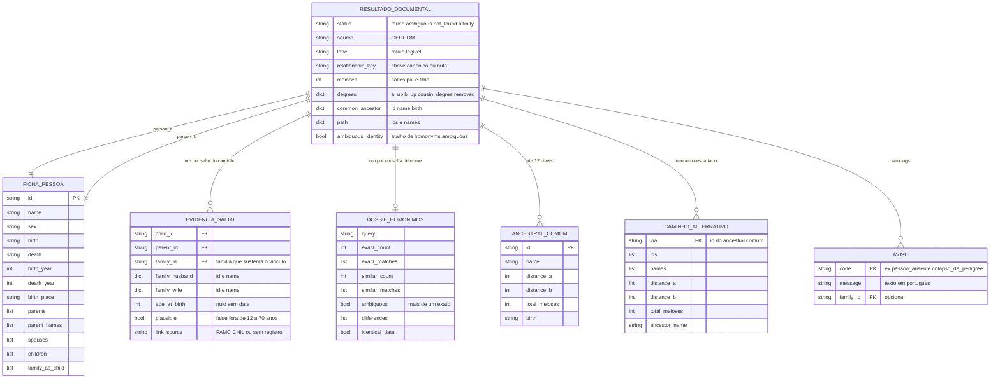
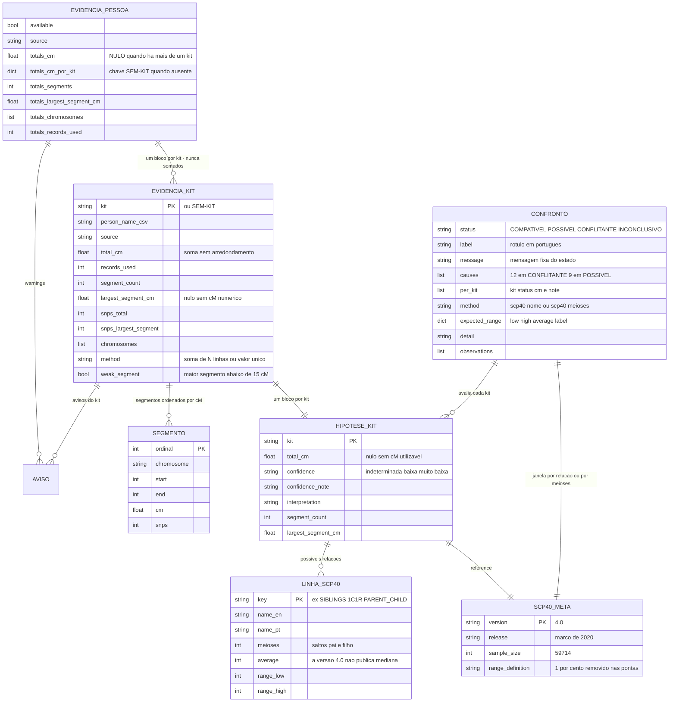
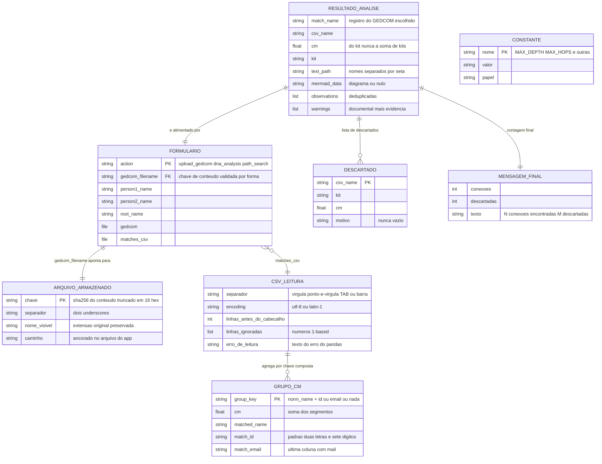

# ERD Completo — analisador-genealogico

> Nível de documentação: **Completo** (`state.json` → `doc_level`)
> Re-extração de **2026-10-05**. Artefato **novo** — o nível `essencial` embutia um ERD resumido no `architecture.md`.
> Confiança: 🟢 CONFIRMADO | 🟡 INFERIDO | 🔴 LACUNA
> Fonte dos campos, tipos, padrões e sentinelas: `data-dictionary.md` (441 linhas). Visão geral: `architecture.md`.

---

## 1. Como ler este ERD

**Este sistema não tem banco de dados.** Não há DDL, migration, schema, ORM nem arquivo de configuração de persistência. As **27 estruturas** abaixo existem em três lugares, e a notação de ERD é usada como **modelo lógico**, não como esquema físico:

| Onde | Quantas estruturas | Vida útil | Dono |
| --- | ---: | --- | --- |
| **Memória do processo** | 21 | Morre com o processo | `core/gedcom_state.py` e os módulos de `core/` |
| **Disco** | 2 | Persistente, imutável | `app.py` + `utils/validate.py` |
| **Corpo da requisição / payload da tela** | 4 | Uma requisição | `app.py` + Jinja2 |

> ⚠️ **`PK` e `FK` aqui são lógicos.** Onde a tabela diz `FK`, significa "este campo referencia um `xref_id` de outro registro" — **não** que exista constraint. Não existe nenhuma. Uma referência GEDCOM pendente (`CHIL` apontando para xref inexistente) **não é rejeitada**: a aresta simplesmente não é criada (`BR-U-18`). É exatamente o comportamento que o alvo da migração pretende mudar com `FK` real (`migration/target_data_model.md`).
>
> ⚠️ **`None` significa "não sei / não existe", nunca zero.** A regra é invariante do sistema e está anotada campo a campo no `data-dictionary.md` §10.

---

## 2. Diagrama A — Árvore do GEDCOM em memória

| Relacionamento | Cardinalidade | Regra | Conf. |
| --- | --- | --- | --- |
| `PESSOA` → `FAMILIA` (como filho) | `0..N` | `FAMC` é preferido; sem ele, o índice `child_to_family` acumula **todas** as famílias em que a pessoa aparece como `CHIL` | 🟢 |
| `PESSOA` → `FAMILIA` (como cônjuge) | `0..N` | pelos sub-registros `FAMS` | 🟢 |
| `FAMILIA` → `PESSOA` | `0..2` cônjuges + `0..N` filhos | `HUSB` e `WIFE` são **opcionais** | 🟢 |
| `PESSOA`/`FAMILIA` → `GRAFO_BIPARTIDO` | `1..1` por nó | Aresta só é criada se **os dois** nós existirem; família sem `xref_id` é ignorada por completo | 🟢 |
| `ESTADO_VERSAO` → índices derivados | `1..N` | **Sem FK.** `versao` é o sinal de invalidação do índice `norm_name → ids` de `documentary_relationship`; existe porque `id()` não muda com mutação *in place* e dois GEDCOMs podem ter a mesma contagem de pessoas | 🟢 |

> **O grafo é `networkx.Graph` não-direcionado, e não `MultiGraph`.** A direção parental **não** está no grafo — é derivada por `get_parents`/`get_children`, que leem `FAMC`/`FAMS`/`CHIL` diretamente dos registros. 🟢
> **`graph` é reatribuído**, enquanto `people`, `families` e `child_to_family` são mutados *in place*. É a razão de `path_finding.py:38` importar `graph` **dentro da função** enquanto os outros são importados no topo. 🟢

---

## 3. Diagrama B — Parentesco documental

| Relacionamento | Cardinalidade | Regra | Conf. |
| --- | --- | --- | --- |
| `RESULTADO_DOCUMENTAL` → `FICHA_PESSOA` | `1..1` × 2 | **Sempre duas fichas completas** — inclusive quando não há caminho. É o custo registrado em `L-20` | 🟢 |
| `RESULTADO_DOCUMENTAL` → `EVIDENCIA_SALTO` | `0..N` | Um por aresta do caminho; **zero** quando não há caminho | 🟢 |
| `RESULTADO_DOCUMENTAL` → `DOSSIE_HOMONIMOS` | `0..1` | Preenchido quando o chamador informa homônimos; `{}` caso contrário | 🟢 |
| `RESULTADO_DOCUMENTAL` → `ANCESTRAL_COMUM` | `0..12` | Enumerados até **12 níveis**, limitados a **12**, ordenados por meioses totais | 🟢 |
| `RESULTADO_DOCUMENTAL` → `CAMINHO_ALTERNATIVO` | `0..N` | Todos os caminhos alternativos são listados; **nenhum é descartado** | 🟢 |
| `ANCESTRAL_COMUM` → colapso | `0..N` cadeias | Mais de uma cadeia de pais até o mesmo ancestral gera o aviso `colapso_de_pedigree` (teto de **8** cadeias) | 🟢 |

---

## 4. Diagrama C — Evidência genética, possibilidades e confronto

| Relacionamento | Cardinalidade | Regra | Conf. |
| --- | --- | --- | --- |
| `EVIDENCIA_PESSOA` → `EVIDENCIA_KIT` | `0..N` | Chave de evidência é **(nome, kit)**. **Nunca somados entre si** | 🟢 |
| `EVIDENCIA_KIT` → `SEGMENTO` | `0..N` | Ordenados por cM decrescente, com `None` por último | 🟢 |
| `EVIDENCIA_KIT` → `HIPOTESE_KIT` | `1..1` | Um bloco de hipótese por kit; o cM do bloco é o **do kit** | 🟢 |
| `HIPOTESE_KIT` → `LINHA_SCP40` | `0..27` | 27 relações publicadas; **lista vazia é resposta válida** e significa "não descarta parentesco" | 🟢 |
| `LINHA_SCP40` → ausência | 6 relações | `1C4R`, `1C5R`, `1C6R`, `3C2R`, 2º e 3º bisavós **não são publicadas** e **não recebem número inventado** — a janela passa a ser a envoltória por meioses | 🟢 |
| `CONFRONTO` → `HIPOTESE_KIT` | `0..N` | Avalia cada kit; sem kit utilizável, o estado é `INCONCLUSIVO` | 🟢 |
| `CONFRONTO` → `SCP40_META` | `1..1` | A janela é derivada da relação exata (`scp40:<nome>`) ou da envoltória por meioses (`scp40:meioses=<n>`) | 🟢 |

> **O `status` do confronto é derivado, não armazenado.** Ele é o resultado de uma função sobre os três eixos — ver a máquina de decisão em `state-machines.md` §3.
> **`totals.cm` nulo com múltiplos kits é contrato, não ausência de dado**: é a resposta honesta quando não se sabe qual kit corresponde à pessoa do GEDCOM. 🟢

---

## 5. Diagrama D — Entrada, disco e payload da tela

| Relacionamento | Cardinalidade | Regra | Conf. |
| --- | --- | --- | --- |
| `FORMULARIO` → `ARQUIVO_ARMAZENADO` | `1..1` por requisição pós-upload | O valor é validado **por forma fechada** antes de virar caminho; fora da forma, a resposta é `"Erro: Arquivo 'X' não existe mais."` | 🟢 |
| `ARQUIVO_ARMAZENADO` → conteúdo | `1..1` | Chave derivada do **conteúdo**: mesmo conteúdo, mesma chave; arquivo existente **não é reescrito** | 🟢 |
| `FORMULARIO` → `CSV_LEITURA` | `0..1` | Só no fluxo `dna_analysis` | 🟢 |
| `CSV_LEITURA` → `GRUPO_CM` | `0..N` | Agrupamento vetorizado por chave composta; nome normalizado **uma vez por nome distinto** | 🟢 |
| `RESULTADO_ANALISE` → `DESCARTADO` | `0..N` | Disjuntos: um match ou vira resultado, ou vira descartado — **nunca os dois** | 🟢 |
| `RESULTADO_ANALISE` → `MENSAGEM_FINAL` | `1..1` | `"{N} conexões encontradas. {M} descartadas."`; sem resultados, os avisos de arquivo são **anexados à mensagem** | 🟢 |
| `CONSTANTE` | sem aresta | Parâmetros de domínio e configuração (§9 do dicionário) | 🟢 |

### Composição do item de resultado

`RESULTADO_ANALISE` **agrega os quatro eixos** — é o único ponto do modelo em que eles aparecem lado a lado **sem se misturar**:

| Campo do item | Estrutura agregada | Eixo |
| --- | --- | --- |
| `documentary` | `RESULTADO_DOCUMENTAL` (§3) | 🧬 documental |
| `genetic_evidence` | `EVIDENCIA_PESSOA` (§4) | 🧪 genético |
| `hypotheses` | lista de `HIPOTESE_KIT` (§4) | 📊 possibilidades |
| `comparison` | `CONFRONTO` (§4) | ⚖️ confronto |
| `cm` | cM **do kit** | 🧪 genético |

---

## 6. Inventário das 27 estruturas

| # | Estrutura (ERD) | Nome no código | Diagrama | PK / FK | Conf. |
| ---: | --- | --- | --- | --- | --- |
| 1 | `PESSOA` | registro `ged4py` INDI em `gedcom_state.people` | A | `xref_id` | 🟢 |
| 2 | `FAMILIA` | registro `ged4py` FAM em `gedcom_state.families` | A | `xref_id`; `husb`/`wife`/`chil` → `PESSOA` | 🟢 |
| 3 | `GRAFO_BIPARTIDO` | `gedcom_state.graph` (`networkx.Graph`) | A | nó por `xref_id` | 🟢 |
| 4 | `CHILD_TO_FAMILY` | `gedcom_state.child_to_family` | A | `person_id` → lista de famílias | 🟢 |
| 5 | `ESTADO_VERSAO` | `gedcom_state.versao` | A | contador | 🟢 |
| 6 | `ARQUIVO_ARMAZENADO` | nome em `src/uploads/` | D | chave de conteúdo | 🟢 |
| 7 | `FORMULARIO` | `request.form` + `request.files` | D | `action` | 🟢 |
| 8 | `CSV_LEITURA` | `df` + `df.attrs` | D | — | 🟢 |
| 9 | `GRUPO_CM` | coluna `_group_key` | D | chave composta | 🟢 |
| 10 | `EVIDENCIA_PESSOA` | `evidence_for(...)` | C | nome normalizado | 🟢 |
| 11 | `EVIDENCIA_KIT` | bloco de `evidencias[nome][kit]` | C | `kit` | 🟢 |
| 12 | `SEGMENTO` | item de `evidencia["segments"]` | C | ordinal | 🟢 |
| 13 | `AVISO` | `{code, message}` | B e C | `code` | 🟢 |
| 14 | `HIPOTESE_KIT` | bloco de `possible_relationships` | C | `kit` | 🟢 |
| 15 | `LINHA_SCP40` | tupla de `SCP40_ROWS` | C | `key` | 🟢 |
| 16 | `SCP40_META` | `SCP40_META` | C | `version` | 🟢 |
| 17 | `CONFRONTO` | `compare(...)` | C | — | 🟢 |
| 18 | `RESULTADO_DOCUMENTAL` | `documentary_relationship(...)` | B | — | 🟢 |
| 19 | `FICHA_PESSOA` | `person_summary(pid)` | B | `id` | 🟢 |
| 20 | `EVIDENCIA_SALTO` | `hop_evidence(...)` | B | par filho/genitor | 🟢 |
| 21 | `DOSSIE_HOMONIMOS` | `homonym_dossier(...)` | B | `query` | 🟢 |
| 22 | `ANCESTRAL_COMUM` | item de `common_ancestors` | B | `id` | 🟢 |
| 23 | `CAMINHO_ALTERNATIVO` | item de `additional_paths` | B | `via` | 🟢 |
| 24 | `RESULTADO_ANALISE` | item de `results_sorted` | D | — | 🟢 |
| 25 | `DESCARTADO` | item de `skipped_matches` | D | `csv_name` | 🟢 |
| 26 | `MENSAGEM_FINAL` | `message` de `dna_analysis` | D | — | 🟢 |
| 27 | `CONSTANTE` | `data-dictionary.md` §9 | D | `nome` | 🟢 |

---

## 7. O que este ERD **não** tem — e por quê

| Ausência | Motivo | Conf. |
| --- | --- | --- |
| **Constraint de integridade referencial** | Não há banco. Referência GEDCOM pendente é **aceita** e a aresta não é criada. O alvo da migração quer o inverso (`FK` real + rejeição no parse) | 🟢 |
| **Unicidade de `xref_id`** | Garantida pelo `dict` (chave), não por constraint. `families` e `people` são dicionários indexados por `xref_id` | 🟢 |
| **Entidade de usuário / `owner_id`** | Não existe. É a raiz do `BUG-20260929-BJJH` e o invariante que a Onda 3 vai introduzir | 🟢 |
| **Histórico, versionamento ou auditoria de dado** | Nada é versionado: o arquivo é imutável e o estado em memória é substituído | 🟢 |
| **Relação entre `RESULTADO_ANALISE` e `PESSOA`** | Ela existe **dentro** de `documentary` (as fichas), e não como FK do item de resultado — reflexo de que não há persistência que precisasse da chave | 🟢 |
| **Cardinalidade `N:M` explícita** | Pessoa↔família é `N:M` por natureza (uma pessoa está em várias famílias; uma família tem várias pessoas) e é resolvida por **nó intermediário** no grafo bipartido | 🟢 |

---

## 8. Lacunas do modelo de dados 🔴

| ID | Lacuna | Conf. |
| --- | --- | --- |
| **E-01** | **Ordem é dado, não consequência — e não está modelada.** Três ordens determinam resultado e não têm estrutura que as proteja: a ordem de inserção das arestas (decide qual caminho o `shortest_path` devolve), a ordem dos candidatos de nome (decide o desempate) e a ordem de apresentação dos resultados. Só a terceira é explícita no código. Ver `adrs/22` e `adrs/23`. | 🟢 |
| **E-02** | **O `RESULTADO_ANALISE` não referencia a `PESSOA` escolhida por chave**, só por nome (`match_name`) e pelo conteúdo de `documentary`. Não há como reconstruir a ligação sem reabrir a árvore. | 🟢 |
| **E-03** | ✅ **FECHADA em 2026-10-05 — a sentinela foi tornada incapaz de colidir.** Você decidiu trocá-la. `SEM_KIT` passou a ser `" SEM-KIT"`, **com espaço à esquerda**: como `_clean` aplica `.strip()` em todo valor vindo do CSV, nenhum kit real (nem e-mail) pode começar com espaço. Antes, um CSV com um kit literalmente chamado `SEM-KIT` fazia as linhas **sem** kit caírem no mesmo grupo e somarem cM de origens diferentes. **Teste de regressão:** `test_8c_kit_chamado_SEM_KIT_nao_colide_com_a_ausencia_de_kit` prova três grupos separados. | 🟢 |
| **E-04** | ✅ **DECIDIDA em 2026-10-05 — persistir é requisito do ALVO, e o legado mantém o comportamento efêmero.** Nenhuma estrutura é gravada entre requisições hoje, e isso **permanece**; o histórico de análises entra como requisito do sistema alvo (ver `gaps.md` § "Requisitos encaminhados ao alvo"). Registro importante para o modelo de dados do alvo: `RESULTADO_ANALISE` e `DESCARTADO` deixam de ser payload de tela e passam a ser **entidades persistidas**. | 🟢 |

---

*Gerado pelo Reversa-Architect em 2026-10-05 (re-extração, nível completo).*
