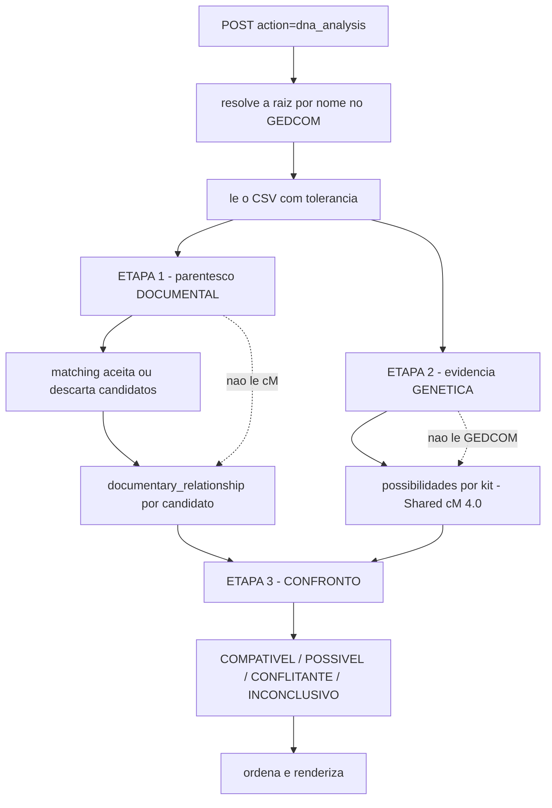
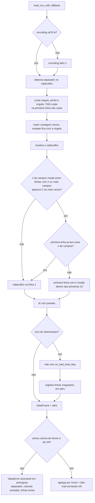
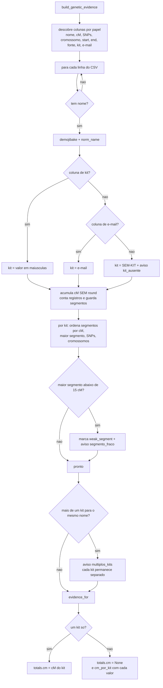
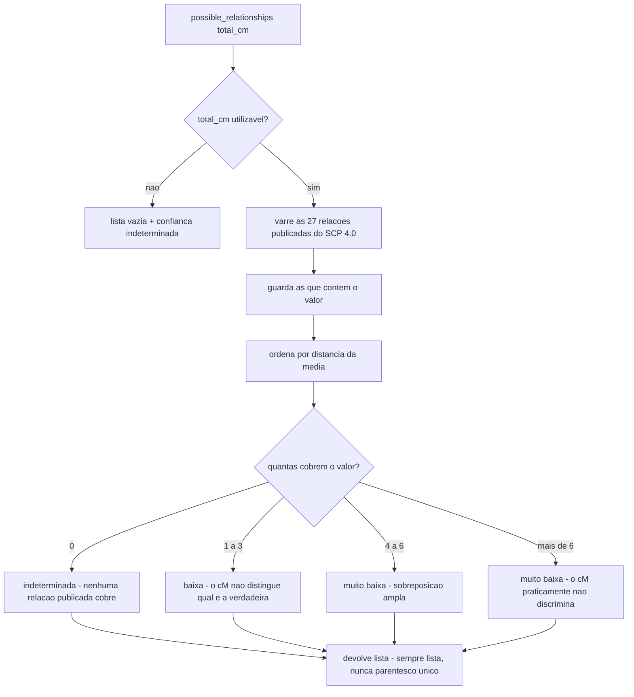
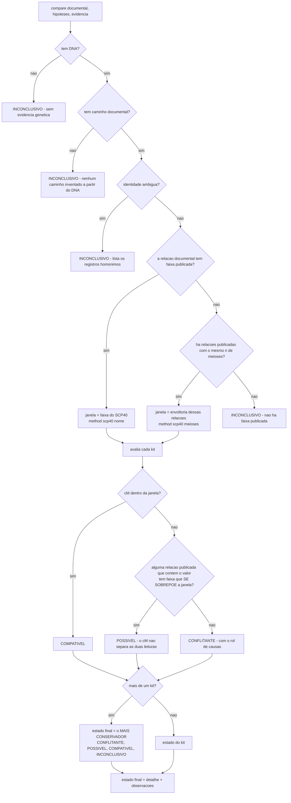
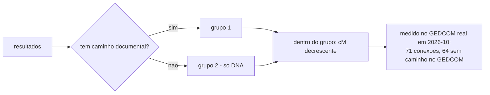

# Fluxograma — módulo `analise-dna`

> Gerado pelo Reversa-Archaeologist em 2026-10-05 (re-extração, nível **completo**).
> Fontes: `src/core/dna_analysis.py`, `genetic_evidence.py`, `relationship_hypotheses.py`, `evidence_comparison.py`, `matching.py`, `name_normalization.py`, `cm_estimator.py`, `src/parsers/csv_ingest.py`.
> Escala de confiança: 🟢 CONFIRMADO | 🟡 INFERIDO | 🔴 LACUNA
> **Regra do projeto:** o DNA determina a evidência genética; ele **não** determina parentesco. O cM nunca é usado sozinho para afirmar vínculo.

## 1. Visão geral — as três etapas nunca se misturam

## 2. Leitura tolerante do CSV (`csv_ingest`)

## 3. Evidência genética por (nome, kit) — nunca somando kits

## 4. Do cM às possibilidades (`relationship_hypotheses`)

## 5. Decisão do confronto (`evidence_comparison.compare`)

## 6. Ordem de apresentação dos resultados

## 7. Notas de leitura

* **A ordem de apresentação não é ordem de confiança.** É primeiro o que tem caminho documental, depois o que só tem DNA; dentro de cada grupo, cM decrescente. A justificativa está medida no próprio código: das 71 conexões do GEDCOM real, 64 não têm caminho no GEDCOM — ordenar só por cM enterraria as 7 documentais no meio. 🟢
* **Nenhum caminho é inventado a partir do DNA.** Quando não há caminho documental, o confronto é INCONCLUSIVO e o texto diz isso explicitamente. 🟢
* **A escolha entre homônimos é a do legado** (o primeiro candidato que tenha caminho), preservada de propósito para não alterar resultado — mas passa a ser **declarada** como identidade ambígua, em vez de silenciosa. 🟢
* **`cm_estimator` está fora do fluxo.** As nove faixas escritas à mão continuam existindo por compatibilidade (`__all__` do `dna_analysis`, harness de paridade e `tests/test_dna_analysis.py`), e o próprio módulo declara que não devem ser usadas em código novo. Quem traduz cM agora é `relationship_hypotheses`, com fonte publicada. 🟢
* **`LIMITE_SEGMENTO_FRACO` (15 cM) é critério do projeto, não da fonte.** A própria `relationship_hypotheses` registra que a versão 4.0 do Shared cM Project não afirma nada sobre "segmento abaixo de X é falso positivo". 🟢

---

*Gerado pelo Reversa-Archaeologist em 2026-10-05.*
