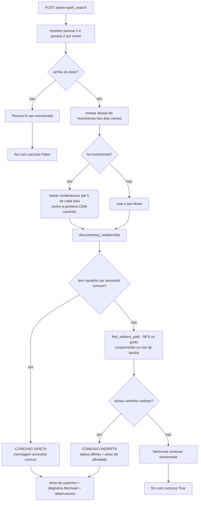
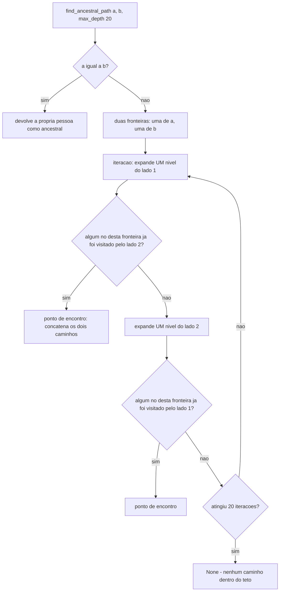
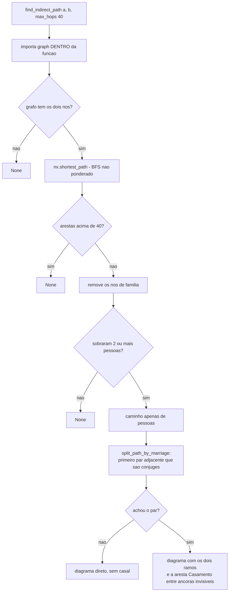
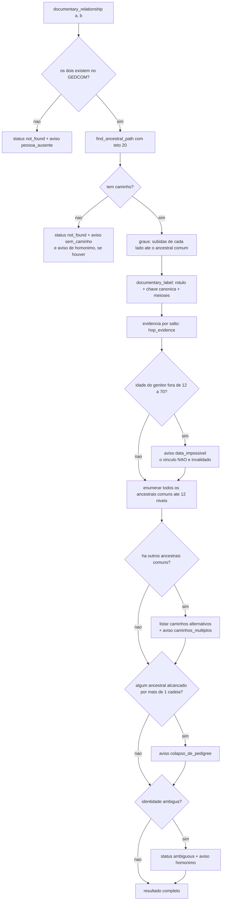
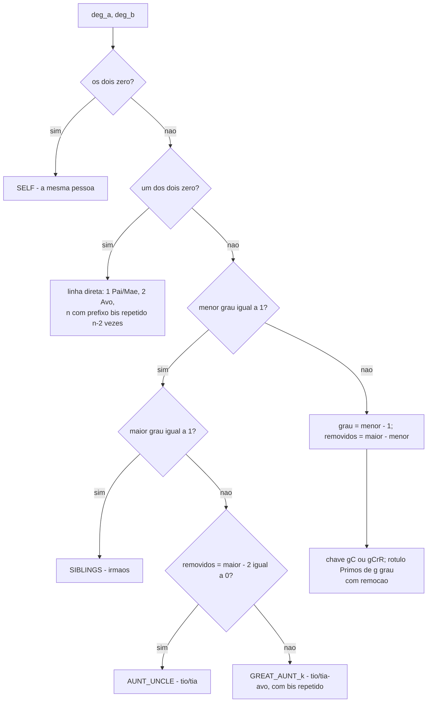
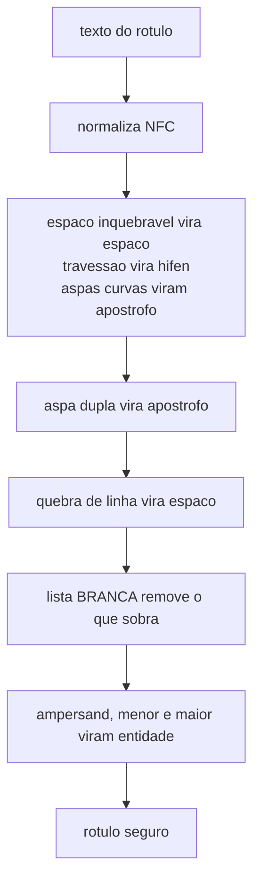

# Fluxograma — módulo `busca-caminho`

> Gerado pelo Reversa-Archaeologist em 2026-10-05 (re-extração, nível **completo**).
> Fontes: `src/core/path_search.py`, `path_finding.py`, `family_navigation.py`, `documentary_relationship.py`, `src/reporting/mermaid_render.py`.
> Escala de confiança: 🟢 CONFIRMADO | 🟡 INFERIDO | 🔴 LACUNA
> **Regra do projeto:** esta busca é **documental**. Não há DNA nesta tela, e a conexão por casamento **nunca** é apresentada como parentesco consanguíneo.

## 1. Fluxo da busca (`path_search`)

## 2. Caminho direto — BFS bidirecional subindo por pais

> O teto conta **iterações de profundidade** do BFS bidirecional, e não gerações: cada iteração expande um nível de **um** dos dois lados, alternadamente. A extração anterior descrevia isso como "profundidade máxima de 20 níveis".

## 3. Caminho indireto por afinidade

## 4. Parentesco documental (`documentary_relationship`)

## 5. Tradução de graus em parentesco (`documentary_label`)

## 6. Contrato de escape do rótulo Mermaid

> A lista é **branca**, e não negra: a negra anterior era furada pela **crase**, que logo após a aspa de abertura desvia o lexer do Mermaid para markdown-string e faz o fecha-colchete nunca virar o token exigido pela gramática (`BUG-20260929-J6PQ`). A versão seguinte era estreita demais e descartava 14 caracteres sem intenção (`BUG-20261002-T4ZM`).

## 7. Notas de leitura

* **A conexão indireta é marcada como afinidade em três lugares**: o `status` vira `affinity`, o rótulo diz "Sem ancestral comum: conexão por afinidade (casamento)" e um aviso afirma em maiúsculas que não há parentesco consanguíneo. 🟢
* **Nenhuma data invalida um vínculo.** O GEDCOM manda; o sistema **registra a evidência** (`age_at_birth`, `plausible`) e **avisa**. O caso medido está no próprio código: mãe nascida 11 anos depois do filho (`@F6@`, Celso Gomes Gama n. 1961, filho de Maria Auxiliadora n. 1972) apresentado pelo legado como "conexão direta por ancestral comum". 🟢
* **Escolha de homônimos: comportamento do legado preservado, mas declarado.** Na busca de caminho, as combinações são testadas e vence a primeira com caminho (medido: "Jose Vicente de Souza" tem três registros e só um tem pais — antes a tela dizia "nenhuma conexão"); na análise de DNA, mantém-se o primeiro candidato do legado. Em ambos os casos a ambiguidade é **avisada**. 🟢
* **O teto de 20 iterações corta em silêncio** quando a árvore é mais funda: o retorno é `(None, None)`, e o aviso diz que isso **não prova** ausência de parentesco. Decisão humana de 2026-09-30: preservar a fidelidade ao legado. 🟢
* **`get_spouses` busca no registro FAMS e, se nada achar, varre todas as famílias.** A varredura só roda quando a lista por FAMS fica vazia — e é isso que faz o cônjuge de uma segunda família desaparecer quando a primeira resolve. A decisão de 2026-09-30 foi documentar como contrato explícito. 🟢

---

*Gerado pelo Reversa-Archaeologist em 2026-10-05.*
