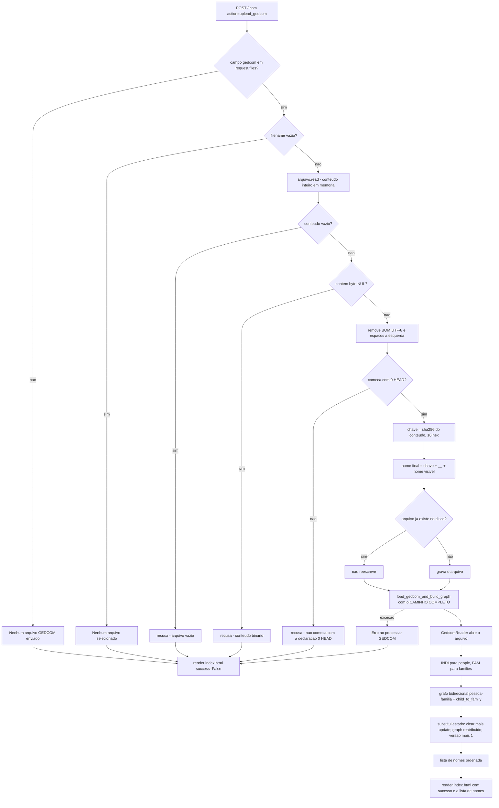
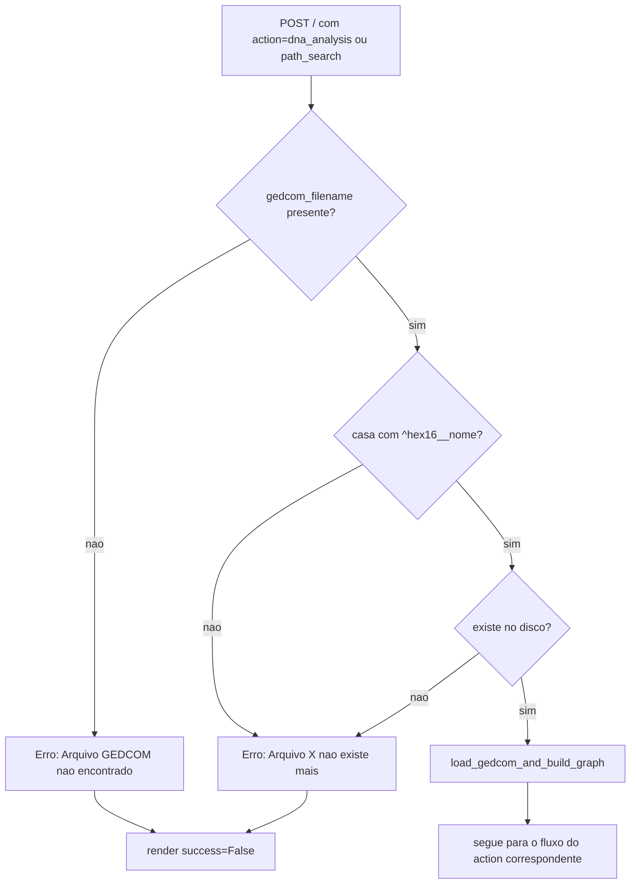
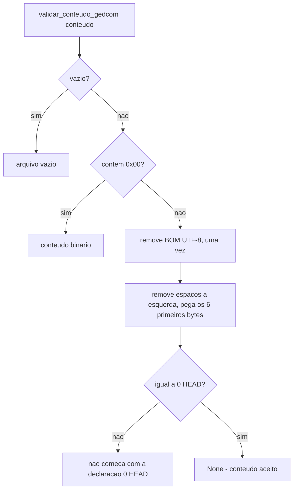
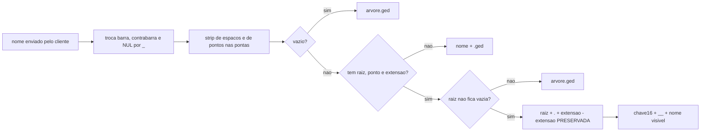

# Fluxograma — módulo `upload-gedcom`

> Gerado pelo Reversa-Archaeologist em 2026-10-05 (re-extração, nível **completo**).
> Fontes: `src/app.py`, `src/utils/validate.py`, `src/parsers/gedcom_parser.py`, `src/core/gedcom_state.py`, `src/utils/text_cleaning.py`.
> Escala de confiança: 🟢 CONFIRMADO | 🟡 INFERIDO | 🔴 LACUNA

## 1. Fluxo principal do upload (POST `action=upload_gedcom`)

## 2. Fluxo da requisição seguinte (`gedcom_filename` vindo do formulário)

## 3. Decisão de aceitação do conteúdo (recorte de `utils/validate.py`)

## 4. Composição do nome de arquivo armazenado

## 5. Notas de leitura

* **A validação é de conteúdo, não de extensão.** Um GEDCOM legítimo sem a extensão `.ged` é aceito; o `RISK-007` autoriza esse relaxamento justamente para não quebrar a paridade de parsing com o oráculo. 🟢
* **O nome do cliente nunca decide o caminho.** Ele vira metadado legível depois da chave; a pasta é sempre a resolvida por `_pasta_uploads()`. 🟢
* **A chave é derivada do conteúdo, e não aleatória**, porque o formulário devolve o valor no POST seguinte: a mesma árvore reenviada precisa dar a mesma chave. 🟢
* **A assimetria de substituição do estado é deliberada**: dicionários mutados *in place* para preservar os bindings importados no topo; o grafo é reatribuído, e por isso é importado dentro da função por quem o consome. 🟢
* **O contador `versao`** existe porque `id()` não muda com mutação *in place*, e índices derivados (nome normalizado para ids) precisam de um sinal de invalidação. 🟢

---

*Gerado pelo Reversa-Archaeologist em 2026-10-05.*
