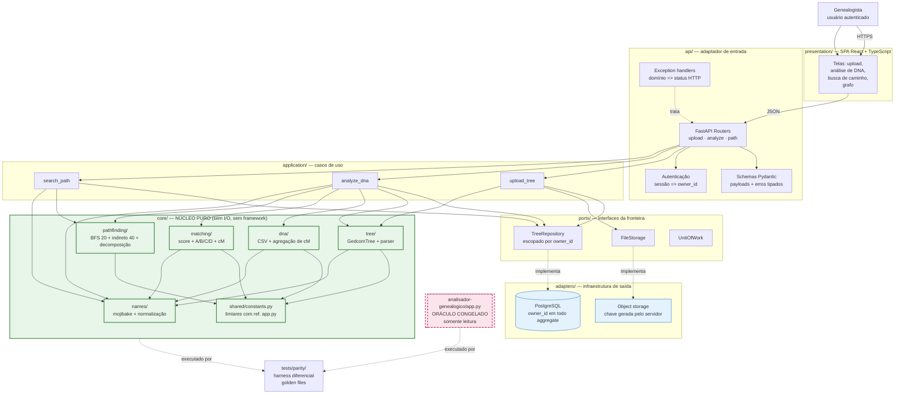

# Target Architecture

> Arquitetura alvo do sistema novo, respeitando o paradigma escolhido em `paradigm_decision.md` e a estratégia confirmada em `migration_strategy.md`.

## Visão geral

O sistema novo é um **serviço multiusuário** (FastAPI + PostgreSQL + SPA React) que faz análise de genealogia genética: recebe uma árvore GEDCOM e um relatório de matches de DNA, calcula o parentesco e explica o caminho genealógico até a pessoa-raiz. A arquitetura é **hexagonal com núcleo puro**: todo o algoritmo de negócio (parsing, mojibake, matching viral, regras A/B/C/D, tabela de cM, busca de caminho) vive em `core/` como **funções puras sem I/O e sem framework**; a fronteira — autenticação, tenancy, persistência, HTTP, apresentação — vive em `ports/`, `adapters/`, `application/` e `api/`, com dependências injetadas.

O paradigma é **OO com DI sobre funções puras** (opção 3 do `paradigm_decision.md`): DI e repositórios na borda, funções puras no núcleo. Não há mensageria, não há eventos de domínio, não há estado global: o processamento é **síncrono por requisição**, como no legado.

A borda com o legado durante a migração é o **oráculo congelado**: `analisador-genealogico/app.py` permanece intacto e somente-leitura, e é executado lado a lado com o núcleo novo pelo harness diferencial (`tests/parity/`) — a materialização da estratégia Parallel Run.

## Diagrama (Mermaid)



> O diagrama mostra a direção das dependências: **as setas nunca apontam de `core/` para a fronteira**. Essa é a invariante arquitetural que torna a Onda 1 do `cutover_plan.md` executável.

## Componentes

| Componente | Tipo | Responsabilidade | Origem |
|---|---|---|---|
| `presentation/` (SPA React + TS) | Front-end | Telas de upload, análise, busca de caminho e visualização de grafo. Substitui o render Jinja2 server-side. | **novo** (substitui `templates/index.html` + `static/graph_path_search.html` — BR-DESCARTAR-004, BR-DESCARTAR-005) |
| `api/routers/` | API | FastAPI routers, um por caso de uso. Substituem o despacho por campo `action` no `POST /` do legado. | **novo** (substitui as 3 rotas de `app.py`) |
| `api/schemas/` | API | Validação de entrada/saída com Pydantic; payloads tipados. | **novo** |
| `api/errors.py` | API | Mapeia exceções de domínio para status HTTP semântico. Substitui o `200 (sempre)` do legado. | **novo** (BR-MIGRAR-034, BR-DESCARTAR-004) |
| `api/auth` | API | Autenticação e resolução de sessão → `owner_id`. Inexistia no legado. | **novo** (brief § Escopo; BR-HUMANA-004) |
| `application/upload_tree.py` | Serviço | Caso de uso: receber arquivo, validar, armazenar, parsear via `core/tree`, persistir árvore. | **dividido** de `app.py` bloco `upload_gedcom` |
| `application/analyze_dna.py` | Serviço | Caso de uso: carregar árvore, ler CSV, agregar, fazer matching, calcular caminhos, montar resultado. | **dividido** de `app.py` bloco `dna_analysis` |
| `application/search_path.py` | Serviço | Caso de uso: resolver duas pessoas, buscar conexão direta e, em falha, indireta. | **dividido** de `app.py` bloco `path_search` |
| `ports/tree_repository.py` | Interface | Contrato de persistência de árvores, **sempre escopado por `owner_id`** na assinatura. | **novo** (elimina o estado global — BR-DESCARTAR-001; mitigação RISK-005) |
| `ports/file_storage.py` | Interface | Contrato de armazenamento de arquivos com chave gerada pelo servidor. | **novo** (BR-DESCARTAR-003) |
| `ports/unit_of_work.py` | Interface | Fronteira transacional por caso de uso. | **novo** |
| `core/names/` | Serviço (núcleo puro) | `strip_bad_utf`, `demojibake`, `norm_name`, `split_name_pt`, `surnames_set`. | **preservado** (BR-MIGRAR-006, 007, 012) |
| `core/tree/` | Serviço (núcleo puro) | `GedcomTree` (pessoas, famílias, grafo, índice filho→família) e parser `ged4py` → árvore. | **dividido** de `app.py` (BR-MIGRAR-001, 002, 003) |
| `core/matching/` | Serviço (núcleo puro) | Score difuso, filtros anti-falso-positivo, regras A/B/C/D, Jaccard, desempate e tabela de relação por cM. | **dividido** de `app.py` bloco `dna_analysis` (BR-MIGRAR-009..015, 020, 021) |
| `core/pathfinding/` | Serviço (núcleo puro) | BFS bidirecional (depth 20), conexão indireta (hops 40), **decomposição do caminho** (`split_path_by_marriage`, `are_spouses`). | **fundido + dividido** (BR-MIGRAR-022..027; BR-HUMANA-008) |
| `core/dna/` | Serviço (núcleo puro) | Leitura de CSV com fallback UTF-8/Latin-1, detecção de colunas, `_group_key`, agregação de cM. | **dividido** de `app.py` bloco `dna_analysis` (BR-MIGRAR-016..019) |
| `core/shared/constants.py` | Serviço (núcleo puro) | Todos os limiares de domínio, centralizados e com referência de linha ao `app.py`. | **novo** (defesa contra RISK-003) |
| `adapters/persistence/` | DB | Repositórios PostgreSQL + migrations. Escopo por tenant obrigatório. | **novo** (substitui estado em memória) |
| `adapters/storage/` | Serviço | Object storage escopado por `owner_id`, chave gerada pelo servidor, nome original como metadado. | **novo** (substitui `uploads/`) |
| PostgreSQL | DB | Persistência de usuários, árvores, análises e resultados. | **novo** |
| `tests/parity/` | Serviço | Harness diferencial: executa legado e núcleo sobre as mesmas fixtures e compara saídas. | **novo** (Onda 0) |

## Bounded contexts

> **Restrição da topologia aprovada** (`topology_decision.md`, opção 3): `core/` é **plano**. Os bounded contexts abaixo refletem **capacidades de negócio e donos de invariante persistido** — não espelham arquivos de `core/`. O algoritmo é um núcleo único compartilhado.

### BC-01: Identidade e Tenancy
- **Responsabilidade**: contas, autenticação e a resolução da fronteira de isolamento (`owner_id`). É o contexto que **possui** a invariante de que todo dado pertence a exatamente um usuário.
- **Justificativa do agrupamento / separação**: **novo e separado** porque não existe nada equivalente no legado — `domain.md` §4 registra como lacuna *"Sem autenticação/autorização: sistema não possui RBAC"*. Separado dos demais porque é o único contexto cuja falha de invariante produz **vazamento entre usuários** (RISK-005), e porque a mudança de perspectiva (de "a árvore" para "a árvore de quem") é uma fronteira conceitual, não uma camada técnica.
- **Componentes internos**: `api/auth`, tabela `app_user`, política de escopo por tenant.
- **Invariante central**: nenhuma leitura ou escrita de aggregate ocorre sem `owner_id` explícito.

### BC-02: Árvore Genealógica (GEDCOM)
- **Responsabilidade**: representar e persistir a árvore — pessoas, famílias, relações pai/filho/cônjuge e o índice filho→família — além do ciclo de vida do arquivo que a originou.
- **Justificativa do agrupamento / separação**: **fundido a partir do legado com separação da persistência**. No legado, a árvore **era** o estado global (`people`, `families`, `graph`, `child_to_family`) e vivia misturada com o parsing e com a rota. Aqui o aggregate `GedcomTree` tem invariantes próprias: integridade referencial (`FAMC`/`FAMS`/`HUSB`/`WIFE`/`CHIL` apontando para xrefs existentes) e propriedade (`owner_id`). **Separado** de Análise de DNA porque a árvore **sobrevive** à análise: é carregada uma vez e consultada por múltiplas análises e buscas de caminho — a `architecture.md` §1 registrava o oposto (re-parse a cada POST).
- **Componentes internos**: `core/tree/` (modelo e parsing), `adapters/persistence/tree_repository`, `adapters/storage/file_storage`, `application/upload_tree`.
- **Invariantes**: (a) toda referência de família aponta para pessoa existente; (b) toda árvore tem `owner_id`; (c) a ordem de inserção das arestas no grafo deriva da ordem dos registros no arquivo — preservada, porque determina qual caminho o `shortest_path` retorna (BR-MIGRAR-024).

### BC-03: Análise de DNA
- **Responsabilidade**: cruzar a árvore com um relatório de matches de DNA, produzir os matches aceitos com caminho e relação prevista, e registrar os descartados com motivo.
- **Justificativa do agrupamento / separação**: **dividido do legado, e o núcleo de matching separado conceitualmente dentro dele**. O bloco `dna_analysis` do legado fazia 4 coisas (ler agregar CSV, limpar nomes, pontuar/aceitar matches, calcular caminho). Aqui: `core/dna` (leitura e agregação) e `core/matching` (pontuação, A/B/C/D, cM) são capacidades **distintas** porque têm ciclos de mudança distintos — a agregação depende de formatos de exportador (BR-HUMANA-009), enquanto as regras de aceitação são **congeladas** por decisão humana. Misturá-las faria com que evoluir a leitura de CSV parecesse autorizar mexer nas regras congeladas.
- **Componentes internos**: `core/dna/`, `core/matching/`, `core/names/`, `core/pathfinding/` (consumido), `application/analyze_dna`, aggregate `DnaAnalysis`.
- **Invariantes**: (a) o cM total é a soma dos segmentos agrupados por `_group_key` (BR-MIGRAR-016); (b) resultado ordenado por cM decrescente (BR-MIGRAR-031); (c) todo match não aceito aparece em `skipped_matches` com motivo tipado (BR-MIGRAR-029, 030); (d) o aggregate pertence a um `owner_id`.

### BC-04: Parentesco e Caminho
- **Responsabilidade**: dado duas pessoas da árvore, determinar a conexão (direta por ancestral comum, ou indireta por afinidade) e **decompor** essa conexão em ramos, MRCA e ponto de afinidade.
- **Justificativa do agrupamento / separação**: **fundido e depois separado da apresentação**. `find_ancestral_path` era usado por **duas** units do legado (`busca-caminho` **e** `analise-dna`), o que prova que é uma capacidade própria, não um detalhe de uma tela. E `generate_mermaid_graph` misturava a **decomposição do parentesco** (regra) com a **emissão de sintaxe de diagrama** (apresentação). Aqui a decomposição vive no domínio (`core/pathfinding/decomposition.py`) e a apresentação vive no cliente — BR-HUMANA-008 (decisão humana explícita) e RISK-011.
- **Componentes internos**: `core/pathfinding/`, `application/search_path`, estrutura tipada de caminho no payload.
- **Invariantes**: (a) busca direta **antes** da indireta (BR-MIGRAR-022); (b) `start_id == end_id` → caminho trivial; (c) limite de profundidade 20 e de hops 40 medido **antes** da compressão de famílias (BR-MIGRAR-023, 025); (d) conexão indireta divide no **1º par de cônjuges adjacentes** (BR-HUMANA-008).

### BC-05: Conformidade e Ciclo de Vida do Dado
- **Responsabilidade**: consentimento, retenção, expurgo, criptografia, auditoria de acesso e direito de exclusão do titular.
- **Justificativa do agrupamento / separação**: **novo e deliberadamente separado**. Não existe nada equivalente no legado (BR-HUMANA-007). Separado porque **atravessa** todos os outros contextos (consentimento refere-se a dado genético, que pertence a Árvore e Análise) e porque seu gatilho de mudança é **regulatório**, não de produto — misturá-lo com Análise de DNA faria cada ajuste de retenção parecer uma mudança no matching. ⚠️ **Escopo parcial por decisão do usuário** (BR-HUMANA-007, opção 2): criptografia e isolamento são implementados agora (são estruturais); consentimento, retenção e expurgo têm **onda dedicada** antes do go-live. Este contexto é, portanto, o único **incompleto por decisão** na arquitetura alvo.
- **Componentes internos**: campos de consentimento e retenção no schema (desde já), criptografia em `adapters/persistence`, fluxos de consentimento/expurgo/exclusão em `api` (Onda 5).
- **Invariantes**: (a) dado genético nunca é armazenado sem registro de consentimento (a partir da Onda 5); (b) dado expirado é inelegível para leitura; (c) a exclusão do titular é exercível de ponta a ponta.

> **Não existe BC de "Matching" separado de "Análise de DNA"**, e **não existe BC de "Upload" separado de "Árvore"**. Justificativa: `core/matching` e `core/dna` não têm invariante persistido próprio — são cálculo puro sobre o aggregate `DnaAnalysis`; e o upload não tem ciclo de vida independente da árvore que cria. Criar contextos para eles seria decomposição por arquivo, não por capacidade.

## Decisões arquiteturais (ADR-style resumido)

### AD-01: Núcleo puro e plano, sem dependência de framework
- **Decisão**: todo algoritmo de negócio vive em `core/` como funções puras; `core/` **não pode** importar `fastapi`, `sqlalchemy`, `pydantic` nem `flask`. `core/` é plano (sem subpastas de bounded context), conforme a topologia aprovada.
- **Alternativas descartadas**: (a) núcleo subdividido em bounded contexts (opção 2 do `topology_decision.md`) — rejeitada por criar fronteiras sem evidência, já que o diagnóstico registrou coesão alta; (b) lógica de domínio em classes de serviço com estado — rejeitada porque objetos com estado são pior para testabilidade diferencial e criam superfície de divergência sobre algoritmos congelados.
- **Justificativa**: é o que torna a **Onda 1 executável**. Sem núcleo puro não há como executar candidato e legado sobre as mesmas fixtures, e a estratégia Parallel Run confirmada pelo usuário fica sem instrumento. Também é a aplicação literal da regra de fronteira do `paradigm_decision.md`.
- **Rastreabilidade**: `paradigm_decision.md` § Notas (regra de fronteira); `migration_strategy.md` § Recomendação (Onda 1); `topology_decision.md` § Decisão do usuário.

### AD-02: `owner_id` como invariante de aggregate, não filtro de consulta
- **Decisão**: `owner_id` é parte da identidade de `GedcomTree` e `DnaAnalysis`, e os métodos de repositório **exigem** `owner_id` na assinatura — não existe variante "sem escopo".
- **Alternativas descartadas**: (a) filtro `WHERE user_id = ?` aplicado nas queries — rejeitada porque um único ponto de leitura esquecido vaza dados genéticos, e o erro é invisível em teste felizário; (b) escopo por sessão em memória — rejeitada por ser volátil e não escalar por worker.
- **Justificativa**: dado genético é **irrevogável** (não há como rotacionar o genoma de alguém). A falha é assimétrica: um vazamento não tem mitigação posterior. Tornar o escopo estrutural converte um erro de disciplina em erro de compilação/assinatura.
- **Rastreabilidade**: `discard_log.md` BR-DESCARTAR-001; BR-HUMANA-004 (decisão humana); `risk_register.md` RISK-005.

### AD-03: Acumulação de cM calculada em aplicação, persistida já calculada
- **Decisão**: a soma de cM é produzida pelo núcleo puro (preservando a ordem de acumulação de origem) e **persistida como valor calculado**. O banco **não** é usado como calculadora (`SUM` com semântica própria é proibido para esse valor).
- **Alternativas descartadas**: agregação via `SUM` do PostgreSQL — rejeitada porque soma em ponto flutuante não é associativa; o resultado pode diferir no último dígito e **cruzar um limite de faixa de cM**, alterando a relação prevista (ex.: 46 cM é fronteira de faixa).
- **Justificativa**: o `target_business_rules.md` congela a tabela de relação por cM; um erro de centésimo pode mudar a resposta apresentada ao usuário. Persistir o valor calculado mantém o banco como armazenamento e o núcleo como autoridade aritmética.
- **Rastreabilidade**: BR-MIGRAR-016 e BR-MIGRAR-020; `risk_register.md` RISK-004.

### AD-04: Lógica de decomposição do caminho no domínio; apresentação no cliente
- **Decisão**: `split_path_by_marriage` e `are_spouses` migram como **funções puras de domínio**; o servidor emite uma **estrutura de caminho tipada** (ramos, MRCA, par de cônjuges) e o React decide como desenhar. Nenhuma geração de Mermaid/pyvis no servidor.
- **Alternativas descartadas**: (a) emitir Mermaid no servidor e renderizar no cliente — rejeitada por manter acoplamento a uma tecnologia de diagramação e desperdiçar o SPA; (b) tratar o grafo inteiramente como preocupação de UI — **rejeitada por risco de perda silenciosa de regra de negócio**.
- **Justificativa**: separa corretamente *como o parentesco é decomposto* (precisa de paridade — é regra) de *como o grafo é pintado* (livre — é tecnologia). Descartar a emissão de Mermaid é autorizado (BR-DESCARTAR-005); descartar a decomposição violaria a proibição do `decision-rubric.md` sobre regras de negócio puras.
- **Rastreabilidade**: BR-HUMANA-008 (decisão humana); `discard_log.md` BR-DESCARTAR-005; `risk_register.md` RISK-011.

### AD-05: Sem eventos de domínio e sem mensageria
- **Decisão**: o processamento permanece **síncrono por requisição**. Não há barramento, fila, outbox nem event sourcing.
- **Alternativas descartadas**: introduzir eventos para o pipeline de análise (ex.: `GedcomUploaded`, `AnalysisCompleted`) — rejeitada.
- **Justificativa**: o paradigma decidido é `OO com DI sobre funções puras`, **não** event-driven — o catálogo do Designer exige eventos apenas para event-driven/híbrido-eventos. O brief não menciona mensageria (declarada "não definida — nenhuma necessária identificada"). O legado é síncrono e o volume é single-user por natureza analítica. Criar eventos aqui seria **cerimônia sem consumidor**, e adicionaria superfície de divergência (ordem, idempotência, consistência eventual) sobre um núcleo que precisa ser determinístico para o oráculo funcionar.
- **Rastreabilidade**: `paradigm_decision.md` § Paradigma natural inferido (OO com DI); `migration_brief.md` § Stack alvo (mensageria não definida).

### AD-06: Oráculo diferencial no próprio repositório, apontando para o legado
- **Decisão**: `tests/parity/` executa `analisador-genealogico/app.py` (**somente leitura**) e o núcleo novo sobre as mesmas fixtures, comparando saídas com **igualdade exata**. Os golden files registram a origem legada.
- **Alternativas descartadas**: (a) reusar `tests/` existentes (47 testes) como base de paridade — rejeitada porque eles validam a **reconstrução**, não o legado (RISK-002); (b) comparação com tolerância numérica — rejeitada porque a aritmética afeta limites de faixa de cM.
- **Justificativa**: a métrica primária do brief ("paridade de matching ≥ 100% nos casos de teste") só é verificável contra o comportamento real do legado. Usar a reconstrução como oráculo criaria validação circular, em que um erro compartilhado passa despercebido indefinidamente.
- **Rastreabilidade**: BR-HUMANA-006 (decisão humana); `migration_strategy.md` § Onda 0; `risk_register.md` RISK-002.

## Honra ao paradigma escolhido

> Seção obrigatória (há mudança de paradigma: `procedural → OO com DI`, gap **alto**).

- **Paradigma alvo**: **OO com DI sobre funções puras** (opção 3 — híbrido; `derived_appetite = balanced`).

**Materialização de cada uma das 5 implicações do `paradigm_decision.md`:**

| # | Implicação registrada | Como esta arquitetura a realiza |
|---|---|---|
| 1 | *Estado global vira dependência injetada; o re-parse por requisição desaparece* | O estado global (`people`, `families`, `graph`, `child_to_family`) é substituído pelo aggregate `GedcomTree`, **persistido** e carregado por `TreeRepository`, injetado nos casos de uso via DI. Não existe "a árvore atual": existe a árvore identificada por `tree_id` e escopada por `owner_id`. O re-parse por POST desaparece — o parse ocorre uma vez, no upload (BC-02). O acoplamento por mutação in-place da reconstrução (`clear`/`update`) não é transportado. |
| 2 | *Tratamento de erro deixa de ser flash/template e vira exceção de domínio + status HTTP* | `api/errors.py` mapeia exceções tipadas (`RootPersonNotFound`, `UnsupportedGedcom`, `DnaCsvMissingColumns`, `TreeNotFound`) para `404`/`422` com payload estruturado. O `200 (sempre)` do legado é descartado (BR-DESCARTAR-004). ⚠️ O **fallback de encoding Latin-1** do CSV é comportamento de negócio congelado e vive como estratégia explícita de codec em `core/dna/csv_reader.py` — não como `try/except` incidental. As **mensagens** de BR-MIGRAR-028 são preservadas como chaves i18n. |
| 3 | *Lógica embutida na rota migra para serviços de domínio, com os limiares virando constantes nomeadas* | O bloco `process_dna_action` é desmontado em `core/dna`, `core/names`, `core/matching` e `application/analyze_dna`. Todos os limiares literais (92, 90, 86, 100, 0.55/0.25/0.20, 8.0/−4.0, 0.5, 0.33, 150, 20, 40) ficam em `core/shared/constants.py`, **cada um com referência de linha ao `app.py`**. ⚠️ Nomear não altera valor nem ordem de soma — a ordem de avaliação das regras A/B/C/D e a ordem de acumulação do score são preservadas (ver AD-03 e RISK-004). |
| 4 | *"Dono do dado" vira invariante do aggregate, não filtro de rota* | AD-02. `owner_id` faz parte da identidade de `GedcomTree` e `DnaAnalysis`; `TreeRepository` exige escopo na assinatura. O isolamento é **estrutural** (BC-01 possui a invariante), e o go/no-go do `cutover_plan.md` exige teste negativo (`404` para recurso de outro usuário). |
| 5 | *A renderização server-side some, e o transporte de estado pela `index.html` desaparece* | `presentation/` é uma SPA React que consome JSON. Os resultados deixam de ser renderizados no servidor e passam a ser payload: matches ordenados por cM, `skipped_matches` com motivo tipado, e **estrutura de caminho tipada** (ramos, MRCA, par de cônjuges) para o grafo (AD-04). As **duas** tecnologias de visualização do legado (Mermaid + pyvis) colapsam em uma só no cliente. |

- **Como a arquitetura honra `OO com DI` especificamente** (exigência do catálogo para esse paradigma): **interfaces** (`ports/` definem os contratos `TreeRepository`, `FileStorage`, `UnitOfWork`); **container de injeção** (FastAPI `Depends()` compõe adaptadores concretos nos casos de uso, e nada é instanciado dentro do domínio); **separação de camadas** (`api` → `application` → `ports` ← `adapters`, com `core/` no centro sem depender de ninguém).
- **O que a arquitetura explicitamente NÃO faz** (para não trair o apetite `balanced`): não reifica o cálculo em objetos com estado; não cria aggregates ricos para o matching; não usa eventos; não move lógica de negócio para a fronteira. O núcleo é portável e executável sem o framework.

## Honra à topologia escolhida

> Seção obrigatória. A topologia aprovada é a **opção 3 — Híbrido: núcleo puro e plano + fronteira hexagonal completa**.

- **Como a árvore de pastas materializa a decisão**:
  - **Núcleo plano e puro** (`core/*.py`): a opção 3 rejeitou explicitamente subdividir `core/` em bounded contexts. Portanto **não existem** `core/tree/`, `core/matching/`, `core/pathfinding/` como *bounded contexts* — o diagrama acima os mostra como agrupamentos de arquivos dentro de um núcleo único, e é assim que o agente de codificação deve tratá-los: um pacote `core/` coeso, sem fronteiras internas que a evolução ainda não justificou.
  - **Fronteira totalmente modernizada**: `application/`, `ports/`, `adapters/`, `api/`, `presentation/` seguem o desenho hexagonal completo — é modernização livre segundo a regra de fronteira do `paradigm_decision.md`, sem risco de paridade.
  - **Bounded contexts (BC-01..BC-05) não espelham pastas de `core/`**: são capacidades de negócio com invariante persistido. `core/matching` e `core/dna` **não** viraram bounded contexts; `BC-04` funde o que o legado tinha em duas units e separa o que o legado tinha numa função só.
- **Esboço final da árvore do sistema novo**:
  ```
  analisador/
  ├── core/                          # NÚCLEO PURO E PLANO (sem framework, sem I/O)
  │   ├── constants.py               # limiares com referência a app.py:<linha>
  │   ├── mojibake.py                # strip_bad_utf, demojibake
  │   ├── normalization.py           # norm_name, split_name_pt, surnames_set
  │   ├── tree.py                    # Person, Family, GedcomTree
  │   ├── parser.py                  # ged4py => GedcomTree
  │   ├── matching.py                # score + anti-falso-positivo + regras A/B/C/D
  │   ├── relationship.py            # tabela de relação por faixa de cM
  │   ├── pathfinding.py             # BFS depth 20 + indireto hops 40
  │   ├── decomposition.py           # split_path_by_marriage, are_spouses
  │   └── dna.py                     # leitura CSV, _group_key, agregação de cM
  ├── application/                   # casos de uso (sem I/O direto)
  │   ├── upload_tree.py
  │   ├── analyze_dna.py
  │   └── search_path.py
  ├── ports/                         # interfaces da fronteira
  │   ├── tree_repository.py         # exige owner_id na assinatura
  │   ├── file_storage.py
  │   └── unit_of_work.py
  ├── adapters/
  │   ├── persistence/               # PostgreSQL + migrations
  │   └── storage/                   # object storage, chave do servidor
  ├── api/
  │   ├── routers/                   # um router por caso de uso
  │   ├── schemas/                   # Pydantic
  │   ├── auth.py
  │   └── errors.py                  # domínio => status HTTP
  ├── presentation/                  # React + TypeScript
  ├── migrations/
  └── tests/
      ├── parity/                    # ONDA 0: harness diferencial + golden files
      └── unit/                      # núcleo puro
  ```
- **Diferença em relação ao esboço do `topology_decision.md`** (registrada por honestidade): o esboço da Fase 1 mostrava `core/` com subpastas (`names/`, `matching/`, `tree/`, `pathfinding/`, `dna/`, `shared/`) porque aquele artefato cobria duas opções — a opção 2 (subdividida) e a opção 3 (plana). **A topologia aprovada é a opção 3**, logo o esboço final acima é **plano**, com os módulos como arquivos. Nenhuma outra diferença.

## Bordas com o legado durante a migração

- **O legado não é estrangulado nem roteado.** Não há proxy, gateway ou reroteamento: a estratégia confirmada é Parallel Run **em lote**, não sobre tráfego. A borda com o legado é exclusivamente o **oráculo**: `analisador-genealogico/app.py` é executado pelo harness `tests/parity/` e permanece **intacto e somente-leitura**.
- **Não há fase de coexistência em produção.** O sistema novo não recebe tráfego do legado em nenhum momento, porque o legado nunca teve tráfego. A "coexistência" é entre duas implementações rodando sobre as mesmas fixtures.
- **A progressão das bordas segue as ondas** (`cutover_plan.md`): Onda 1 existe apenas `core/` + `tests/parity/` (sem API, sem banco, sem UI); Onda 2 acrescenta `application/` + `api/` + `ports/`; Onda 3 acrescenta `adapters/persistence/`; Onda 4 acrescenta `presentation/`; Onda 5 completa `adapters/` e `api/` com conformidade. **Nenhuma onda depende de a anterior estar em produção.**
- **O legado permanece como especificação executável** após o cutover. O `cutover_plan.md` recomenda **não** removê-lo nem no decommission operacional: é o único instrumento capaz de dirimir dúvidas futuras sobre o comportamento congelado.

## Notas

- **Verificação automática obrigatória (AD-01)**: incluir um teste que falha se qualquer módulo em `core/` importar algo fora da biblioteca padrão e das dependências de núcleo (`ged4py`, `networkx`, `pandas`, `thefuzz`). Este teste é a salvaguarda da Onda 1 — sem ele, a fronteira vaza para o núcleo silenciosamente e o harness diferencial perde valor.
- **Toda constante transcrita traz referência de linha ao legado** (`# analisador-genealogico/app.py:759`). Mecanismo de defesa contra RISK-003 (transcrição incompleta a partir de código).
- **`pandas` no núcleo é aceitável, mas não é obrigatório.** Ele está listado como dependência de núcleo por ser container de dados, não framework de aplicação. Se o agente de codificação preferir implementar a agregação de CSV sem `pandas`, é permitido — **desde que a ordem de acumulação de cM seja idêntica** (AD-03). A paridade do fallback de encoding e da detecção de colunas é obrigatória de qualquer forma.
- **`networkx` no núcleo é aceitável pelo mesmo critério.** ⚠️ Atenção ao BR-MIGRAR-024: `nx.shortest_path` com múltiplos caminhos de mesmo comprimento retorna aquele determinado pela **ordem de inserção das arestas**. Se o grafo for reconstruído com ordem diferente, o caminho indireto muda. A ordem deriva da ordem dos registros no GEDCOM e deve ser preservada.
- **Nenhum evento de domínio foi definido** (AD-05). Se o paradigma fosse event-driven, esta seção seria obrigatória — registrado explicitamente para que a ausência não seja lida como omissão.
