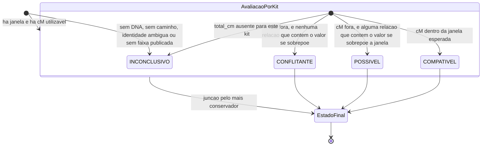
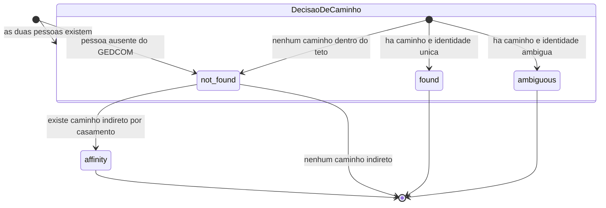

# Máquinas de Estado — analisador-genealogico

> Nível de documentação: **Completo** (`state.json` → `doc_level`)
> Re-extração de **2026-10-05**. Este arquivo **não existia** nas extrações anteriores: em 2026-09-30 a varredura não encontrou nenhum campo de estado e o artefato foi declarado não-aplicável, o que era **correto para o código daquele momento** e **deixou de ser** depois da regra final da análise.
> Escala de confiança: 🟢 CONFIRMADO | 🟡 INFERIDO | 🔴 LACUNA

---

## 1. Resultado da Varredura

**Método.** Varredura de `src/` por todo campo, atributo ou chave nomeado `status`, `state`, `flag`, `enabled`, `active` ou equivalente; leitura integral de `core/gedcom_state.py` (o registro de estado do processo) e dos dois módulos que produzem veredito; cruzamento com o consumo no template (`templates/index.html`).

| Campo encontrado | Onde é escrito | Valores | Sobrevive à requisição? | Conf. |
| --- | --- | --- | --- | --- |
| `documentary.status` | `core/documentary_relationship.py:444`, `:468`, `:552` e `core/path_search.py:187` | `not_found`, `found`, `ambiguous`, `affinity` | **Não** — vive no dicionário de resultado da requisição | 🟢 |
| `comparison.status` | `core/evidence_comparison.py:79`, `:86`, `:101`, `:111`, `:162`, `:229` | `COMPATIVEL`, `POSSIVEL`, `CONFLITANTE`, `INCONCLUSIVO` | **Não** | 🟢 |
| `comparison.per_kit[].status` | `core/evidence_comparison.py:223` | os mesmos 4, por kit | **Não** | 🟢 |
| `core/gedcom_state.versao` | `src/parsers/gedcom_parser.py` (incremento por carga) | inteiro crescente | **Não** — é contador de invalidação, não estado | 🟢 |
| `documentary.affinity_path` | `core/path_search.py:189` | traço do caminho, não estado | **Não** | 🟢 |
| `df.attrs[...]` | `src/parsers/csv_ingest.py:170-174` | metadados de leitura (`separador`, `encoding`, `linhas_ignoradas`) | **Não** | 🟢 |
| `role="status"`, `role="alert"`, `role="tab"` | `templates/index.html` | atributos **HTML de acessibilidade** | — | 🟢 |

**Não existem** — em nenhum arquivo de `src/` — campos `flag`, `enabled`, `active`, `state`, `stage`, `phase` ou equivalentes de ciclo de vida. 🟢

---

## 2. Por que NÃO há ciclo de vida de entidade

Esta seção responde de frente à pergunta que a extração anterior fechou com "não se aplica". A conclusão mudou de **razão**, não de natureza:

1. **Não há banco de dados.** Nenhum DDL, migration, schema ou ORM. Não existe registro persistido que pudesse ter coluna de status (L-21 em `domain.md` §7).
2. **Nada sobrevive à requisição.** O estado do GEDCOM é reconstruído do arquivo a cada `POST`; nenhum resultado é gravado. Uma "entidade" que não persiste não tem ciclo de vida para modelar.
3. **Nenhuma ação do usuário transiciona estado armazenado.** As três ações (`upload_gedcom`, `dna_analysis`, `path_search`) produzem **saída**, não mudança de estado durável. O upload **substitui** o estado em memória em vez de transicioná-lo.
4. **O único estado que persiste é o arquivo em disco**, e ele é imutável: arquivo com a mesma chave de conteúdo **não é reescrito**.

**Portanto:** o que segue são **máquinas de decisão** — conjuntos de estados terminais calculados a partir de entradas —, e não ciclos de vida. Elas são reais, têm transições com guardas e são consumidas pela interface; chamá-las de "máquina de estados de entidade" seria impreciso.

---

## 3. Máquina 1 — Veredito do Confronto GEDCOM × DNA 🟢

**Onde:** `core/evidence_comparison.py` · **Consumido em:** `templates/index.html` (seção de confronto de cada conexão) · **Granularidade:** **por kit**, com junção conservadora no fim.

### 3.1 Diagrama

### 3.2 Tabela de transições

| Estado de origem | Guarda (condição) | Estado de destino | Local |
| --- | --- | --- | --- |
| *(início)* | `not evidence.available` | `INCONCLUSIVO` | `:177-181` |
| *(início)* | `documentary.status == "not_found"` **ou** sem `path` | `INCONCLUSIVO` | `:183-190` |
| *(início)* | `ambiguous_identity` **ou** `status == "ambiguous"` | `INCONCLUSIVO` | `:192-201` |
| *(início)* | sem relação publicada **nem** janela por meioses | `INCONCLUSIVO` | `:203-208` |
| *(início)* | nenhum valor de cM utilizável | `INCONCLUSIVO` | `:217-220` |
| avaliação por kit | `total_cm is None` | `INCONCLUSIVO` | `:78-80` |
| avaliação por kit | `range_low ≤ cM ≤ range_high` | `COMPATIVEL` | `:85-87` |
| avaliação por kit | cM fora **e** existe relação candidata cuja faixa se sobrepõe à janela | `POSSIVEL` | `:95-105` |
| avaliação por kit | cM fora **e** nenhuma sobreposição | `CONFLITANTE` | `:107-113` |
| junção | mais de um kit | **o mais conservador** na ordem `CONFLITANTE > POSSIVEL > COMPATIVEL > INCONCLUSIVO` | `:225-227` |

### 3.3 Fatos de contrato desta máquina

- **A ordem de conservadorismo é declarada como lista literal** (`:225`) e o resultado é o **primeiro estado dessa lista que aparece** entre os kits. Não é média, não é maioria, não é "o pior cM". 🟢
- **`INCONCLUSIVO` é o estado inicial de todo dicionário de confronto** (`:162`), e os ramos de guarda **retornam sem alterá-lo**. Ou seja: o caminho de falha é o caminho padrão, e é isso que garante que nenhum estado seja afirmado por omissão. 🟢
- **O estado carrega três campos acoplados**: `status` (chave canônica), `label` (rótulo em português, de `STATUS_LABEL`) e `message` (o texto de contrato). Trocar um sem os outros quebra a tela. 🟢
- **O estado determina o rol de causas**: `CONFLITANTE` → 12 causas; `POSSIVEL` → 9; os outros dois → nenhuma. 🟢
- **O estado não altera o parentesco documental.** Nenhuma transição reescreve caminho, rótulo ou vínculo — é a proibição central do domínio (`domain.md` §2). 🟢
- **Transições não observadas:** não há estado de "aguardando", "reprocessando" ou "expirado". O veredito é terminal e calculado uma única vez por requisição. 🟢

---

## 4. Máquina 2 — Status do Parentesco Documental 🟢

**Onde:** produzido em `core/documentary_relationship.py` e **completado pelo chamador** em `core/path_search.py` · **Consumido em:** `templates/index.html:160-165` (badge do resultado de DNA) e `:464` (badge da busca de caminho).

### 4.1 Diagrama

### 4.2 Tabela de transições

| Estado | Como se chega | Avisos que acompanham | Local |
| --- | --- | --- | --- |
| `not_found` | `a_id` ou `b_id` **não** existe em `people` | `pessoa_ausente` | `documentary_relationship.py:443-446` |
| `not_found` | as duas existem, mas **nenhum caminho** sobe por pais dentro do teto | `sem_caminho` (+ `homonimo`, se ambíguo) | `:452-484` |
| `found` | há caminho **e** o dossiê de homônimos não é ambíguo | `data_impossivel`, `caminhos_multiplos`, `colapso_de_pedigree` (conforme o caso) | `:551-552` |
| `ambiguous` | há caminho **e** o dossiê de homônimos é ambíguo | os acima + `homonimo` | `:541-552` |
| `affinity` | o módulo **não produz este estado** — ele é **atribuído pelo chamador** quando o caminho direto falha e o indireto existe | `afinidade` (acrescentado) | `path_search.py:186-192` |

### 4.3 Fatos de contrato desta máquina

- **`affinity` é o único estado definido fora do módulo que o calcula.** `documentary_relationship` devolve `not_found` e o chamador **sobrescreve** o status, o rótulo, acrescenta `affinity_path` e o aviso. Quem ler apenas o módulo de parentesco **não** descobre que este estado existe. 🟢
- **`ambiguous` não substitui `not_found` quando não há caminho.** Com identidade ambígua **e** sem caminho, o status permanece `not_found` e a ambiguidade aparece apenas como aviso adicional. O `status` é, portanto, **mais grosseiro que a causa** — e é por isso que existe a §6. 🟢
- **O estado amplia, mas não resolve, a escolha de homônimos.** Na busca de caminho, até 5×5 combinações são testadas e vence a primeira **com caminho**; o resultado ainda sai `ambiguous`, com o operador convidado a conferir as fichas. O estado **avisa**, não **decide**. 🟢
- **`found` não significa "parentesco comprovado"**: significa "o GEDCOM declara um caminho". Os avisos de plausibilidade de data correm **em paralelo** ao estado, e não o rebaixam. 🟢
- **Afinidade nunca é consanguinidade** — o estado tem rótulo próprio e a mensagem que o acompanha é a única do sistema escrita **em maiúsculas**, de propósito. 🟢
- **Transições não observadas:** não há estado de "vínculo corrigido" nem de "caminho aceito pelo operador". Nada no sistema registra uma decisão humana sobre um resultado. 🟢

---

## 5. Estados Deliberadamente NÃO Gerados

| Máquina candidata | Por que não foi gerada | Conf. |
| --- | --- | --- |
| **Ciclo de vida do GEDCOM carregado** | O estado em memória é **substituído** a cada parse, não transiciona. Não há estados "carregado", "em uso", "substituído" no código: há um único ponto de escrita. | 🟢 |
| **Ciclo de vida do arquivo enviado** | O arquivo é imutável após a gravação (mesma chave não é reescrita) e nunca é apagado pelo sistema. Não há estados. | 🟢 |
| **Ciclo de vida da análise** | Não há análise persistida, nem fila, nem retomada. A análise é um cálculo síncrono dentro da requisição. | 🟢 |
| **Ciclo de vida do usuário ou da sessão** | Não existe usuário nem sessão (`permissions.md`). | 🟢 |
| **Ciclo de vida do bug/oportunidade** | Existe, mas **fora do sistema em runtime** — no registro do Reversa (`_reversa_bugs/`), com `status` e `phase` em front-matter. Não é estado da aplicação. | 🟢 |

---

## 6. Os Códigos de Aviso São o Estado de Granularidade Fina 🟢

O `status` perde informação de propósito. **A causa vive no código do aviso**, e é ele que carrega o conhecimento de domínio. Um reimplementador que mapear apenas os 8 valores de `status` (4 + 4) e descartar os avisos **perderá a maior parte das regras de negócio**.

| Código | Significado de negócio | Produtor |
| --- | --- | --- |
| `pessoa_ausente` | Um dos registros não existe no GEDCOM carregado. | `documentary_relationship.py:446` |
| `sem_caminho` | Nenhum percurso por pais dentro do teto — **não prova** ausência de parentesco. | `:453-458` |
| `homonimo` | Identidade ambígua; a análise **não é conclusiva** e o operador deve conferir as fichas. | `:460-466`, `:541-549` |
| `data_impossivel` | Idade de genitor fora de 12–70 anos. **O vínculo é mantido** como o GEDCOM o declara. | `:499-507` |
| `caminhos_multiplos` | Mais de um percurso distinto; nenhum foi descartado. | `:519-525` |
| `colapso_de_pedigree` | Mesmo ancestral por mais de uma cadeia (teto de 8): infla o cM esperado. | `:532-539` |
| `afinidade` | O caminho passa por casamento; **não** é consanguinidade. | `path_search.py:190-191` |
| `multiplos_kits` | Mais de um kit para o mesmo nome; **nenhum total foi somado entre kits**. | `genetic_evidence.py:180-188` |
| `kit_ausente` | Sem coluna de kit e sem e-mail: a chave de agrupamento é `SEM-KIT`. | `genetic_evidence.py:189-196` |
| `segmento_fraco` | Maior segmento abaixo de 15 cM — **heurística do projeto**, não da fonte. | `genetic_evidence.py:208-209` |
| `sem_evidencia` | Não há evidência genética para esta pessoa. | `genetic_evidence.py:221-230` |

---

## 7. Lacunas desta Máquina 🔴

| ID | Lacuna | Conf. |
| --- | --- | --- |
| **M-01** | **O estado `affinity` não sobrevive a uma segunda leitura.** Ele é atribuído a uma **cópia** do dicionário (`dict(documental)` em `path_search.py:186`); o dicionário original continua `not_found`. Nenhum consumidor atual usa o original depois disso, mas a divergência entre duas referências ao "mesmo" resultado é uma armadilha para quem reimplementar. | 🟢 |
| **M-02** | ✅ **DECIDIDA em 2026-10-05 — a assimetria é INTENCIONAL e vira contrato.** A ambiguidade rebaixa `found` para `ambiguous`, mas **não** rebaixa `not_found`. O motivo é que `not_found` já é um resultado **mais fraco** que `ambiguous`: quando não há caminho, não existe afirmação de parentesco a qualificar. Quem reimplementar deve **preservar** a assimetria. | 🟢 |
| **M-03** | **A concorrência não está modelada em nenhum estado.** O estado global do GEDCOM é mutado por requisição, com 4 threads por padrão, e nada no código serializa o par parse→uso (ver `L-16` em `domain.md` §7 e `permissions.md` §4). Um estado compartilhado entre threads **não tem máquina de estados** — tem condição de corrida. | 🟡 |
| **M-04** | ✅ **DECIDIDA em 2026-10-05 — É REQUISITO, e pertence ao ALVO.** Você confirmou que o veredito do operador sobre uma conexão (aceitei / rejeitei / corrigi) precisa ser registrado. **Não existe estado para isso hoje, e nada é alterado no legado** — como nada é persistido, um veredito não teria onde viver (`E-04`). Entra como requisito do sistema alvo: uma máquina de estados nova, com transições por ação humana. Ver `gaps.md` § "Requisitos encaminhados ao alvo". | 🟢 |

---

*Gerado pelo Reversa-Detective em 2026-10-05 (re-extração, nível completo).*
